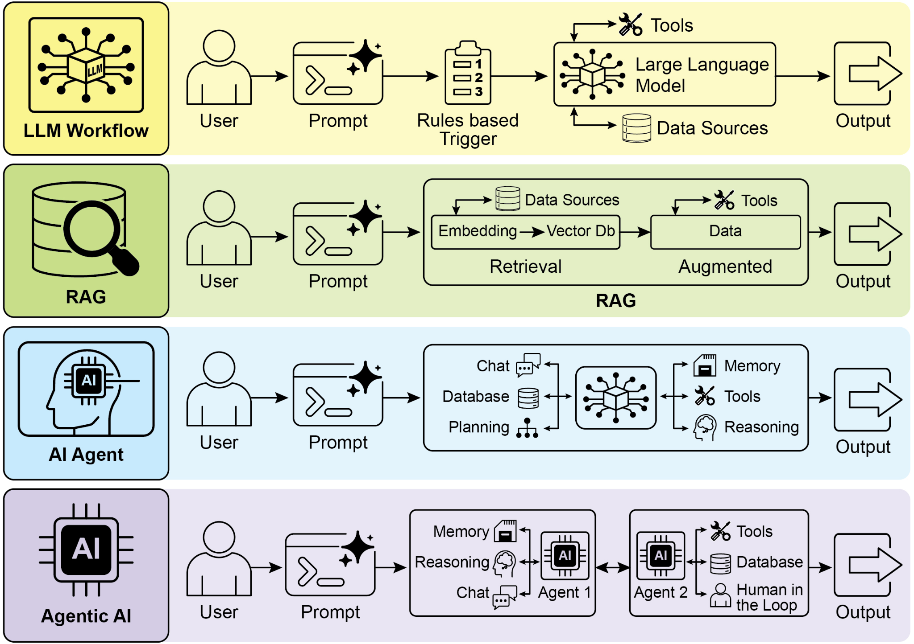
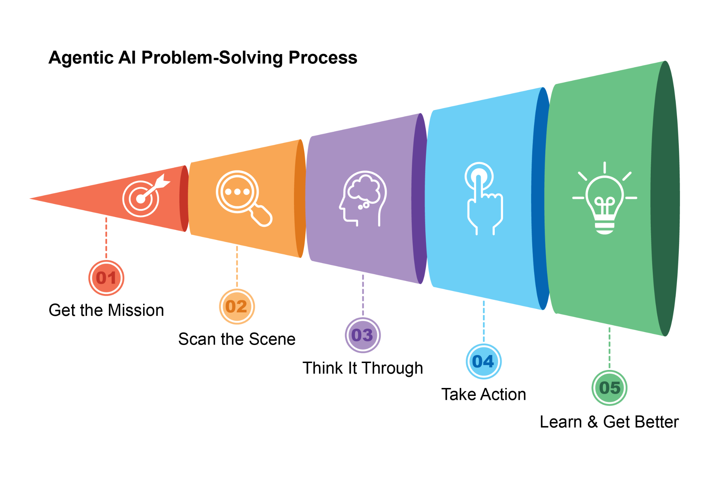
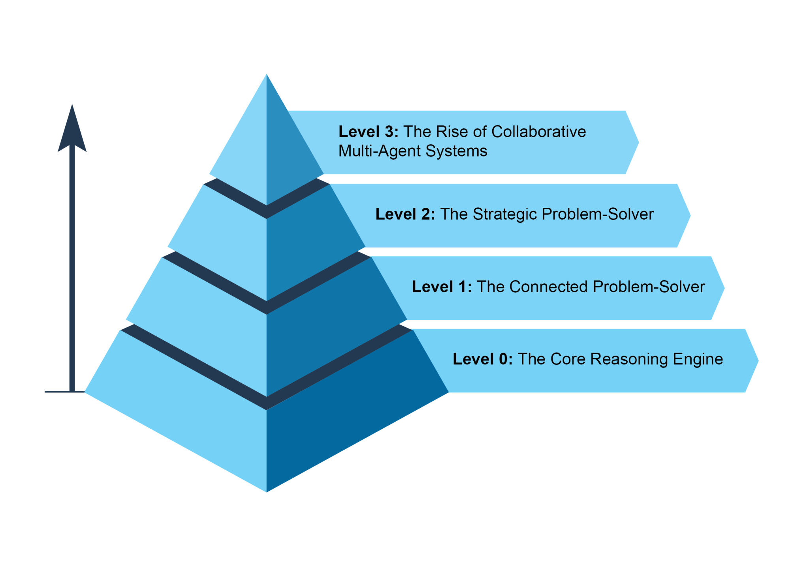
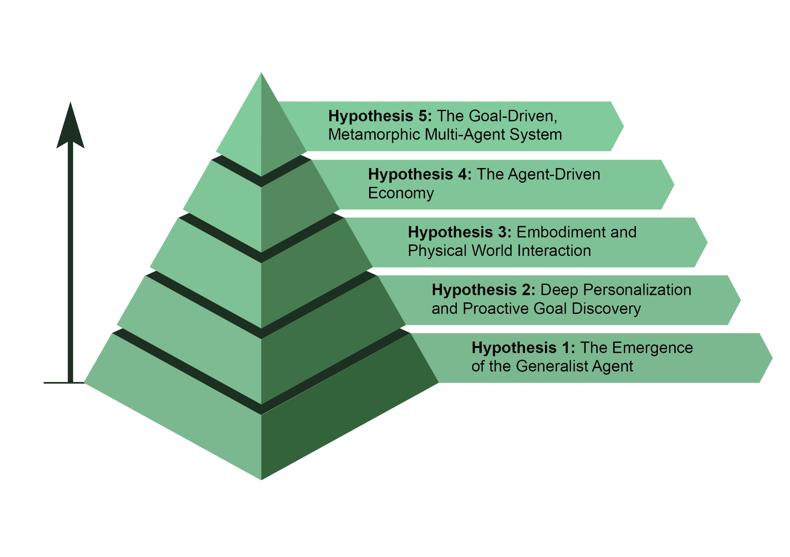

# What makes an AI system an Agent?

In simple terms, an **AI agent** is a system designed to perceive its environment and take actions to achieve a specific goal. It's an evolution from a standard Large Language Model (LLM), enhanced with the abilities to plan, use tools, and interact with its surroundings. Think of an Agentic AI as a smart assistant that learns on the job. It follows a simple, five-step loop to get things done (see Fig.1):

> 简而言之，**智能体**是为感知环境、采取行动并达成特定目标而设计的系统。它建立在标准大语言模型（LLM）之上，并进一步具备规划、调用工具以及与环境交互的能力。不妨把智能体化 AI 视为一位在实践中持续学习的智能助手：它通过一个清晰的五步闭环来推进任务（见图 1）：

1. **Get the Mission:** You give it a goal, like "organize my schedule."
2. **Scan the Scene:** It gathers all the necessary information—reading emails, checking calendars, and accessing contacts—to understand what's happening.
3. **Think It Through:** It devises a plan of action by considering the optimal approach to achieve the goal.
4. **Take Action:** It executes the plan by sending invitations, scheduling meetings, and updating your calendar.
5. **Learn and Get Better:** It observes successful outcomes and adapts accordingly. For example, if a meeting is rescheduled, the system learns from this event to enhance its future performance.

> 1. **获取任务：** 你为它设定目标，例如「整理我的日程」。
> 2. **扫描现场：** 收集所需信息——读邮件、查日历、访问联系人——以把握当前状况。
> 3. **思考对策：** 权衡可行路径，形成行动计划。
> 4. **采取行动：** 依计划发送邀请、安排会议、更新日历等。
> 5. **学习改进：** 观察结果并持续调整；例如会议改期后，系统从该事件学习，以改进后续表现。

Fig.1: Agentic AI functions as an intelligent assistant, continuously learning through experience. It operates via a straightforward five-step loop to accomplish tasks.

> 图 1：智能体化 AI 扮演智能助手角色，在经验中持续学习，并通过清晰的五步循环完成任务。

Agents are becoming increasingly popular at a stunning pace. According to recent studies, a majority of large IT companies are actively using these agents, and a fifth of them just started within the past year. The financial markets are also taking notice. By the end of 2024, AI agent startups had raised more than $2 billion, and the market was valued at $5.2 billion. It's expected to explode to nearly $200 billion in value by 2034\. In short, all signs point to AI agents playing a massive role in our future economy.

> 智能体正以惊人速度普及。近期研究显示，多数大型 IT 企业已在积极使用智能体，其中约五分之一是在过去一年才起步。资本市场同样瞩目：截至 2024 年底，智能体初创公司融资逾 20 亿美元，市场规模约 52 亿美元；预计到 2034 年将飙升至近 2000 亿美元。简言之，种种信号表明，智能体将在未来经济中扮演关键角色。

In just two years, the AI paradigm has shifted dramatically, moving from simple automation to sophisticated, autonomous systems (see Fig. 2). Initially, workflows relied on basic prompts and triggers to process data with LLMs. This evolved with Retrieval-Augmented Generation (RAG), which enhanced reliability by grounding models on factual information. We then saw the development of individual AI Agents capable of using various tools.  Today, we are entering the era of Agentic AI, where a team of specialized agents works in concert to achieve complex goals, marking a significant leap in AI's collaborative power.

> 短短两年间，AI 范式发生了剧烈迁移：从简单自动化走向更成熟的自主系统（见图 2）。最初，工作流主要依赖基础提示与触发器，用 LLM 处理数据；随后出现检索增强生成（RAG），通过让模型建立在事实信息之上来提升可靠性；再进一步，则是能够调用多种工具的独立智能体。如今，我们正迈入智能体化 AI 时代：多名专精智能体协同完成复杂目标，标志着协作智能的一次重要跃升。

Fig 2.: Transitioning from LLMs to RAG, then to Agentic RAG, and finally to Agentic AI.

> 图 2：从 LLM 到 RAG，再到智能体化 RAG，直至智能体化 AI 的演进。

The intent of this book is to discuss the design patterns of how  specialized agents can work in concert and collaborate to achieve  complex goals, and you will see one paradigm of collaboration and interaction in each chapter.

> 本书旨在探讨「专精智能体如何协同、合作以达成复杂目标」的设计模式；每一章都会呈现一种协作与交互范式。

Before doing that, let's examine examples that span the range of agent complexity (see Fig. 3).

> 在此之前，先浏览覆盖智能体复杂度谱系的示例（见图 3）。

Fig. 3: Various instances demonstrating the spectrum of agent complexity.

> 图 3：若干实例，展示智能体复杂度的谱系。

## Level 0: The Core Reasoning Engine

While an LLM is not an agent in itself, it can serve as the reasoning core of a basic agentic system. In a 'Level 0' configuration, the LLM operates without tools, memory, or environment interaction, responding solely based on its pretrained knowledge. Its strength lies in leveraging its extensive training data to explain established concepts. The trade-off for this powerful internal reasoning is a complete lack of current-event awareness. For instance, it would be unable to name the 2025 Oscar winner for "Best Picture" if that information is outside its pre-trained knowledge.

> LLM 本身并非智能体，却可充当基础智能体化系统的推理核心。在「0 级」配置下，LLM 无工具、无记忆、不与环境交互，仅依预训练知识作答。其长处在于借助海量训练数据阐释既有概念；代价则是缺乏对时事的感知——例如若信息不在预训练范围内，它无法回答 2025 年奥斯卡「最佳影片」得主是谁。

## Level 1: The Connected Problem-Solver

At this level, the LLM becomes a functional agent by connecting to and utilizing external tools. Its problem-solving is no longer limited to its pre-trained knowledge. Instead, it can execute a sequence of actions to gather and process information from sources like the internet (via search) or databases (via Retrieval Augmented Generation, or RAG). For detailed information, refer to Chapter 14\.

> 在这一层，LLM 通过接入并调用外部工具，升格为可落地的功能性智能体：解题不再受限于预训练知识，而能串联多步动作，从互联网（搜索）或数据库（检索增强生成，RAG）等处采集并处理信息。详见第 14 章。

For instance, to find new TV shows, the agent recognizes the need for current information, uses a search tool to find it, and then synthesizes the results. Crucially, it can also use specialized tools for higher accuracy, such as calling a financial API to get the live stock price for AAPL. This ability to interact with the outside world across multiple steps is the core capability of a Level 1 agent.

> 例如查找新剧时，智能体判断需要最新信息，便调用搜索工具检索并综合结果。它也可调用专用工具换取更高准确度，例如通过金融 API 拉取 AAPL 实时股价。能够跨多步与外部世界交互，是 1 级智能体的核心能力。

## Level 2: The Strategic Problem-Solver

At this level, an agent's capabilities expand significantly, encompassing strategic planning, proactive assistance, and self-improvement, with prompt engineering and context engineering as core enabling skills.

> 在这一层，智能体能力显著扩展，覆盖战略规划、主动协助与自我改进；`提示工程`与`上下文工程`是关键的使能技能(`基础能力`)。

First, the agent moves beyond single-tool use to tackle complex, multi-part problems through strategic problem-solving. As it executes a sequence of actions, it actively performs context engineering: the strategic process of selecting, packaging, and managing the most relevant information for each step. For example, to find a coffee shop between two locations, it first uses a mapping tool. It then engineers this output, curating a short, focused context—perhaps just a list of street names—to feed into a local search tool, preventing cognitive overload and ensuring the second step is efficient and accurate. To achieve maximum accuracy from an AI, it must be given a short, focused, and powerful context. Context engineering is the discipline that accomplishes this by strategically selecting, packaging, and managing the most critical information from all available sources. It effectively curates the model's limited attention to prevent overload and ensure high-quality, efficient performance on any given task. For detailed information, refer to the Appendix A\.

> 首先，智能体不再局限于单次工具调用，而是通过策略性解题来应对复杂、多阶段问题。在执行一连串动作时，它会主动进行上下文工程：为每一步甄选、封装并维护最相关的信息。例如，要在两地之间寻找咖啡馆，可先调用地图工具，再对输出进行工程化处理，压缩为短小、聚焦的上下文（也许只是一串街道名称），再交给本地搜索工具；这样既能避免认知过载，又能保证第二步高效而准确。若要让 AI 发挥最高准确度，就必须提供简洁、聚焦且信息密度高的上下文；而上下文工程，正是从所有可用来源中策略性筛选、封装并维护关键信息的学问——在模型有限的注意力预算下完成“策展”，避免过载，并换取高质量、高效率的任务表现。详见附录 A。

This level leads to proactive and continuous operation. A travel assistant linked to your email demonstrates this by engineering the context from a verbose flight confirmation email; it selects only the key details (flight numbers, dates, locations) to package for subsequent tool calls to your calendar and a weather API.

> 这一层也支撑主动、持续运行。与邮箱联动的旅行助手是典型例子：面对冗长的航班确认邮件，先做上下文工程，仅抽出航班号、日期、地点等关键字段并封装，供后续调用日历与天气 API。

In specialized fields like software engineering, the agent manages an entire workflow by applying this discipline. When assigned a bug report, it reads the report and accesses the codebase, then strategically engineers these large sources of information into a potent, focused context that allows it to efficiently write, test, and submit the correct code patch.

> 在软件工程等专业场景中，智能体也用同样的方法贯穿整个工作流：接到缺陷报告后，它会读取报告、访问代码库，再把这些庞杂信息经过策略性处理，整理成有力而聚焦的上下文，从而高效地编写、测试并提交正确的补丁。

Finally, the agent achieves self-improvement by refining its own context engineering processes. When it asks for feedback on how a prompt could have been improved, it is learning how to better curate its initial inputs. This allows it to automatically improve how it packages information for future tasks, creating a powerful, automated feedback loop that increases its accuracy and efficiency over time. For detailed information, refer to Chapter 17\.

> 最后，智能体还能通过持续打磨自身的上下文工程流程来实现自我改进：当它主动征求「提示还能如何改写」的反馈时，本质上是在学习怎样更好地组织初始输入，并自动优化未来任务中的信息打包方式，从而形成强有力的自动化反馈闭环，随着时间推移不断提升准确度与效率。详见第 17 章。

## Level 3: The Rise of Collaborative Multi-Agent Systems

At Level 3, we see a significant paradigm shift in AI development, moving away from the pursuit of a single, all-powerful super-agent and towards the rise of sophisticated, collaborative multi-agent systems. In essence, this approach recognizes that complex challenges are often best solved not by a single generalist, but by a team of specialists working in concert. This model directly mirrors the structure of a human organization, where different departments are assigned specific roles and collaborate to tackle multi-faceted objectives. The collective strength of such a system lies in this division of labor and the synergy created through coordinated effort. For detailed information, refer to Chapter 7\.

> 在 3 级，AI 开发出现显著范式转移：从追逐单一「全能超级智能体」，转向成熟的协作式多智能体系统。其核心洞见是，复杂难题往往更适合由专家团队协同破解，而非仰赖单个通才。该模型与人类组织同构：不同部门各担其责，协作推进多目标。系统的集体优势来自分工与协调所产生的合力。详见第 7 章。

To bring this concept to life, consider the intricate workflow of launching a new product. Rather than one agent attempting to handle every aspect, a "Project Manager" agent could serve as the central coordinator. This manager would orchestrate the entire process by delegating tasks to other specialized agents: a "Market Research" agent to gather consumer data, a "Product Design" agent to develop concepts, and a "Marketing" agent to craft promotional materials. The key to their success would be the seamless communication and information sharing between them, ensuring all individual efforts align to achieve the collective goal.

> 以新品上市的复杂工作流为例：与其让单一智能体包办，不如由「项目经理」智能体居中协调，把任务分派给专精角色——「市场研究」采集消费者洞察、「产品设计」打磨概念、「营销」撰写推广素材。成败系于彼此顺畅沟通与信息共享，让个体产出对齐共同目标。

While this vision of autonomous, team-based automation is already being developed, it's important to acknowledge the current hurdles. The effectiveness of  such multi-agent systems is presently constrained by the reasoning limitations of LLMs they are using. Furthermore, their ability to genuinely learn from one another and improve as a cohesive unit is still in its early stages. Overcoming these technological bottlenecks is the critical next step, and doing so will unlock the profound promise of this level: the ability to automate entire business workflows from start to finish.

> 尽管「自主团队式自动化」的愿景已在路上，仍需直面现实掣肘：多智能体系统的上限仍受制于底层 LLM 的推理能力；智能体之间能否真正互学、并以整体进化，也尚处早期。攻克这些瓶颈是下一程的关键，也将兑现本层级的长远承诺：端到端自动化整条业务流程。

## The Future of Agents: Top 5 Hypotheses

AI agent development is progressing at an unprecedented pace across domains such as software automation, scientific research, and customer service among others. While current systems are impressive, they are just the beginning. The next wave of innovation will likely focus on making agents more reliable, collaborative, and deeply integrated into our lives. Here are five leading hypotheses for what's next (see Fig. 4).

> 智能体开发在软件自动化、科学研究、客户服务等领域正以空前速度推进。今天的系统虽已亮眼，却只是序幕。下一波创新或将集中在：提升可靠性、强化协作、以及把智能体更深地嵌入日常生活。以下是与「下一步」相关的五条主流假设（见图 4）。

Fig. 4: Five hypotheses about the future of agents

> 图 4：关于智能体未来的五条假设

### Hypothesis 1: The Emergence of the Generalist Agent

The first hypothesis is that AI agents will evolve from narrow specialists into true generalists capable of managing complex, ambiguous, and long-term goals with high reliability. For instance, you could give an agent a simple prompt like, "Plan my company's offsite retreat for 30 people in Lisbon next quarter." The agent would then manage the entire project for weeks, handling everything from budget approvals and flight negotiations to venue selection and creating a detailed itinerary from employee feedback, all while providing regular updates. Achieving this level of autonomy will require fundamental breakthroughs in AI reasoning, memory, and near-perfect reliability. An alternative, yet not mutually exclusive, approach is the rise of Small Language Models (SLMs). This "Lego-like" concept involves composing systems from small, specialized expert agents rather than scaling up a single monolithic model. This method promises systems that are cheaper, faster to debug, and easier to deploy. Ultimately, the development of large generalist models and the composition of smaller specialized ones are both plausible paths forward, and they could even complement each other.

> 假设一：智能体将从狭窄领域的专才，演进为真正的通才，能够以较高可靠性处理复杂、模糊且周期较长的目标。例如，你只需给它一个简单提示：「为公司规划一次下季度在里斯本举行、30 人参加的团建活动。」随后，智能体就可能在数周内接手整个项目，处理从预算审批、机票谈判、场地选择，到根据员工反馈制定详细行程等各项事务，并持续同步进展。要实现这种程度的自主性，仍有赖于 AI 在推理、记忆和接近完美的可靠性方面取得根本性突破。另一条可并行推进、且并不与之冲突的路径，是小语言模型（SLM）的兴起。这种类似「乐高拼装」的思路，不是继续扩张单一的大一统模型，而是用多个小型、专精的专家智能体来组合系统。这样的方法有望让系统更便宜、更容易调试，也更容易部署。归根结底，发展大型通才模型和组合小型专精模型，都是合理可行的方向，而且二者还有可能彼此互补。

### Hypothesis 2: Deep Personalization and Proactive Goal Discovery

The second hypothesis posits that agents will become deeply personalised and proactive partners. We are witnessing the emergence of a new class of agent: the proactive partner. By learning from your unique patterns and goals, these systems are beginning to shift from just following orders to anticipating your needs. AI systems operate as agents when they move beyond simply responding to chats or instructions. They initiate and execute tasks on behalf of the user, actively collaborating in the process.  This moves beyond simple task execution into the realm of proactive goal discovery.

> 假设二：智能体将演进为高度个性化、具备主动性的伙伴。我们正见证一种新型智能体的出现：「主动型伙伴」。这类系统会学习你独有的行为模式和目标，逐步从被动执行指令，转向主动预判你的需求。当 AI 不再只是回应对话或照着指令做事，而是能够代表用户发起并执行任务，并在过程中积极协作时，它才真正以智能体的方式运转。这也意味着，它已从单纯执行任务，迈向主动发现目标的新阶段。

For instance, if you're exploring sustainable energy, the agent might identify your latent goal and proactively support it by suggesting courses or summarizing research. While these systems are still developing, their trajectory is clear. They will become increasingly proactive, learning to take initiative on your behalf when highly confident that the action will be helpful. Ultimately, the agent becomes an indispensable ally, helping you discover and achieve ambitions you have yet to fully articulate.

> 例如当你研究可持续能源时，智能体可能察觉潜在意图，主动推荐课程或汇总研究进展。相关系统仍在演进，但方向明确：它们将更主动，在高度确信某项行动对你有益时替你出手。最终，智能体或可成为不可或缺的盟友，协助你发掘并实现那些尚未被清晰表述的志向。

### Hypothesis 3: Embodiment and Physical World Interaction

This hypothesis foresees agents breaking free from their purely digital confines to operate in the physical world. By integrating agentic AI with robotics, we will see the rise of "embodied agents." Instead of just booking a handyman, you might ask your home agent to fix a leaky tap. The agent would use its vision sensors to perceive the problem, access a library of plumbing knowledge to formulate a plan, and then control its robotic manipulators with precision to perform the repair. This would represent a monumental step, bridging the gap between digital intelligence and physical action, and transforming everything from manufacturing and logistics to elder care and home maintenance.

> 假设三：智能体将走出纯数字空间，在物理世界落地。智能体化 AI 与机器人深度融合，会催生「具身智能体」。未来你或许可以让家庭智能体直接处理漏水龙头，而不止于代约师傅：它用视觉定位故障、检索管道知识并规划步骤，再驱动机械臂精准作业。这将是拉近「数字智能」与「物理行动」距离的关键一跃，并深刻影响制造、物流、长者照护与居家维保等领域。

### Hypothesis 4: The Agent-Driven Economy

The fourth hypothesis is that highly autonomous agents will become active participants in the economy, creating new markets and business models. We could see agents acting as independent economic entities, tasked with maximising a specific outcome, such as profit. An entrepreneur could launch an agent to run an entire e-commerce business. The agent would identify trending products by analysing social media, generate marketing copy and visuals, manage supply chain logistics by interacting with other automated systems, and dynamically adjust pricing based on real-time demand. This shift would create a new, hyper-efficient "agent economy" operating at a speed and scale impossible for humans to manage directly.

> 假设四：高度自主的智能体将成为经济活动的积极参与者，催生新市场与新业态。智能体可被配置为独立「经济主体」，受托优化特定指标（如利润）。创业者亦可让智能体操盘整家电商：从社媒信号捕捉趋势、生成文案与视觉素材，到与其他自动化系统协同管理供应链，再按实时需求动态调价。由此或将出现一种速度与规模都超出人类直接掌控边界的超高效「智能体经济」。

### Hypothesis 5:  The Goal-Driven, Metamorphic Multi-Agent System

This hypothesis posits the emergence of intelligent systems that operate not from explicit programming, but from a declared goal. The user simply states the desired outcome, and the system autonomously figures out how to achieve it. This marks a fundamental shift towards metamorphic multi-agent systems capable of true self-improvement at both the individual and collective levels.

> 假设五：将出现不再依赖冗长显式编程、而由“目标声明”驱动的智能系统。用户只需描述期望结果，系统便能自主推导实现路径。这标志着我们正迈向一种可演化的多智能体架构：无论个体还是整体，都有望实现真正意义上的自我改进。

This system would be a dynamic entity, not a single agent. It would have the ability to analyze its own performance and modify the topology of its multi-agent workforce, creating, duplicating, or removing agents as needed to form the most effective team for the task at hand. This evolution happens at multiple levels:

> 该系统是动态整体，而非单点智能体：既能审视自身表现，也能重塑多智能体拓扑——按需创建、复制或下线成员，以拼出对当前任务最高效的队伍。演化同时发生在多个层级：

- Architectural Modification: At the deepest level, individual agents can rewrite their own source code and re-architect their internal structures for higher efficiency, as in the original hypothesis.  
- Instructional Modification: At a higher level, the system continuously performs automatic prompt engineering and context engineering. It refines the instructions and information given to each agent, ensuring they are operating with optimal guidance without any human intervention.

> - **架构修改：** 在底层，单个智能体可改写自身源码并重构内部结构以换取更高效率（与原始假设一致）。
> - **指令修改：** 在更高层，系统持续执行自动提示工程与上下文工程，精炼下发给各智能体的提示与信息，使其在少人或无人介入时仍能获得较优指引。

For instance, an entrepreneur would simply declare the intent: "Launch a successful e-commerce business selling artisanal coffee." The system, without further programming, would spring into action. It might initially spawn a "Market Research" agent and a "Branding" agent. Based on the initial findings, it could decide to remove the branding agent and spawn three new specialized agents: a "Logo Design" agent, a "Webstore Platform" agent, and a "Supply Chain" agent. It would constantly tune their internal prompts for better performance. If the webstore agent becomes a bottleneck, the system might duplicate it into three parallel agents to work on different parts of the site, effectively re-architecting its own structure on the fly to best achieve the declared goal.

> 例如，创业者只需声明一个意图：「打造一家成功销售手工咖啡的电商业务」。系统无需再额外编程，便会立即开始运作：它可能先生成「市场研究」和「品牌建设」两个智能体；根据初步结果，又可能撤下品牌建设智能体，转而生成三个新的专精智能体，分别负责「Logo 设计」「网店平台」和「供应链」。同时，系统还会持续调整它们的内部提示，以提升整体表现。若负责网店的智能体成为瓶颈，系统还可能将其复制为三个并行智能体，分别处理网站的不同部分。也就是说，它会在运行过程中动态重组自身结构，以更好地实现既定目标。

## Conclusion

In essence, an AI agent represents a significant leap from traditional models, functioning as an autonomous system that perceives, plans, and acts to achieve specific goals. The evolution of this technology is advancing from single, tool-using agents to complex, collaborative multi-agent systems that tackle multifaceted objectives. Future hypotheses predict the emergence of generalist, personalized, and even physically embodied agents that will become active participants in the economy. This ongoing development signals a major paradigm shift towards self-improving, goal-driven systems poised to automate entire workflows and fundamentally redefine our relationship with technology.

> 总之，相对传统模型，智能体是一次范式级跃迁：它以自主系统之姿感知环境、规划路径并付诸行动以达成目标。技术脉络正由「单智能体 + 工具调用」迈向「协作式多智能体」以拆解多维目标。前述假设则指向通才化、深度个性化乃至具身智能体全面参与经济活动的未来。这一演进标志着自我改进、目标驱动系统的兴起，有望把整条工作流自动化，并重塑人与技术的关系。

## References

1. Cloudera, Inc. (April 2025), 96% of enterprises are increasing their use of AI agents.[https://www.cloudera.com/about/news-and-blogs/press-releases/2025-04-16-96-percent-of-enterprises-are-expanding-use-of-ai-agents-according-to-latest-data-from-cloudera.html](https://www.cloudera.com/about/news-and-blogs/press-releases/2025-04-16-96-percent-of-enterprises-are-expanding-use-of-ai-agents-according-to-latest-data-from-cloudera.html)
2. Autonomous generative AI agents: [https://www.deloitte.com/us/en/insights/industry/technology/technology-media-and-telecom-predictions/2025/autonomous-generative-ai-agents-still-under-development.html](https://www.deloitte.com/us/en/insights/industry/technology/technology-media-and-telecom-predictions/2025/autonomous-generative-ai-agents-still-under-development.html)
3. Market.us. Global Agentic AI Market Size, Trends and Forecast 2025–2034. [https://market.us/report/agentic-ai-market/](https://market.us/report/agentic-ai-market/)

