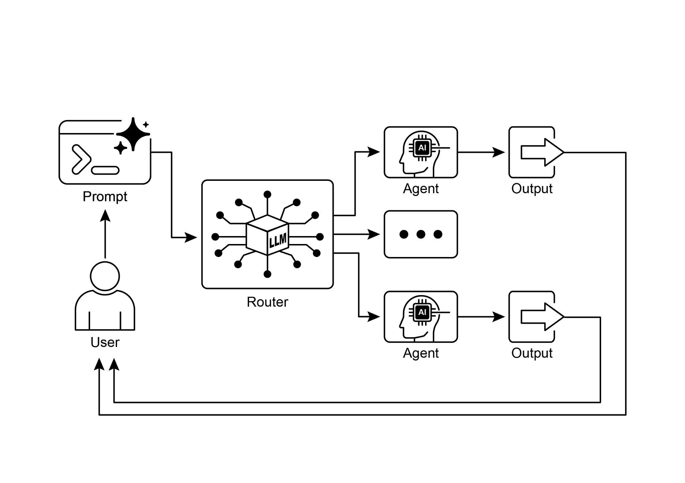

# Chapter 2: Routing

> 第二章：路由（Routing）

## Routing Pattern Overview

> ## 路由模式概览

While sequential processing via `prompt chaining` is a foundational technique for executing deterministic, linear workflows with language models, its applicability is limited in scenarios requiring adaptive responses. Real-world agentic systems must often arbitrate between multiple potential actions based on contingent factors, such as the state of the environment, user input, or the outcome of a preceding operation. This capacity for dynamic decision-making, which governs the flow of control to different specialized functions, tools, or sub-processes, is achieved through a mechanism known as routing.

> 借助`提示链`进行顺序处理，是执行确定性、线性语言模型工作流的基础方法；但在需要自适应响应的场景中，这种方式的适用性就会受到限制。现实世界中的智能体系统，往往需要根据环境状态、用户输入或前一步操作的结果等条件，在多种可能的动作之间做出选择。这种动态决策能力，也就是将控制流导向不同专用函数、工具或子流程的能力，正是通过 `路由` 机制来实现的。

Routing introduces conditional logic into an agent's operational framework, enabling a shift from a fixed execution path to a model where the agent dynamically evaluates specific criteria to select from a set of possible subsequent actions. This allows for more flexible and context-aware system behavior.

> `路由`在智能体的运行框架中引入了`条件逻辑`，使系统从固定的执行路径转向能够根据特定标准进行动态评估，并从一组候选后续动作中选择其一执行，从而具备更灵活、也更具上下文感知能力的行为方式。

For instance, an agent designed for customer inquiries, when equipped with a routing function, can first classify an incoming query to determine the user's intent. Based on this classification, it can then direct the query to a specialized agent for direct question-answering, a database retrieval tool for account information, or an escalation procedure for complex issues, rather than defaulting to a single, predetermined response pathway.  Therefore, a more sophisticated agent using routing could:

> 例如，一个面向客户咨询的智能体如果具备路由能力，就可以先对传入查询进行分类，以判断用户意图；然后再据此将请求转交给专门的问答智能体、查询账户信息的数据库检索工具，或处理复杂问题的升级流程，而不是默认走单一、预设的响应路径。因此，一个更成熟、具备路由能力的智能体可以：

1. Analyze the user's query.  
2. **Route** the query based on its *intent*:  

   * If the intent is "check order status", route to a sub-agent or tool chain that interacts with the order database.  
   * If the intent is "product information", route to a sub-agent or chain that searches the product catalog.  
   * If the intent is "technical support", route to a different chain that accesses troubleshooting guides or escalates to a human.  
   * If the intent is unclear, route to a clarification sub-agent or prompt chain.

> 1. 分析用户查询。
> 2. 根据其 *意图* 对查询进行**路由**：
> 
>    * 若意图为“查询订单状态”，则路由到与订单数据库交互的子智能体或工具链。
>    * 若意图为“产品信息”，则路由到负责检索产品目录的子智能体或处理链。
>    * 若意图为“技术支持”，则路由到可访问排障指南或升级至人工处理的另一条链路。
>    * 若意图不明确，则路由到负责澄清需求的子智能体或提示链。

The core component of the Routing pattern is a mechanism that performs the evaluation and directs the flow. This mechanism can be implemented in several ways:

> 路由模式的核心，是一个负责进行`评估`并`引导控制流`的机制；这一机制可以通过多种方式实现：

* **LLM-based Routing:** The language model itself can be prompted to analyze the input and output a specific identifier or instruction that indicates the next step or destination. For example, a prompt might ask the LLM to "Analyze the following user query and output only the category: 'Order Status', 'Product Info', 'Technical Support', or 'Other'." The agentic system then reads this output and directs the workflow accordingly.  
* **Embedding-based Routing:** The input query can be converted into a vector embedding (see RAG, Chapter 14). This embedding is then compared to embeddings representing different routes or capabilities. The query is routed to the route whose embedding is most similar. This is useful for semantic routing, where the decision is based on the meaning of the input rather than just keywords.  
* **Rule-based Routing:** This involves using predefined rules or logic (e.g., if-else statements, switch cases) based on keywords, patterns, or structured data extracted from the input. This can be faster and more deterministic than LLM-based routing, but is less flexible for handling nuanced or novel inputs.  
* **Machine Learning Model-Based Routing**: it employs a discriminative model, such as a classifier, that has been specifically trained on a small corpus of labeled data to perform a routing task. While it shares conceptual similarities with embedding-based methods, its key characteristic is the supervised fine-tuning process, which adjusts the model's parameters to create a specialized routing function. This technique is distinct from LLM-based routing because the decision-making component is not a generative model executing a prompt at inference time. Instead, the routing logic is encoded within the fine-tuned model's learned weights. While LLMs may be used in a pre-processing step to generate synthetic data for augmenting the training set, they are not involved in the real-time routing decision itself.

> * **基于 LLM 的路由：** 可以提示语言模型 LLM 分析输入，并输出一个表示下一步操作或目标去向的标识符或指令。例如，可要求模型“分析以下用户查询，并且只输出类别：‘订单状态’‘产品信息’‘技术支持’或‘其他’”；智能体系统随后读取该输出，并据此推进工作流。
> * **基于嵌入的路由：** 可先将查询转换为向量嵌入（见第 14 章 `RAG`），再与不同路径或能力对应的嵌入进行相似度比较，并将查询路由到最相近的一条路径。这种方式适用于语义路由，即决策依据是输入的语义，而不仅仅是关键词。
> * **基于规则的路由：** 使用预定义的规则或逻辑（如 `if-else`、`switch`），依据关键词、模式或从输入中提取出的结构化数据进行分流。它通常比基于 LLM 的路由更快、也更具确定性，但在处理细微差别较多或全新类型的输入时灵活性较弱。
> * **基于机器学习模型的路由：** 采用判别式模型（如分类器），在少量标注语料上进行专门训练，以完成路由任务。虽然它在概念上与基于嵌入的方法有相通之处，但关键特征在于监督式微调过程，即通过调整模型参数来形成专用的路由函数。它与基于 LLM 的路由不同，因为其决策组件并不是在推理阶段执行提示词的生成模型，而是编码在微调后模型权重中的逻辑。LLM 可能会在预处理阶段用于生成合成数据，以扩充训练集，但并不直接参与实时路由决策。

Routing mechanisms can be implemented at multiple junctures within an agent's operational cycle. They can be applied at the outset to classify a primary task, at intermediate points within a processing chain to determine a subsequent action, or during a subroutine to select the most appropriate tool from a given set.

> `路由机制`可以部署在智能体运行周期的`多个环节`：既可以在入口处对主任务进行分类，也可以在处理链的中间阶段决定下一步动作，还可以在某个子程序内部，从给定的工具集中选出最合适的一项。

Computational frameworks such as LangChain, LangGraph, and Google's Agent Developer Kit (ADK) provide explicit constructs for defining and managing such conditional logic. With its state-based graph architecture, LangGraph is particularly well-suited for complex routing scenarios where decisions are contingent upon the accumulated state of the entire system. Similarly, Google's ADK provides foundational components for structuring an agent's capabilities and interaction models, which serve as the basis for implementing routing logic. Within the execution environments provided by these frameworks, developers define the possible operational paths and the functions or model-based evaluations that dictate the transitions between nodes in the computational graph.

> LangChain、LangGraph 与 Google Agent Developer Kit（ADK）等框架，都提供了用于定义和管理这类条件逻辑的显式结构。LangGraph 基于状态的图结构，尤其适合处理那些决策依赖于系统整体累积状态的复杂路由场景。类似地，Google ADK 也提供了用于组织智能体能力与交互模型的基础组件，为实现路由逻辑打下基础。在这些框架的执行环境中，开发者需要定义可能的执行路径，以及决定计算图节点之间如何跳转的函数或基于模型的评估机制。

The implementation of routing enables a system to move beyond deterministic sequential processing. It facilitates the development of more adaptive execution flows that can respond dynamically and appropriately to a wider range of inputs and state changes.

> 引入路由之后，系统就不再局限于确定性的顺序处理，而能够构建出更具适应性的执行流，以便对更加多样的输入和状态变化作出动态且恰当的响应。

## Practical Applications & Use Cases

> ## 实际应用与用例

The routing pattern is a critical control mechanism in the design of adaptive agentic systems, enabling them to dynamically alter their execution path in response to variable inputs and internal states. Its utility spans multiple domains by providing a necessary layer of conditional logic.

> 路由模式是设计自适应智能体系统时的一项关键控制机制，它使系统能够随着输入和内部状态的变化动态调整执行路径。通过引入这一必要的条件逻辑层，路由模式在多个领域都具有广泛价值。

In human-computer interaction, such as with virtual assistants or AI-driven tutors, routing is employed to interpret user intent. An initial analysis of a natural language query determines the most appropriate subsequent action, whether it is invoking a specific information retrieval tool, escalating to a human operator, or selecting the next module in a curriculum based on user performance. This allows the system to move beyond linear dialogue flows and respond contextually.

> 在人机交互场景中，例如虚拟助手或 AI 导师，路由常被用于识别用户意图。系统会先对自然语言查询进行初步分析，再决定最合适的后续动作，例如调用特定的信息检索工具、转交给人工坐席，或根据用户表现选择课程中的下一模块。这样一来，系统就不再局限于线性的对话流程，而能够做出更符合上下文的响应。

Within automated data and document processing pipelines, routing serves as a classification and distribution function. Incoming data, such as emails, support tickets, or API payloads, is analyzed based on content, metadata, or format. The system then directs each item to a corresponding workflow, such as a sales lead ingestion process, a specific data transformation function for JSON or CSV formats, or an urgent issue escalation path.

> 在自动化数据与文档处理流水线中，路由承担着分类和分发的职能。系统会根据邮件、支持工单或 API 载荷的内容、元数据或格式进行分析，再将每一项输入分派到相应的工作流，例如销售线索录入流程、针对 JSON 或 CSV 格式的专用数据转换函数，或紧急问题的升级处理通道。

In complex systems involving multiple specialized tools or agents, routing acts as a high-level dispatcher. A research system composed of distinct agents for searching, summarizing, and analyzing information would use a router to assign tasks to the most suitable agent based on the current objective. Similarly, an AI coding assistant uses routing to identify the programming language and user's intent—to debug, explain, or translate—before passing a code snippet to the correct specialized tool.

> 在由多种专用工具或智能体构成的复杂系统中，路由扮演的是高层调度器的角色。一个由搜索、总结和分析等不同智能体组成的研究系统，会借助路由器根据当前目标将任务分配给最合适的智能体。同样，AI 编程助手在把代码片段交给正确的专用工具之前，也会先通过路由识别编程语言以及用户意图，例如调试、解释或翻译。

Ultimately, routing provides the capacity for logical arbitration that is essential for creating functionally diverse and context-aware systems. It transforms an agent from a static executor of pre-defined sequences into a dynamic system that can make decisions about the most effective method for accomplishing a task under changing conditions.

> 归根结底，路由提供了一种逻辑仲裁能力，而这正是构建功能多样且具备上下文感知能力的系统所不可或缺的。它将智能体从一个按照`预定义序列`静态执行的系统，转变为能够在`变化条件下`判断“哪种方式最有效”的动态系统。

## Hands-On Code Example (LangChain)

> ## 动手代码示例（LangChain）

Implementing routing in code involves defining the possible paths and the logic that decides which path to take. Frameworks like LangChain and LangGraph provide specific components and structures for this. LangGraph's state-based graph structure is particularly intuitive for visualizing and implementing routing logic.

> 在代码中实现路由，首先需要定义可选路径，以及决定应当走哪条路径的逻辑。`LangChain`、`LangGraph` 等框架都为此提供了专门的组件和结构；其中，`LangGraph` 基于状态的图结构尤其便于对路由逻辑进行可视化和实现。

This code demonstrates a simple agent-like system using LangChain and Google's Generative AI. It sets up a "coordinator" that routes user requests to different simulated "sub-agent" handlers based on the request's intent (booking, information, or unclear). The system uses a language model to classify the request and then delegates it to the appropriate handler function, simulating a basic delegation pattern often seen in multi-agent architectures.

> 下面的代码演示了如何使用 LangChain 与 Google 生成式 AI 构建一个简单的类智能体系统：系统设置了一个“协调器”，根据请求意图（预订、信息咨询或意图不明）将用户请求路由到不同的模拟“子智能体”处理器。语言模型先对请求进行分类，再将其委派给相应的处理函数，从而模拟多智能体架构中常见的基础委托模式。

First, ensure you have the necessary libraries installed:

> 请先安装所需库：

```bash
pip install langchain langgraph google-cloud-aiplatform langchain-google-genai google-adk deprecated pydantic
```

You will also need to set up your environment with your API key for the language model you choose (e.g., OpenAI, Google Gemini, Anthropic).

> 此外，你还需要为所选的语言模型（如 OpenAI、Google Gemini、Anthropic）在环境中配置相应的 API 密钥。

```python
# Copyright (c) 2025 Marco Fago
# https://www.linkedin.com/in/marco-fago/
#
# This code is licensed under the MIT License.
# See the LICENSE file in the repository for the full license text.

from langchain_google_genai import ChatGoogleGenerativeAI
from langchain_core.prompts import ChatPromptTemplate
from langchain_core.output_parsers import StrOutputParser
from langchain_core.runnables import RunnablePassthrough, RunnableBranch


# --- Configuration ---
# Ensure your API key environment variable is set (e.g., GOOGLE_API_KEY)
try:
    llm = ChatGoogleGenerativeAI(model="gemini-2.5-flash", temperature=0)
    print(f"Language model initialized: {llm.model}")
except Exception as e:
    print(f"Error initializing language model: {e}")
    llm = None


# --- Define Simulated Sub-Agent Handlers (equivalent to ADK sub_agents) ---
def booking_handler(request: str) -> str:
    """Simulates the Booking Agent handling a request."""
    print("\n--- DELEGATING TO BOOKING HANDLER ---")
    return f"Booking Handler processed request: '{request}'. Result: Simulated booking action."


def info_handler(request: str) -> str:
    """Simulates the Info Agent handling a request."""
    print("\n--- DELEGATING TO INFO HANDLER ---")
    return f"Info Handler processed request: '{request}'. Result: Simulated information retrieval."


def unclear_handler(request: str) -> str:
    """Handles requests that couldn't be delegated."""
    print("\n--- HANDLING UNCLEAR REQUEST ---")
    return f"Coordinator could not delegate request: '{request}'. Please clarify."


# --- Define Coordinator Router Chain (equivalent to ADK coordinator's instruction) ---
# This chain decides which handler to delegate to.
coordinator_router_prompt = ChatPromptTemplate.from_messages([
    (
        "system",
        """Analyze the user's request and determine which specialist handler should process it.
        - If the request is related to booking flights or hotels,
           output 'booker'.
        - For all other general information questions, output 'info'.
        - If the request is unclear or doesn't fit either category,
           output 'unclear'.
        ONLY output one word: 'booker', 'info', or 'unclear'."""
    ),
    ("user", "{request}")
])

if llm:
    coordinator_router_chain = coordinator_router_prompt | llm | StrOutputParser()


# --- Define the Delegation Logic (equivalent to ADK's Auto-Flow based on sub_agents) ---
# Use RunnableBranch to route based on the router chain's output.

# Define the branches for the RunnableBranch
branches = {
    "booker": RunnablePassthrough.assign(
        output=lambda x: booking_handler(x['request']['request'])
    ),
    "info": RunnablePassthrough.assign(
        output=lambda x: info_handler(x['request']['request'])
    ),
    "unclear": RunnablePassthrough.assign(
        output=lambda x: unclear_handler(x['request']['request'])
    ),
}

# Create the RunnableBranch. It takes the output of the router chain
# and routes the original input ('request') to the corresponding handler.
delegation_branch = RunnableBranch(
    (lambda x: x['decision'].strip() == 'booker', branches["booker"]),  # Added .strip()
    (lambda x: x['decision'].strip() == 'info', branches["info"]),      # Added .strip()
    branches["unclear"]  # Default branch for 'unclear' or any other output
)

# Combine the router chain and the delegation branch into a single runnable
# The router chain's output ('decision') is passed along with the original input ('request')
# to the delegation_branch.
coordinator_agent = {
    "decision": coordinator_router_chain,
    "request": RunnablePassthrough()
} | delegation_branch | (lambda x: x['output'])  # Extract the final output


# --- Example Usage ---
def main():
    if not llm:
        print("\nSkipping execution due to LLM initialization failure.")
        return

    print("--- Running with a booking request ---")
    request_a = "Book me a flight to London."
    result_a = coordinator_agent.invoke({"request": request_a})
    print(f"Final Result A: {result_a}")

    print("\n--- Running with an info request ---")
    request_b = "What is the capital of Italy?"
    result_b = coordinator_agent.invoke({"request": request_b})
    print(f"Final Result B: {result_b}")

    print("\n--- Running with an unclear request ---")
    request_c = "Tell me about quantum physics."
    result_c = coordinator_agent.invoke({"request": request_c})
    print(f"Final Result C: {result_c}")


if __name__ == "__main__":
    main()
```

As mentioned, this Python code constructs a simple agent-like system using the LangChain library and Google's Generative AI model, specifically gemini-2.5-flash. In detail, It defines three simulated sub-agent handlers: `booking_handler`, `info_handler`, and `unclear_handler`, each designed to process specific types of requests.

> 如上所示，这段 Python 代码基于 LangChain 和 Google 的生成式模型（具体为 `gemini-2.5-flash`）构建了一个简单的类智能体系统。它定义了三个模拟子智能体处理器：`booking_handler`、`info_handler` 和 `unclear_handler`，分别用于处理不同类型的请求。

A core component is the `coordinator_router_chain`, which utilizes a ChatPromptTemplate to instruct the language model to categorize incoming user requests into one of three categories: `booker`, `info`, or `unclear`. The output of this router chain is then used by a RunnableBranch to delegate the original request to the corresponding handler function. The RunnableBranch checks the decision from the language model and directs the request data to either the `booking_handler`, `info_handler`, or `unclear_handler`. The `coordinator_agent` combines these components, first routing the request for a decision and then passing the request to the chosen handler. The final output is extracted from the handler's response.

> 其中的核心组件是 `coordinator_router_chain`。它借助 `ChatPromptTemplate` 指示语言模型将用户请求归类为 `booker`、`info` 或 `unclear` 三类之一。随后，路由链的输出会由 `RunnableBranch` 接手，并将原始请求分发给相应的处理函数。`RunnableBranch` 会根据模型给出的判断结果，将请求数据导向 `booking_handler`、`info_handler` 或 `unclear_handler`。`coordinator_agent` 则把这些组件整合在一起：先对请求进行路由判断，再交由被选中的处理器执行，最后从处理器的响应中提取最终输出。

The main function demonstrates the system's usage with three example requests, showcasing how different inputs are routed and processed by the simulated agents. Error handling for language model initialization is included to ensure robustness. The code structure mimics a basic multi-agent framework where a central coordinator delegates tasks to specialized agents based on intent.

> `main` 函数通过三条示例请求演示了系统的使用方式，展示不同输入如何被路由，并分别交由对应的模拟智能体处理。代码中还加入了语言模型初始化失败时的处理逻辑，以增强系统的稳健性。整体结构模拟了一个基础的多智能体框架，即由中央协调器根据意图将任务委派给专用智能体。

## Hands-On Code Example (Google ADK)

> ## 动手代码示例（Google ADK）

The Agent Development Kit (ADK) is a framework for engineering agentic systems, providing a structured environment for defining an agent's capabilities and behaviours. In contrast to architectures based on explicit computational graphs, routing within the ADK paradigm is typically implemented by defining a discrete set of "tools" that represent the agent's functions. The selection of the appropriate tool in response to a user query is managed by the framework's internal logic, which leverages an underlying model to match user intent to the correct functional handler.

> Agent Development Kit（ADK）是一个面向智能体系统工程化开发的框架，它为定义智能体的能力与行为提供了结构化环境。与基于显式计算图的架构不同，在 ADK 范式中，路由通常是通过定义一组离散的“工具”来实现的，每个工具代表智能体的一项功能。针对用户查询应选择哪一个工具，通常由框架内部逻辑结合底层模型来完成意图与功能处理器之间的匹配。

This Python code demonstrates an example of an Agent Development Kit (ADK) application using Google's ADK library. It sets up a "Coordinator" agent that routes user requests to specialized sub-agents ("Booker" for bookings and "Info" for general information) based on defined instructions. The sub-agents then use specific tools to simulate handling the requests, showcasing a basic delegation pattern within an agent system

> 下面的 Python 代码展示了一个基于 Google ADK 库构建的 ADK 应用示例。它配置了一个“Coordinator”智能体，根据既定指令将用户请求路由到专门的子智能体中去处理，其中“Booker”负责预订任务，“Info”负责通用信息任务；随后，各子智能体再调用具体工具来模拟处理请求，从而展示智能体系统内部的一种基础委托模式。

```python
# Copyright (c) 2025 Marco Fago
#
# This code is licensed under the MIT License.
# See the LICENSE file in the repository for the full license text.

import uuid
from typing import Dict, Any, Optional

from google.adk.agents import Agent
from google.adk.runners import InMemoryRunner
from google.adk.tools import FunctionTool
from google.genai import types
from google.adk.events import Event


# --- Define Tool Functions ---
# These functions simulate the actions of the specialist agents.
def booking_handler(request: str) -> str:
    """
    Handles booking requests for flights and hotels.

    Args:
        request: The user's request for a booking.

    Returns:
        A confirmation message that the booking was handled.
    """
    print("-------------------------- Booking Handler Called ----------------------------")
    return f"Booking action for '{request}' has been simulated."


def info_handler(request: str) -> str:
    """
    Handles general information requests.

    Args:
        request: The user's question.

    Returns:
        A message indicating the information request was handled.
    """
    print("-------------------------- Info Handler Called ----------------------------")
    return f"Information request for '{request}'. Result: Simulated information retrieval."


def unclear_handler(request: str) -> str:
    """Handles requests that couldn't be delegated."""
    return f"Coordinator could not delegate request: '{request}'. Please clarify."


# --- Create Tools from Functions ---
booking_tool = FunctionTool(booking_handler)
info_tool = FunctionTool(info_handler)

# Define specialized sub-agents equipped with their respective tools
booking_agent = Agent(
    name="Booker",
    model="gemini-2.0-flash",
    description="A specialized agent that handles all flight "
                "and hotel booking requests by calling the booking tool.",
    tools=[booking_tool],
)

info_agent = Agent(
    name="Info",
    model="gemini-2.0-flash",
    description="A specialized agent that provides general information "
                "and answers user questions by calling the info tool.",
    tools=[info_tool],
)

# Define the parent agent with explicit delegation instructions
coordinator = Agent(
    name="Coordinator",
    model="gemini-2.0-flash",
    instruction=(
        "You are the main coordinator. Your only task is to analyze "
        "incoming user requests "
        "and delegate them to the appropriate specialist agent. Do not try to answer the user directly.\n"
        "- For any requests related to booking flights or hotels, delegate to the 'Booker' agent.\n"
        "- For all other general information questions, delegate to the 'Info' agent."
    ),
    description="A coordinator that routes user requests to the correct specialist agent.",
    # The presence of sub_agents enables LLM-driven delegation (Auto-Flow) by default.
    sub_agents=[booking_agent, info_agent],
)


# --- Execution Logic ---
async def run_coordinator(runner: InMemoryRunner, request: str):
    """Runs the coordinator agent with a given request and delegates."""
    print(f"\n--- Running Coordinator with request: '{request}' ---")
    final_result = ""
    try:
        user_id = "user_123"
        session_id = str(uuid.uuid4())

        await runner.session_service.create_session(
            app_name=runner.app_name,
            user_id=user_id,
            session_id=session_id,
        )

        for event in runner.run(
            user_id=user_id,
            session_id=session_id,
            new_message=types.Content(
                role='user',
                parts=[types.Part(text=request)],
            ),
        ):
            if event.is_final_response() and event.content:
                # Try to get text directly from event.content to avoid iterating parts
                if hasattr(event.content, 'text') and event.content.text:
                    final_result = event.content.text
                elif event.content.parts:
                    # Fallback: Iterate through parts and extract text (might trigger warning)
                    text_parts = [part.text for part in event.content.parts if getattr(part, "text", None)]
                    final_result = "".join(text_parts)
                # Assuming the loop should break after the final response
                break

        print(f"Coordinator Final Response: {final_result}")
        return final_result

    except Exception as e:
        print(f"An error occurred while processing your request: {e}")
        return f"An error occurred while processing your request: {e}"


async def main():
    """Main function to run the ADK example."""
    print("--- Google ADK Routing Example (ADK Auto-Flow Style) ---")
    print("Note: This requires Google ADK installed and authenticated.")

    runner = InMemoryRunner(coordinator)

    # Example Usage
    result_a = await run_coordinator(runner, "Book me a hotel in Paris.")
    print(f"Final Output A: {result_a}")

    result_b = await run_coordinator(runner, "What is the highest mountain in the world?")
    print(f"Final Output B: {result_b}")

    result_c = await run_coordinator(runner, "Tell me a random fact.")  # Should go to Info
    print(f"Final Output C: {result_c}")

    result_d = await run_coordinator(runner, "Find flights to Tokyo next month.")  # Should go to Booker
    print(f"Final Output D: {result_d}")


if __name__ == "__main__":
    import nest_asyncio

    nest_asyncio.apply()
    await main()
```

This script consists of a main Coordinator agent and two specialized `sub_agents`: Booker and Info. Each specialized agent is equipped with a FunctionTool that wraps a Python function simulating an action. The `booking_handler` function simulates handling flight and hotel bookings, while the `info_handler` function simulates retrieving general information. The `unclear_handler` is included as a fallback for requests the coordinator cannot delegate, although the current coordinator logic doesn't explicitly use it for delegation failure in the main `run_coordinator` function.

> 该脚本由一个主 Coordinator 智能体和两个专用 `sub_agents` 组成，分别是 Booker 和 Info。每个专用智能体都配备了一个 `FunctionTool`，用于封装模拟具体动作的 Python 函数：`booking_handler` 用于模拟航班和酒店预订，`info_handler` 用于模拟通用信息检索。`unclear_handler` 则作为协调器无法完成委派时的兜底处理；不过在当前的协调器逻辑中，主流程 `run_coordinator` 并没有在委派失败时显式调用它。

The Coordinator agent's primary role, as defined in its instruction, is to analyze incoming user messages and delegate them to either the Booker or Info agent. This delegation is handled automatically by the ADK's Auto-Flow mechanism because the Coordinator has `sub_agents` defined. The `run_coordinator` function sets up an InMemoryRunner, creates a user and session ID, and then uses the runner to process the user's request through the coordinator agent. The runner.run method processes the request and yields events, and the code extracts the final response text from the event.content.

> Coordinator 的首要职责，如其 `instruction` 中所定义的那样，是分析传入的用户消息，并将其委派给 Booker 或 Info。由于 Coordinator 声明了 `sub_agents`，这一委派过程会由 ADK 的 Auto-Flow 机制自动完成。`run_coordinator` 函数负责创建 `InMemoryRunner`、用户 ID 和会话 ID，然后通过 runner 将请求交给协调器处理。`runner.run` 会逐条产出事件，而代码则从 `event.content` 中提取最终响应文本。

The main function demonstrates the system's usage by running the coordinator with different requests, showcasing how it delegates booking requests to the Booker and information requests to the Info agent.

> `main` 函数通过不同类型的请求来驱动协调器运行，演示预订类请求如何被路由到 Booker，而信息类请求则如何被路由到 Info。

## At a Glance

> ## 速览

**What**: Agentic systems must often respond to a wide variety of inputs and situations that cannot be handled by a single, linear process. A simple sequential workflow lacks the ability to make decisions based on context. Without a mechanism to choose the correct tool or sub-process for a specific task, the system remains rigid and non-adaptive. This limitation makes it difficult to build sophisticated applications that can manage the complexity and variability of real-world user requests.

> **是什么：** 智能体系统常常需要面对`多样化的输入`和情境，而这些情况无法通过单一的线性流程妥善处理。简单的顺序工作流缺乏`基于上下文做决策`的能力；如果系统不能为特定任务选择正确的工具或子流程，就会变得僵化且缺乏适应性，从而难以构建能够应对真实世界请求复杂性与多样性的成熟应用。

**Why:** The Routing pattern provides a standardized solution by introducing conditional logic into an agent's operational framework. It enables the system to first analyze an incoming query to determine its intent or nature. Based on this analysis, the agent dynamically directs the flow of control to the most appropriate specialized tool, function, or sub-agent. This decision can be driven by various methods, including prompting LLMs, applying predefined rules, or using embedding-based semantic similarity. Ultimately, routing transforms a static, predetermined execution path into a flexible and context-aware workflow capable of selecting the best possible action.

> **为什么：** `路由模式`通过在智能体的运行框架中引入`条件逻辑`，为这一问题提供了标准化的解决方案。它使系统能够先分析传入查询的意图或性质，再将控制流动态导向最合适的专用工具、函数或子智能体。这一决策过程可以由多种方式驱动，包括提示 LLM、应用预定义规则，或基于嵌入的语义相似度判断。归根结底，路由将静态、预设的执行路径转化为一种能够择优而行、具备上下文感知能力的灵活工作流。

**Rule of Thumb:** Use the Routing pattern when an agent must decide between multiple distinct workflows, tools, or sub-agents based on the user's input or the current state. It is essential for applications that need to triage or classify incoming requests to handle different types of tasks, such as a customer support bot distinguishing between sales inquiries, technical support, and account management questions.

> **经验法则：** 当智能体需要依据用户输入或当前状态，在多种不同的工作流、工具或子智能体之间做出选择时，就应当使用路由模式。对于那些需要先对传入请求进行分拣或分类、再处理不同任务类型的应用而言，路由尤为关键，例如客服机器人需要区分销售咨询、技术支持和账户管理等不同问题。

**Visual Summary:**

> **图示摘要：**



Fig.1: Router pattern, using an LLM as a Router

> 图 1：路由模式——以 LLM 作为路由器

## Key Takeaways

> ## 要点

* Routing enables agents to make dynamic decisions about the next step in a workflow based on conditions.  
* It allows agents to handle diverse inputs and adapt their behavior, moving beyond linear execution.  
* Routing logic can be implemented using LLMs, rule-based systems, or embedding similarity.  
* Frameworks like LangGraph and Google ADK provide structured ways to define and manage routing within agent workflows, albeit with different architectural approaches.

> * `路由`(Routing) 使智能体，能够根据条件，对工作流中的“下一步”做出`动态决策`。
> * 它使智能体能够应对多样化输入并调整自身行为，从而突破纯线性执行模式。
> * 路由逻辑可以通过 LLM、规则系统或嵌入相似度等多种方式实现。
> * LangGraph 与 Google ADK 等框架都提供了在智能体工作流中定义和管理路由的结构化方法，只是架构侧重点有所不同。

## Conclusion

> ## 结语

The Routing pattern is a critical step in building truly dynamic and responsive agentic systems. By implementing routing, we move beyond simple, linear execution flows and empower our agents to make intelligent decisions about how to process information, respond to user input, and utilize available tools or sub-agents.

> `路由`模式(Routing pattern)是构建真正动态且响应灵敏的智能体系统的关键一步。通过实现路由，我们得以超越简单的线性执行流，使智能体能够更智能地决定如何处理信息、回应用户，以及调用可用的工具或子智能体。

We've seen how routing can be applied in various domains, from customer service chatbots to complex data processing pipelines. The ability to analyze input and conditionally direct the workflow is fundamental to creating agents that can handle the inherent variability of real-world tasks.

> 前文已经展示了路由在客服聊天机器人、复杂数据处理流水线等多个领域中的应用。对输入进行分析并根据条件引导工作流的能力，是构建能够应对真实世界任务内在多样性与变化性的智能体的基础。

The code examples using LangChain and Google ADK demonstrate two different, yet effective, approaches to implementing routing. LangGraph's graph-based structure provides a visual and explicit way to define states and transitions, making it ideal for complex, multi-step workflows with intricate routing logic. Google ADK, on the other hand, often focuses on defining distinct capabilities (Tools) and relies on the framework's ability to route user requests to the appropriate tool handler, which can be simpler for agents with a well-defined set of discrete actions.

> LangChain 和 Google ADK 的代码示例展示了两种不同但同样有效的路由实现思路。LangGraph 的图结构以可视化且显式的方式描述状态与转移，因此特别适合用于路由逻辑较为复杂的多步工作流。相比之下，Google ADK 更侧重于定义离散的能力单元（即工具），并由框架负责将用户请求路由到相应的工具处理器，这种方式对于动作集合边界清晰的智能体来说通常更加简洁。

Mastering the Routing pattern is essential for building agents that can intelligently navigate different scenarios and provide tailored responses or actions based on context. It's a key component in creating versatile and robust agentic applications.

> 掌握路由模式，是构建能够在不同情境中智能切换处理方式、并根据上下文给出定制化响应或动作的智能体的关键。这也是打造通用且稳健的智能体应用的重要一环。

## References

> 下列为英文参考资料链接（条目保持原文）。

1. LangGraph Documentation: [https://www.langchain.com/](https://www.langchain.com/)
2. Google Agent Developer Kit Documentation: [https://google.github.io/adk-docs/](https://google.github.io/adk-docs/)
