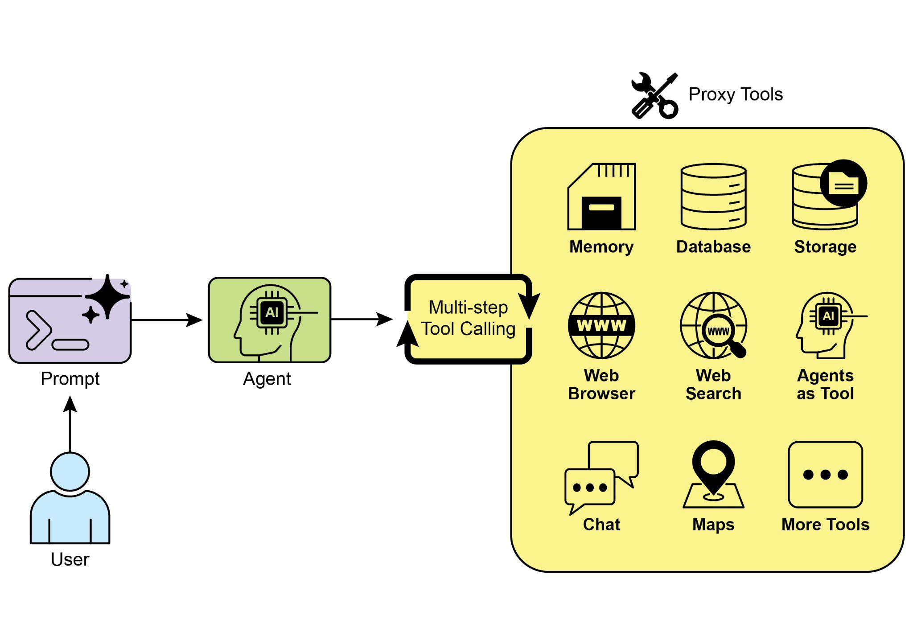
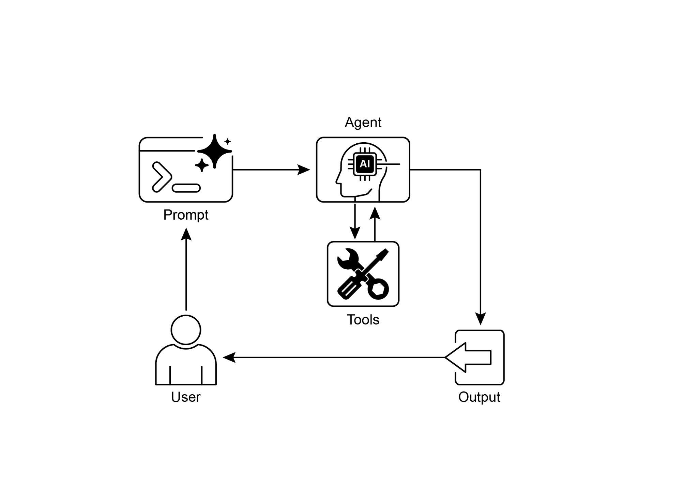

# Chapter 5: Tool Use (Function Calling)

## Tool Use Pattern Overview

So far, we've discussed agentic patterns that primarily involve orchestrating interactions between language models and managing the flow of information within the agent's internal workflow (Chaining, Routing, Parallelization, Reflection). However, for agents to be truly useful and interact with the real world or external systems, they need the ability to use Tools.

> 前文讨论的模式，主要关注如何编排语言模型之间的交互，以及如何管理`智能体内部`工作流中的信息流（链式、路由、并行与反思）。但若要真正与外部系统乃至现实世界交互，智能体还必须具备`使用工具`能力。

The Tool Use pattern, often implemented through a mechanism called Function Calling, enables an agent to interact with external APIs, databases, services, or even execute code. It allows the LLM at the core of the agent to decide when and how to use a specific external function based on the user's request or the current state of the task.

> 工具使用模式通常通过「函数调用」（Function Calling）实现，使智能体能够调用外部 API、数据库、服务，甚至执行代码。位于核心的大语言模型，会根据用户请求或任务当前状态，决定是否调用某个外部函数，以及如何调用。

The process typically involves:

> 一般包括以下步骤：

1. **Tool Definition:** External functions or capabilities are defined and described to the LLM. This description includes the function's purpose, its name, and the parameters it accepts, along with their types and descriptions.  
2. **LLM Decision:** The LLM receives the user's request and the available tool definitions. Based on its understanding of the request and the tools, the LLM decides if calling one or more tools is necessary to fulfill the request.  
3. **Function Call Generation:** If the LLM decides to use a tool, it generates a structured output (often a JSON object) that specifies the name of the tool to call and the arguments (parameters) to pass to it, extracted from the user's request.  
4. **Tool Execution:** The agentic framework or orchestration layer intercepts this structured output. It identifies the requested tool and executes the actual external function with the provided arguments.  
5. **Observation/Result:** The output or result from the tool execution is returned to the agent.  
6. **LLM Processing (Optional but common):** The LLM receives the tool's output as context and uses it to formulate a final response to the user or decide on the next step in the workflow (which might involve calling another tool, reflecting, or providing a final answer).

> 1. **工具定义：** 向 LLM 描述外部函数或能力，包括用途、名称、参数及其类型说明。
> 2. **LLM 决策：** LLM 接收用户请求和可用工具定义，判断是否需要调用一个或多个工具。
> 3. **函数调用生成：** 若需要调用工具，LLM 会生成结构化输出（通常为 JSON），指明工具名称和参数。
> 4. **工具执行：** 框架或编排层拦截该输出，找到对应工具，并用给定参数执行真实函数。
> 5. **结果返回：** 工具执行结果返回给智能体。
> 6. **LLM 再处理（可选但常见）：** LLM 将工具结果纳入上下文，用它生成最终回复，或决定下一步（例如继续调用工具、进行反思，或直接作答）。

This pattern is fundamental because it breaks the limitations of the LLM's training data and allows it to access up-to-date information, perform calculations it can't do internally, interact with user-specific data, or trigger real-world actions. Function calling is the technical mechanism that bridges the gap between the LLM's reasoning capabilities and the vast array of external functionalities available.

> 这一模式的重要性在于，它突破了训练数据的边界：让模型能够获取最新信息、完成自身不擅长的计算、访问用户专属数据，甚至触发真实世界中的动作。`函数调用`(Function Calling) 正是连接 LLM 推理能力与`外部功能`的技术桥梁。

While "function calling" aptly describes invoking specific, predefined code functions, it's useful to consider the more expansive concept of "tool calling." This broader term acknowledges that an agent's capabilities can extend far beyond simple function execution. A "tool" can be a traditional function, but it can also be a complex API endpoint, a request to a database, or even an instruction directed at another specialized agent. This perspective allows us to envision more sophisticated systems where, for instance, a primary agent might delegate a complex data analysis task to a dedicated "analyst agent" or query an external knowledge base through its API. Thinking in terms of "tool calling" better captures the full potential of agents to act as orchestrators across a diverse ecosystem of digital resources and other intelligent entities.

> 「函数调用」准确描述了对预定义代码函数的调用，但「工具调用」的视角更宽：工具不仅可以是传统函数，也可以是复杂 API、数据库查询，甚至是发给另一位专精智能体的指令。这样一来，我们就能构想更复杂的系统，例如主智能体将数据分析任务委派给「分析师智能体」，或通过 API 查询外部知识库。用「工具调用」来理解，更能体现智能体作为编排者连接多种数字资源与其他智能体的潜力。

Frameworks like LangChain, LangGraph, and Google Agent Developer Kit (ADK) provide robust support for defining tools and integrating them into agent workflows, often leveraging the native function calling capabilities of modern LLMs like those in the Gemini or OpenAI series. On the "canvas" of these frameworks, you define the tools and then configure agents (typically LLM Agents) to be aware of and capable of using these tools.

> LangChain、LangGraph、Google ADK 等框架都为工具定义和集成提供了成熟支持，并常结合 Gemini、OpenAI 等模型的原生函数调用能力。在这些框架中，先定义工具，再配置智能体（通常是 LLM Agent），让它能够识别并调用这些工具。

Tool Use is a cornerstone pattern for building powerful, interactive, and externally aware agents.

> 工具使用是构建强大、可交互且具备外部感知能力的智能体的基石模式。

## Practical Applications & Use Cases

The Tool Use pattern is applicable in virtually any scenario where an agent needs to go beyond generating text to perform an action or retrieve specific, dynamic information:

> 只要智能体不只是生成文本，而是需要执行动作或获取动态信息，工具使用模式几乎都适用：

### 1. Information Retrieval from External Sources

Accessing real-time data or information that is not present in the LLM's training data.

> 获取训练数据中不存在或已过时的实时信息与数据。

* **Use Case:** A weather agent.  
  * **Tool:** A weather API that takes a location and returns the current weather conditions.  
  * **Agent Flow:** User asks, "What's the weather in London?", LLM identifies the need for the weather tool, calls the tool with "London", tool returns data, LLM formats the data into a user-friendly response.

> * **用例：** 天气智能体。
>   * **工具：** 接收地点并返回当前天气状况的天气 API。
>   * **流程：** 用户问「伦敦天气如何？」→ LLM 判断需要调用天气工具 → 以 `London` 为参数调用 → 工具返回数据 → LLM 整理成易读回复。

### 2. Interacting with Databases and APIs

Performing queries, updates, or other operations on structured data.

> 对结构化数据执行查询、更新或其他操作。

* **Use Case:** An e-commerce agent.  
  * **Tools:** API calls to check product inventory, get order status, or process payments.  
  * **Agent Flow:** User asks "Is product X in stock?", LLM calls the inventory API, tool returns stock count, LLM tells the user the stock status.

> * **用例：** 电商智能体。
>   * **工具：** 用于查询库存、订单状态或处理支付的 API。
>   * **流程：** 用户问「X 有没有货？」→ LLM 调用库存 API → 返回数量 → LLM 告知库存情况。

### 3. Performing Calculations and Data Analysis

Using external calculators, data analysis libraries, or statistical tools.

> 借助外部计算器、数据分析库或统计工具完成计算与分析。

* **Use Case:** A financial agent.  
  * **Tools:** A calculator function, a stock market data API, a spreadsheet tool.  
  * **Agent Flow:** User asks "What's the current price of AAPL and calculate the potential profit if I bought 100 shares at $150?", LLM calls stock API, gets current price, then calls calculator tool, gets result, formats response.

> * **用例：** 金融智能体。
>   * **工具：** 计算函数、股市行情 API、电子表格工具等。
>   * **流程：** 用户询问 AAPL 现价，以及若以 150 美元买入 100 股的潜在收益 → LLM 先调用股价 API → 再调用计算工具 → 整理成清晰回答。

### 4. Sending Communications

Sending emails, messages, or making API calls to external communication services.

> 发送邮件或消息，或调用外部通信类服务 API。

* **Use Case:** A personal assistant agent.  
  * **Tool:** An email sending API.  
  * **Agent Flow:** User says, "Send an email to John about the meeting tomorrow.", LLM calls an email tool with the recipient, subject, and body extracted from the request.

> * **用例：** 个人助理智能体。
>   * **工具：** 邮件发送 API。
>   * **流程：** 用户说「给 John 发邮件说明天开会的事」→ LLM 从请求中抽取收件人、主题、正文并调用邮件工具。

### 5. Executing Code

Running code snippets in a safe environment to perform specific tasks.

> 在安全环境中运行代码片段以完成特定任务。

* **Use Case:** A coding assistant agent.  
  * **Tool:** A code interpreter.  
  * **Agent Flow:** User provides a Python snippet and asks, "What does this code do?", LLM uses the interpreter tool to run the code and analyze its output.

> * **用例：** 编程助手智能体。
>   * **工具：** 代码解释器。
>   * **流程：** 用户提供 Python 片段并问「这段代码做什么？」→ LLM 通过解释器运行代码并分析输出。

### 6. Controlling Other Systems or Devices

Interacting with smart home devices, IoT platforms, or other connected systems.

> 与智能家居设备、物联网平台或其他联网系统交互。

* **Use Case:** A smart home agent.  
  * **Tool:** An API to control smart lights.  
  * **Agent Flow:** User says, "Turn off the living room lights." LLM calls the smart home tool with the command and target device.

> * **用例：** 智能家居智能体。
>   * **工具：** 控制智能灯具的 API。
>   * **流程：** 用户说「关掉客厅灯」→ LLM 携带命令与目标设备信息调用智能家居工具。

Tool Use is what transforms a language model from a text generator into an agent capable of sensing, reasoning, and acting in the digital or physical world (see Fig. 1\)

> 借助工具，语言模型才能从单纯的`文本生成器`，转变为能够在数字或物理环境中感知、推理并`行动的智能体`（见图 1）。



Fig.1: Some examples of an Agent using Tools

> 图 1：智能体使用工具的若干示例。

## Hands-On Code Example (LangChain)

The implementation of tool use within the LangChain framework is a two-stage process. Initially, one or more tools are defined, typically by encapsulating existing Python functions or other runnable components. Subsequently, these tools are bound to a language model, thereby granting the model the capability to generate a structured tool-use request when it determines that an external function call is required to fulfill a user's query.

> 在 LangChain 中实现工具使用通常分两步：先定义一个或多个工具（通常把现有 Python 函数或其他可运行组件封装为工具），再把它们绑定到语言模型，使模型在判断需要外部函数调用时，能够发出结构化的调用请求。

The following implementation will demonstrate this principle by first defining a simple function to simulate an information retrieval tool. Following this, an agent will be constructed and configured to leverage this tool in response to user input. The execution of this example requires the installation of the core LangChain libraries and a model-specific provider package. Furthermore, proper authentication with the selected language model service, typically via an API key configured in the local environment, is a necessary prerequisite.

> 下面的示例先用一个简单函数模拟信息检索工具，再搭建并配置智能体，让它能根据用户输入调用该工具。运行前需安装 LangChain 核心库和相应的模型提供方包，并在本地环境中配置 API 密钥完成鉴权。

```python
import os
import getpass
import asyncio
import nest_asyncio
from typing import List
from dotenv import load_dotenv
import logging

from langchain_google_genai import ChatGoogleGenerativeAI
from langchain_core.prompts import ChatPromptTemplate
from langchain_core.tools import tool as langchain_tool
from langchain.agents import create_tool_calling_agent, AgentExecutor


# UNCOMMENT
# Prompt the user securely and set API keys as environment variables
os.environ["GOOGLE_API_KEY"] = getpass.getpass("Enter your Google API key: ")
os.environ["OPENAI_API_KEY"] = getpass.getpass("Enter your OpenAI API key: ")

try:
    # A model with function/tool calling capabilities is required.
    llm = ChatGoogleGenerativeAI(model="gemini-2.0-flash", temperature=0)
    print(f"✅ Language model initialized: {llm.model}")
except Exception as e:
    print(f"🛑 Error initializing language model: {e}")
    llm = None


# --- Define a Tool ---
@langchain_tool
def search_information(query: str) -> str:
    """
    Provides factual information on a given topic. Use this tool to find answers to phrases
    like 'capital of France' or 'weather in London?'.
    """
    print(f"\n--- 🛠️ Tool Called: search_information with query: '{query}' ---")

    # Simulate a search tool with a dictionary of predefined results.
    simulated_results = {
        "weather in london": "The weather in London is currently cloudy with a temperature of 15°C.",
        "capital of france": "The capital of France is Paris.",
        "population of earth": "The estimated population of Earth is around 8 billion people.",
        "tallest mountain": "Mount Everest is the tallest mountain above sea level.",
        "default": f"Simulated search result for '{query}': No specific information found, but the topic seems interesting.",
    }
    result = simulated_results.get(query.lower(), simulated_results["default"])
    print(f"--- TOOL RESULT: {result} ---")
    return result


tools = [search_information]


# --- Create a Tool-Calling Agent ---
if llm:
    # This prompt template requires an `agent_scratchpad` placeholder for the agent's internal steps.
    agent_prompt = ChatPromptTemplate.from_messages([
        ("system", "You are a helpful assistant."),
        ("human", "{input}"),
        ("placeholder", "{agent_scratchpad}"),
    ])

    # Create the agent, binding the LLM, tools, and prompt together.
    agent = create_tool_calling_agent(llm, tools, agent_prompt)

    # AgentExecutor is the runtime that invokes the agent and executes the chosen tools.
    # The 'tools' argument is not needed here as they are already bound to the agent.
    agent_executor = AgentExecutor(agent=agent, verbose=True, tools=tools)


async def run_agent_with_tool(query: str):
    """Invokes the agent executor with a query and prints the final response."""
    print(f"\n--- 🏃 Running Agent with Query: '{query}' ---")
    try:
        response = await agent_executor.ainvoke({"input": query})
        print("\n--- ✅ Final Agent Response ---")
        print(response["output"])
    except Exception as e:
        print(f"\n🛑 An error occurred during agent execution: {e}")


async def main():
    """Runs all agent queries concurrently."""
    tasks = [
        run_agent_with_tool("What is the capital of France?"),
        run_agent_with_tool("What's the weather like in London?"),
        run_agent_with_tool("Tell me something about dogs."),  # Should trigger the default tool response
    ]
    await asyncio.gather(*tasks)


nest_asyncio.apply()
asyncio.run(main())

```

The code sets up a tool-calling agent using the LangChain library and the Google Gemini model. It defines a `search_information` tool that simulates providing factual answers to specific queries. The tool has predefined responses for "weather in london," "capital of france," and "population of earth," and a default response for other queries. A ChatGoogleGenerativeAI model is initialized, ensuring it has tool-calling capabilities. A ChatPromptTemplate is created to guide the agent's interaction. The `create_tool_calling_agent` function is used to combine the language model, tools, and prompt into an agent. An AgentExecutor is then set up to manage the agent's execution and tool invocation. The `run_agent_with_tool` asynchronous function is defined to invoke the agent with a given query and print the result. The main asynchronous function prepares multiple queries to be run concurrently. These queries are designed to test both the specific and default responses of the `search_information` tool. Finally, the asyncio.run(main()) call executes all the agent tasks. The code includes checks for successful LLM initialization before proceeding with agent setup and execution.

> 上述代码用 LangChain 与 Google Gemini 搭建了一个工具调用智能体。`search_information` 用来模拟事实检索，对「weather in london」「capital of france」「population of earth」等查询返回预设结果，其余情况走默认分支。代码先初始化具备工具调用能力的 `ChatGoogleGenerativeAI`，再用 `ChatPromptTemplate` 构造提示；`create_tool_calling_agent` 把模型、工具和提示组装成智能体，`AgentExecutor` 负责执行与调度工具。`run_agent_with_tool` 异步发起查询并打印结果，`main` 并发运行多条查询以覆盖不同路径；最后通过 `asyncio.run(main())` 执行整个示例。只有在 LLM 初始化成功后，后续构建与执行才会继续。

## Hands-On Code Example (CrewAI)

This code provides a practical example of how to implement function calling (Tools) within the CrewAI framework. It sets up a simple scenario where an agent is equipped with a tool to look up information. The example specifically demonstrates fetching a simulated stock price using this agent and tool.

> 本示例演示如何在 CrewAI 中实现函数调用：给智能体配一个行情查询工具，再用它查询模拟股价。

```python
# pip install crewai langchain-openai

import os
from crewai import Agent, Task, Crew
from crewai.tools import tool
import logging


# --- Best Practice: Configure Logging ---
# A basic logging setup helps in debugging and tracking the crew's execution.
logging.basicConfig(level=logging.INFO, format='%(asctime)s - %(levelname)s - %(message)s')


# --- Set up your API Key ---
# For production, it's recommended to use a more secure method for key management
# like environment variables loaded at runtime or a secret manager.
#
# Set the environment variable for your chosen LLM provider (e.g., OPENAI_API_KEY)
# os.environ["OPENAI_API_KEY"] = "YOUR_API_KEY"
# os.environ["OPENAI_MODEL_NAME"] = "gpt-4o"


# --- 1. Refactored Tool: Returns Clean Data ---
# The tool now returns raw data (a float) or raises a standard Python error.
# This makes it more reusable and forces the agent to handle outcomes properly.
@tool("Stock Price Lookup Tool")
def get_stock_price(ticker: str) -> float:
    """
    Fetches the latest simulated stock price for a given stock ticker symbol.
    Returns the price as a float. Raises a ValueError if the ticker is not found.
    """
    logging.info(f"Tool Call: get_stock_price for ticker '{ticker}'")
    simulated_prices = {
        "AAPL": 178.15,
        "GOOGL": 1750.30,
        "MSFT": 425.50,
    }
    price = simulated_prices.get(ticker.upper())
    if price is not None:
        return price
    else:
        # Raising a specific error is better than returning a string.
        # The agent is equipped to handle exceptions and can decide on the next action.
        raise ValueError(f"Simulated price for ticker '{ticker.upper()}' not found.")


# --- 2. Define the Agent ---
# The agent definition remains the same, but it will now leverage the improved tool.
financial_analyst_agent = Agent(
    role='Senior Financial Analyst',
    goal='Analyze stock data using provided tools and report key prices.',
    backstory="You are an experienced financial analyst adept at using data sources to find stock information. You provide clear, direct answers.",
    verbose=True,
    tools=[get_stock_price],
    # Allowing delegation can be useful, but is not necessary for this simple task.
    allow_delegation=False,
)


# --- 3. Refined Task: Clearer Instructions and Error Handling ---
# The task description is more specific and guides the agent on how to react
# to both successful data retrieval and potential errors.
analyze_aapl_task = Task(
    description=(
        "What is the current simulated stock price for Apple (ticker: AAPL)? "
        "Use the 'Stock Price Lookup Tool' to find it. "
        "If the ticker is not found, you must report that you were unable to retrieve the price."
    ),
    expected_output=(
        "A single, clear sentence stating the simulated stock price for AAPL. "
        "For example: 'The simulated stock price for AAPL is $178.15.' "
        "If the price cannot be found, state that clearly."
    ),
    agent=financial_analyst_agent,
)


# --- 4. Formulate the Crew ---
# The crew orchestrates how the agent and task work together.
financial_crew = Crew(
    agents=[financial_analyst_agent],
    tasks=[analyze_aapl_task],
    verbose=True  # Set to False for less detailed logs in production
)


# --- 5. Run the Crew within a Main Execution Block ---
# Using a __name__ == "__main__": block is a standard Python best practice.
def main():
    """Main function to run the crew."""
    # Check for API key before starting to avoid runtime errors.
    if not os.environ.get("OPENAI_API_KEY"):
        print("ERROR: The OPENAI_API_KEY environment variable is not set.")
        print("Please set it before running the script.")
        return

    print("\n## Starting the Financial Crew...")
    print("---------------------------------")

    # The kickoff method starts the execution.
    result = financial_crew.kickoff()

    print("\n---------------------------------")
    print("## Crew execution finished.")
    print("\nFinal Result:\n", result)


if __name__ == "__main__":
    main()
```

This code demonstrates a simple application using the Crew.ai library to simulate a financial analysis task. It defines a custom tool, `get_stock_price`, that simulates looking up stock prices for predefined tickers. The tool is designed to return a floating-point number for valid tickers or raise a ValueError for invalid ones. A Crew.ai Agent named `financial_analyst_agent` is created with the role of a Senior Financial Analyst. This agent is given the `get_stock_price` tool to interact with. A Task is defined, `analyze_aapl_task`, specifically instructing the agent to find the simulated stock price for AAPL using the tool. The task description includes clear instructions on how to handle both success and failure cases when using the tool. A Crew is assembled, comprising the `financial_analyst_agent` and the `analyze_aapl_task`. The verbose setting is enabled for both the agent and the crew to provide detailed logging during execution. The main part of the script runs the crew's task using the kickoff() method within a standard `if __name__ \== "__main__":` block. Before starting the crew, it checks if the `OPENAI_API_KEY` environment variable is set, which is required for the agent to function. The result of the crew's execution, which is the output of the task, is then printed to the console. The code also includes basic logging configuration for better tracking of the crew's actions and tool calls. It uses environment variables for API key management, though it notes that more secure methods are recommended for production environments. In short, the core logic showcases how to define tools, agents, and tasks to create a collaborative workflow in Crew.ai.

> 该示例用 CrewAI 模拟一项金融分析任务：自定义工具 `get_stock_price` 用于查询预设股票代码的模拟股价，合法代码返回浮点数，未知代码则抛出 `ValueError`。随后创建担任高级金融分析师角色的 `financial_analyst_agent`，并挂载该工具；任务 `analyze_aapl_task` 明确要求借助工具查询 AAPL 的模拟价格，并说明成功和失败时该如何表述。接着将智能体与任务组成 Crew，并开启 `verbose` 以便观察日志。脚本在标准的 `if __name__ == "__main__":` 块中通过 `kickoff()` 执行任务，启动前会先检查是否已设置 `OPENAI_API_KEY`，结束后再把结果打印到控制台。整体上，它展示了如何在 CrewAI 中定义工具、智能体与任务，并组装成协作式工作流。

## Hands-on code (Google ADK)

The Google Agent Developer Kit (ADK) includes a library of natively integrated tools that can be directly incorporated into an agent's capabilities.

> Google 智能体开发套件（ADK）内置了多种可与智能体能力原生集成的工具。

**Google search:** A primary example of such a component is the Google Search tool. This tool serves as a direct interface to the Google Search engine, equipping the agent with the functionality to perform web searches and retrieve external information.

> **Google 搜索：** 其中典型代表是 Google Search 工具——它直接对接 Google 搜索引擎，使智能体能够进行网页检索并获取外部信息。

```python
from google.adk.agents import Agent as ADKAgent
from google.adk.runners import Runner
from google.adk.sessions import InMemorySessionService
from google.adk.tools import google_search
from google.genai import types
import nest_asyncio
import asyncio


# Define variables required for Session setup and Agent execution
APP_NAME = "Google Search Agent"
USER_ID = "user1234"
SESSION_ID = "1234"


# Define Agent with access to search tool
root_agent = ADKAgent(
    name="basic_search_agent",
    model="gemini-2.0-flash-exp",
    description="Agent to answer questions using Google Search.",
    instruction="I can answer your questions by searching the internet. Just ask me anything!",
    tools=[google_search],  # Google Search is a pre-built tool to perform Google searches.
)


# Agent Interaction
async def call_agent(query: str):
    """
    Helper function to call the agent with a query.
    """
    # Session and Runner
    session_service = InMemorySessionService()
    await session_service.create_session(
        app_name=APP_NAME,
        user_id=USER_ID,
        session_id=SESSION_ID,
    )

    runner = Runner(agent=root_agent, app_name=APP_NAME, session_service=session_service)

    content = types.Content(role='user', parts=[types.Part(text=query)])
    events = runner.run(user_id=USER_ID, session_id=SESSION_ID, new_message=content)

    for event in events:
        if event.is_final_response() and event.content:
            # Safely extract text from the final response
            if hasattr(event.content, "text") and event.content.text:
                final_response = event.content.text
            elif event.content.parts:
                final_response = "".join(
                    part.text for part in event.content.parts if getattr(part, "text", None)
                )
            else:
                final_response = ""
            print("Agent Response:", final_response)


nest_asyncio.apply()
asyncio.run(call_agent("what's the latest ai news?"))
```

This code demonstrates how to create and use a basic agent powered by the Google ADK for Python. The agent is designed to answer questions by utilizing Google Search as a tool. First, necessary libraries from IPython, google.adk, and google.genai are imported. Constants for the application name, user ID, and session ID are defined. An Agent instance named `basic_search_agent` is created with a description and instructions indicating its purpose. It's configured to use the Google Search tool, which is a pre-built tool provided by the ADK. An InMemorySessionService (see Chapter 8) is initialized to manage sessions for the agent. A new session is created for the specified application, user, and session IDs. A Runner is instantiated, linking the created agent with the session service. This runner is responsible for executing the agent's interactions within a session. A helper function `call_agent` is defined to simplify the process of sending a query to the agent and processing the response. Inside `call_agent`, the user's query is formatted as a types.Content object with the role 'user'. The runner.run method is called with the user ID, session ID, and the new message content. The runner.run method returns a list of events representing the agent's actions and responses. The code iterates through these events to find the final response. If an event is identified as the final response, the text content of that response is extracted. The extracted agent response is then printed to the console. Finally, the `call_agent` function is called with the query "what's the latest ai news?" to demonstrate the agent in action.

> 该示例展示如何用 Google ADK for Python 创建并运行一个基础智能体，并以 Google Search 为工具回答问题。代码导入 `google.adk`、`google.genai` 等相关库，定义应用名、用户 ID、会话 ID 等常量；接着创建名为 `basic_search_agent` 的 Agent，写明描述与指令，并挂载 ADK 预置的 Google Search 工具。随后初始化 InMemorySessionService（详见第 8 章）来管理会话，并通过 Runner 将智能体与会话服务连接起来。辅助函数 `call_agent` 会把用户查询封装为 `types.Content`，调用 `runner.run` 并遍历事件，找到最终响应后抽取文本并打印。最后以查询「what's the latest ai news?」演示智能体运行。

**Code execution:** The Google ADK features integrated components for specialized tasks, including an environment for dynamic code execution. The `built_in_code_execution` tool provides an agent with a sandboxed Python interpreter. This allows the model to write and run code to perform computational tasks, manipulate data structures, and execute procedural scripts. Such functionality is critical for addressing problems that require deterministic logic and precise calculations, which are outside the scope of probabilistic language generation alone.

> **代码执行：** ADK 还提供动态代码执行环境。内置的代码执行工具为智能体提供沙箱化 Python 解释器，使模型能够编写并运行代码，以完成数值计算、操作数据结构或执行过程式脚本。对于需要确定性逻辑与精确演算、难以仅靠概率性文本生成解决的问题，这类能力尤为关键。

```python
import os
import getpass
import asyncio
import nest_asyncio
from typing import List
from dotenv import load_dotenv
import logging

from google.adk.agents import Agent as ADKAgent, LlmAgent
from google.adk.runners import Runner
from google.adk.sessions import InMemorySessionService
from google.adk.tools import google_search
from google.adk.code_executors import BuiltInCodeExecutor
from google.genai import types


# Define variables required for Session setup and Agent execution
APP_NAME = "calculator"
USER_ID = "user1234"
SESSION_ID = "session_code_exec_async"


# Agent Definition
code_agent = LlmAgent(
    name="calculator_agent",
    model="gemini-2.0-flash",
    code_executor=BuiltInCodeExecutor(),
    instruction="""You are a calculator agent.
    When given a mathematical expression, write and execute Python code to calculate the result.
    Return only the final numerical result as plain text, without markdown or code blocks.
    """,
    description="Executes Python code to perform calculations.",
)


# Agent Interaction (Async)
async def call_agent_async(query: str):
    # Session and Runner
    session_service = InMemorySessionService()
    await session_service.create_session(app_name=APP_NAME, user_id=USER_ID, session_id=SESSION_ID)

    runner = Runner(agent=code_agent, app_name=APP_NAME, session_service=session_service)

    content = types.Content(role='user', parts=[types.Part(text=query)])
    print(f"\n--- Running Query: {query} ---")

    try:
        # Use run_async
        async for event in runner.run_async(user_id=USER_ID, session_id=SESSION_ID, new_message=content):
            print(f"Event ID: {event.id}, Author: {event.author}")

            if event.content and event.content.parts and event.is_final_response():
                for part in event.content.parts:  # Iterate through all parts
                    if getattr(part, "executable_code", None):
                        # Access the actual code string via .code
                        print(f"  Debug: Agent generated code:\n```python\n{part.executable_code.code}\n```")
                    elif getattr(part, "code_execution_result", None):
                        # Access outcome and output correctly
                        print(
                            "  Debug: Code Execution Result: "
                            f"{part.code_execution_result.outcome} - Output:\n{part.code_execution_result.output}"
                        )
                    elif getattr(part, "text", None) and not part.text.isspace():
                        # Also print any text parts found in any event for debugging
                        print(f"  Text: '{part.text.strip()}'")

                # --- Check for final response AFTER specific parts ---
                text_parts = [part.text for part in event.content.parts if getattr(part, "text", None)]
                final_result = "".join(text_parts)
                print(f"==> Final Agent Response: {final_result}")

    except Exception as e:
        print(f"ERROR during agent run: {e}")

    print("-" * 30)


# Main async function to run the examples
async def main():
    await call_agent_async("Calculate the value of (5 + 7) * 3")
    await call_agent_async("What is 10 factorial?")


# Execute the main async function
try:
    nest_asyncio.apply()
    asyncio.run(main())
except RuntimeError as e:
    # Handle specific error when running asyncio.run in an already running loop (like Jupyter/Colab)
    if "cannot be called from a running event loop" in str(e):
        print("\nRunning in an existing event loop (like Colab/Jupyter).")
        print("Please run `await main()` in a notebook cell instead.")
        # If in an interactive environment like a notebook, you might need to run:
        # await main()
    else:
        raise e  # Re-raise other runtime errors
```

This script uses Google's Agent Development Kit (ADK) to create an agent that solves mathematical problems by writing and executing Python code. It defines an LlmAgent specifically instructed to act as a calculator, equipping it with the `built_in_code_execution` tool. The primary logic resides in the `call_agent_async` function, which sends a user's query to the agent's runner and processes the resulting events. Inside this function, an asynchronous loop iterates through events, printing the generated Python code and its execution result for debugging. The code carefully distinguishes between these intermediate steps and the final event containing the numerical answer. Finally, a main function runs the agent with two different mathematical expressions to demonstrate its ability to perform calculations.

> 该脚本基于 Google ADK 构建了一个通过编写并执行 Python 代码来解决数学问题的智能体：`LlmAgent` 被明确设定为计算器角色，并配备内置代码执行工具。核心逻辑在 `call_agent_async` 中，即向 runner 提交用户查询并处理返回的事件流；函数内部以异步方式遍历事件，打印生成的代码及其执行结果以便调试，并区分中间步骤与包含数值答案的最终事件。`main` 再用两个数学表达式调用该智能体，演示其计算能力。

**Enterprise search:** This code defines a Google ADK application using the google.adk library in Python. It specifically uses a VSearchAgent, which is designed to answer questions by searching a specified Vertex AI Search datastore. The code initializes a VSearchAgent named `q2_strategy_vsearch_agent`, providing a description, the model to use ("gemini-2.0-flash-exp"), and the ID of the Vertex AI Search datastore. The `DATASTORE_ID` is expected to be set as an environment variable. It then sets up a Runner for the agent, using an InMemorySessionService to manage conversation history. An asynchronous function `call_vsearch_agent_async` is defined to interact with the agent. This function takes a query, constructs a message content object, and calls the runner's `run_async` method to send the query to the agent. The function then streams the agent's response back to the console as it arrives. It also prints information about the final response, including any source attributions from the datastore. Error handling is included to catch exceptions during the agent's execution, providing informative messages about potential issues like an incorrect datastore ID or missing permissions. Another asynchronous function `run_vsearch_example` is provided to demonstrate how to call the agent with example queries. The main execution block checks if the `DATASTORE_ID` is set and then runs the example using asyncio.run. It includes a check to handle cases where the code is run in an environment that already has a running event loop, like a Jupyter notebook.

> **企业搜索：** 这一段代码使用 Python 的 `google.adk` 定义应用，并通过 `VSearchAgent` 在指定的 Vertex AI Search 数据存储上检索并回答问题。代码先初始化名为 `q2_strategy_vsearch_agent` 的智能体，包含描述、模型 `gemini-2.0-flash-exp`，以及通过环境变量传入的 `DATASTORE_ID`；再配合 Runner 与 InMemorySessionService 维护对话历史。`call_vsearch_agent_async` 负责构建用户消息、调用 `run_async`，并将回复流式输出到控制台，同时在最终响应处打印来自数据存储的溯源信息；若执行过程中发生异常，也会提示可能是数据存储 ID 错误或权限不足。`run_vsearch_example` 则提供了示例查询。主入口会先确认 `DATASTORE_ID` 已设置，再通过 `asyncio.run` 运行示例，并兼容 Jupyter 等已存在事件循环的环境。

```python
import asyncio
import os

from google.genai import types
from google.adk import agents
from google.adk.runners import Runner
from google.adk.sessions import InMemorySessionService


# --- Configuration ---
# Ensure you have set your GOOGLE_API_KEY and DATASTORE_ID environment variables
# For example:
# os.environ["GOOGLE_API_KEY"] = "YOUR_API_KEY"
# os.environ["DATASTORE_ID"] = "YOUR_DATASTORE_ID"
DATASTORE_ID = os.environ.get("DATASTORE_ID")


# --- Application Constants ---
APP_NAME = "vsearch_app"
USER_ID = "user_123"  # Example User ID
SESSION_ID = "session_456"  # Example Session ID


# --- Agent Definition (Updated with the newer model from the guide) ---
vsearch_agent = agents.VSearchAgent(
    name="q2_strategy_vsearch_agent",
    description="Answers questions about Q2 strategy documents using Vertex AI Search.",
    model="gemini-2.0-flash-exp",  # Updated model based on the guide's examples
    datastore_id=DATASTORE_ID,
    model_parameters={"temperature": 0.0},
)


# --- Runner and Session Initialization ---
runner = Runner(
    agent=vsearch_agent,
    app_name=APP_NAME,
    session_service=InMemorySessionService(),
)


# --- Agent Invocation Logic ---
async def call_vsearch_agent_async(query: str):
    """Initializes a session and streams the agent's response."""
    print(f"User: {query}")
    print("Agent: ", end="", flush=True)
    try:
        # Construct the message content correctly
        content = types.Content(role='user', parts=[types.Part(text=query)])

        # Process events as they arrive from the asynchronous runner
        async for event in runner.run_async(
            user_id=USER_ID,
            session_id=SESSION_ID,
            new_message=content,
        ):
            # For token-by-token streaming of the response text
            if hasattr(event, "content_part_delta") and event.content_part_delta:
                print(event.content_part_delta.text, end="", flush=True)

            # Process the final response and its associated metadata
            if event.is_final_response():
                print()  # Newline after the streaming response
                if getattr(event, "grounding_metadata", None):
                    print(
                        f"  (Source Attributions: "
                        f"{len(event.grounding_metadata.grounding_attributions)} sources found)"
                    )
                else:
                    print("  (No grounding metadata found)")
                print("-" * 30)
    except Exception as e:
        print(f"\nAn error occurred: {e}")
        print("Please ensure your datastore ID is correct and that the service account has the necessary permissions.")
        print("-" * 30)


# --- Run Example ---
async def run_vsearch_example():
    # Replace with a question relevant to YOUR datastore content
    await call_vsearch_agent_async("Summarize the main points about the Q2 strategy document.")
    await call_vsearch_agent_async("What safety procedures are mentioned for lab X?")


# --- Execution ---
if __name__ == "__main__":
    if not DATASTORE_ID:
        print("Error: DATASTORE_ID environment variable is not set.")
    else:
        try:
            asyncio.run(run_vsearch_example())
        except RuntimeError as e:
            # This handles cases where asyncio.run is called in an environment
            # that already has a running event loop (like a Jupyter notebook).
            if "cannot be called from a running event loop" in str(e):
                print("Skipping execution in a running event loop. Please run this script directly.")
            else:
                raise e
```

Overall, this code provides a basic framework for building a conversational AI application that leverages Vertex AI Search to answer questions based on information stored in a datastore. It demonstrates how to define an agent, set up a runner, and interact with the agent asynchronously while streaming the response. The focus is on retrieving and synthesizing information from a specific datastore to answer user queries.

> 总体而言，这段代码提供了一个基础骨架，用于构建借助 Vertex AI Search、基于数据存储内容回答问题的对话式应用。它演示了如何定义智能体、配置 Runner，以及如何异步交互并流式接收回复，重点是从特定数据存储中检索并整合信息以回答用户查询。

**Vertex Extensions:** A Vertex AI extension is a structured API wrapper that enables a model to connect with external APIs for real-time data processing and action execution. Extensions offer enterprise-grade security, data privacy, and performance guarantees. They can be used for tasks like generating and running code, querying websites, and analyzing information from private datastores. Google provides prebuilt extensions for common use cases like Code Interpreter and Vertex AI Search, with the option to create custom ones. The primary benefit of extensions includes strong enterprise controls and seamless integration with other Google products. The key difference between extensions and function calling lies in their execution: Vertex AI automatically executes extensions, whereas function calls require manual execution by the user or client.

> **Vertex 扩展：** Vertex AI 扩展是一种结构化 API 封装，使模型能够连接外部 API，进行实时数据处理并执行各类操作，同时在安全性、数据隐私与性能层面提供企业级保障。它可用于生成并运行代码、查询网站、分析私有数据存储中的信息等场景。Google 提供了 Code Interpreter、Vertex AI Search 等预置扩展，也支持开发者自定义扩展。它的主要价值在于更强的企业级管控能力，以及与 Google 产品体系的顺畅集成。它与函数调用的关键差异在于执行方式：Vertex AI 会自动执行扩展，而函数调用通常仍需由用户或客户端手动触发。

## At a Glance

**What:** LLMs are powerful text generators, but they are fundamentally disconnected from the outside world. Their knowledge is static, limited to the data they were trained on, and they lack the ability to perform actions or retrieve real-time information. This inherent limitation prevents them from completing tasks that require interaction with external APIs, databases, or services. Without a bridge to these external systems, their utility for solving real-world problems is severely constrained.

> **是什么：** LLM 虽然是强大的文本生成器，但本质上与外部世界隔绝：`知识是静态的`，受限于训练语料，既不能主动执行动作，也难以获取实时信息。因此，它无法独立完成依赖外部 API、数据库或服务的任务；如果缺少与这些系统连接的桥梁，它在解决真实问题时的效用就会大打折扣。

**Why:** The Tool Use pattern, often implemented via function calling, provides a standardized solution to this problem. It works by describing available external functions, or "tools," to the LLM in a way it can understand. Based on a user's request, the agentic LLM can then decide if a tool is needed and generate a structured data object (like a JSON) specifying which function to call and with what arguments. An orchestration layer executes this function call, retrieves the result, and feeds it back to the LLM. This allows the LLM to incorporate up-to-date, external information or the result of an action into its final response, effectively giving it the ability to act.

> **为什么：** `工具使用`模式（通常通过`函数调用`实现）为此提供了一套标准做法：先以 LLM 可理解的方式描述可用的外部函数或「工具」；面对用户请求，具备智能体能力的 LLM 再判断是否需要调用工具，并生成结构化数据（如 JSON），指明调用哪个函数以及传入哪些参数；随后由编排层执行调用、取回结果并回传给 LLM，使其能够把最新的外部信息或动作结果纳入最终回复。换言之，这一模式实质上赋予了模型「行动」能力。

**Rule of thumb:** Use the Tool Use pattern whenever an agent needs to break out of the LLM's internal knowledge and interact with the outside world. This is essential for tasks requiring real-time data (e.g., checking weather, stock prices), accessing private or proprietary information (e.g., querying a company's database), performing precise calculations, executing code, or triggering actions in other systems (e.g., sending an email, controlling smart devices).

> **经验法则：** 当智能体必须跳出模型内部知识、`与外部世界交互`时，就应采用工具使用模式。它尤其适用于需要实时数据（如天气、股价）、访问私有或专有信息（如公司数据库）、进行精确计算、执行代码，或在其他系统中触发动作（如发邮件、控制智能设备）的任务。

**Visual summary:**



Fig.2: Tool use design pattern

> 图 2：工具使用设计模式。

## Key Takeaways

* Tool Use (Function Calling) allows agents to interact with external systems and access dynamic information.  
* It involves defining tools with clear descriptions and parameters that the LLM can understand.  
* The LLM decides when to use a tool and generates structured function calls.  
* Agentic frameworks execute the actual tool calls and return the results to the LLM.  
* Tool Use is essential for building agents that can perform real-world actions and provide up-to-date information.  
* LangChain simplifies tool definition using the @tool decorator and provides `create_tool_calling_agent` and AgentExecutor for building tool-using agents.  
* Google ADK has a number of very useful pre-built tools such as Google Search, Code Execution and Vertex AI Search Tool.

> * 工具使用（函数调用）让智能体能够与外部系统交互，并获取动态信息。
> * 工具需要以清晰的描述和参数定义呈现给 LLM。
> * LLM 负责判断何时调用工具，并生成结构化的调用请求。
> * 智能体框架负责执行真实的工具调用，并将结果返回给 LLM。
> * 如果要构建能够采取真实行动、提供最新信息的智能体，工具使用不可或缺。
> * LangChain 可借助 `@tool` 等方式简化工具定义，并通过 `create_tool_calling_agent` 与 AgentExecutor 搭建会用工具的智能体。
> * Google ADK 提供 Google 搜索、代码执行、Vertex AI Search 等实用的预置工具。

## Conclusion

The Tool Use pattern is a critical architectural principle for extending the functional scope of large language models beyond their intrinsic text generation capabilities. By equipping a model with the ability to interface with external software and data sources, this paradigm allows an agent to perform actions, execute computations, and retrieve information from other systems. This process involves the model generating a structured request to call an external tool when it determines that doing so is necessary to fulfill a user's query. Frameworks such as LangChain, Google ADK, and Crew AI offer structured abstractions and components that facilitate the integration of these external tools. These frameworks manage the process of exposing tool specifications to the model and parsing its subsequent tool-use requests. This simplifies the development of sophisticated agentic systems that can interact with and take action within external digital environments.

> `工具使用模式`(Tool Use) 是扩展大语言模型能力边界、突破纯文本生成局限的关键架构原则。为模型接通外部软件与数据源后，智能体才得以执行动作、完成计算并从其他系统取数；当模型判断只有调用外部工具才能满足用户请求时，就会生成结构化的工具调用请求。LangChain、Google ADK、CrewAI 等框架为集成外部工具提供了相应的抽象与组件，负责向模型暴露工具规约，并解析后续的工具调用请求，从而简化能够在外部数字环境中交互并采取行动的高级智能体系统的开发。

## References

1. LangChain Documentation (Tools): [https://python.langchain.com/docs/integrations/tools/](https://python.langchain.com/docs/integrations/tools/)
2. Google Agent Developer Kit (ADK) Documentation (Tools): [https://google.github.io/adk-docs/tools/](https://google.github.io/adk-docs/tools/)
3. OpenAI Function Calling Documentation: [https://platform.openai.com/docs/guides/function-calling](https://platform.openai.com/docs/guides/function-calling)
4. CrewAI Documentation (Tools): [https://docs.crewai.com/concepts/tools](https://docs.crewai.com/concepts/tools)

