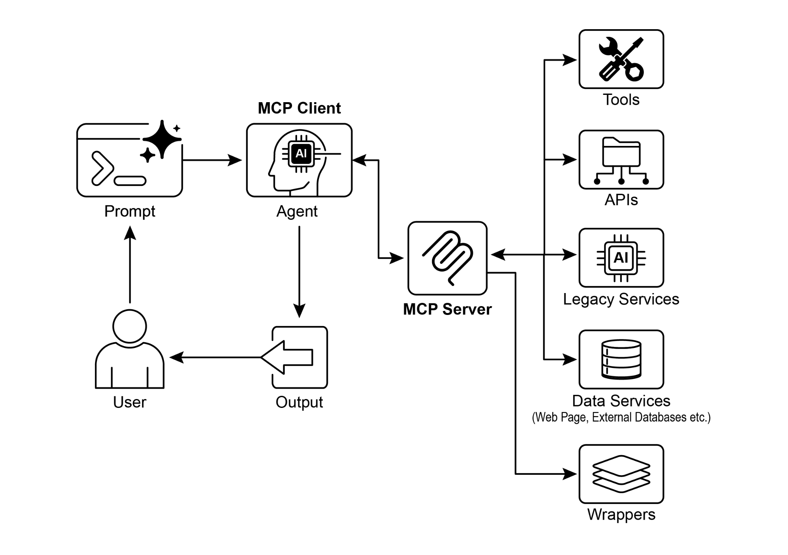

# Chapter 10: Model Context Protocol

> 第 10 章：模型上下文协议（MCP）

To enable LLMs to function effectively as agents, their capabilities must extend beyond multimodal generation. Interaction with the external environment is necessary, including access to current data, utilization of external software, and execution of specific operational tasks. The Model Context Protocol (MCP) addresses this need by providing a standardized interface for LLMs to interface with external resources. This protocol serves as a key mechanism to facilitate consistent and predictable integration.

> 要让 LLM 真正胜任智能体角色，其能力就不能停留在多模态生成上，还必须能够与外部环境交互，包括获取最新数据、调用外部软件以及执行具体操作。模型上下文协议（MCP）正是为此提供的一套标准化接口，使 LLM 能够连接外部资源，并以一致、可预测的方式完成集成。

## MCP Pattern Overview

> ## MCP 模式概览

Imagine a universal adapter that allows any LLM to plug into any external system, database, or tool without a custom integration for each one. That's essentially what the Model Context Protocol (MCP) is. It's an open standard designed to standardize how LLMs like Gemini, OpenAI's GPT models, Mixtral, and Claude communicate with external applications, data sources, and tools. Think of it as a universal connection mechanism that simplifies how LLMs obtain context, execute actions, and interact with various systems.

> 不妨把 MCP 想象成一种通用适配器：任意 LLM 无需为每个外部系统单独编写集成逻辑，就能接入系统、数据库或工具。MCP 本质上就是这样一种机制。它是一项开放标准，旨在规范 Gemini、OpenAI 的 GPT、Mixtral、Claude 等模型与外部应用、数据源及工具之间的通信，可以把它看作一层统一的连接机制，用来简化 LLM 获取上下文、执行动作以及与各类系统交互的方式。

MCP operates on a client-server architecture. It defines how different elements—data (referred to as resources), interactive templates (which are essentially prompts), and actionable functions (known as tools)—are exposed by an MCP server. These are then consumed by an MCP client, which could be an LLM host application or an AI agent itself. This standardized approach dramatically reduces the complexity of integrating LLMs into diverse operational environments.

> MCP 采用客户端—服务器架构。它规定了数据（resources）、交互模板（本质上就是 prompts）以及可执行函数（tools）应如何由 MCP 服务器暴露，再由 MCP 客户端消费。客户端既可以是 LLM 的宿主应用，也可以是 AI 智能体本身。这种标准化方法大幅降低了 LLM 接入多样化运行环境的复杂度。

However, MCP is a contract for an "agentic interface," and its effectiveness depends heavily on the design of the underlying APIs it exposes. There is a risk that developers simply wrap pre-existing, legacy APIs without modification, which can be suboptimal for an agent. For example, if a ticketing system's API only allows retrieving full ticket details one by one, an agent asked to summarize high-priority tickets will be slow and inaccurate at high volumes. To be truly effective, the underlying API should be improved with deterministic features like filtering and sorting to help the non-deterministic agent work efficiently. This highlights that agents do not magically replace deterministic workflows; they often require stronger deterministic support to succeed.

> 不过，MCP 只是「智能体接口」层面的契约，它是否有效，很大程度上仍取决于底层 API 的设计。如果开发者只是把现有的遗留 API 原封不动地包上一层，往往并不适合智能体使用。比如某个工单系统的 API 只能逐条返回完整工单详情，那么当智能体被要求汇总高优先级工单时，在高并发、高数据量场景下就会又慢又不准。要真正发挥作用，底层 API 往往还需要补足过滤、排序等确定性能力，帮助本质上具有非确定性的智能体更高效地工作。这也说明，智能体并不会神奇地取代确定性工作流；恰恰相反，它们往往需要更强的确定性支撑才能真正奏效。

Furthermore, MCP can wrap an API whose input or output is still not inherently understandable by the agent. An API is only useful if its data format is agent-friendly, a guarantee that MCP itself does not enforce. For instance, creating an MCP server for a document store that returns files as PDFs is mostly useless if the consuming agent cannot parse PDF content. The better approach would be to first create an API that returns a textual version of the document, such as Markdown, which the agent can actually read and process. This demonstrates that developers must consider not just the connection, but the nature of the data being exchanged to ensure true compatibility.

> 此外，即便 API 已通过 MCP 暴露，其输入或输出也未必天然就是智能体可以理解的。只有当数据格式对智能体足够友好时，这个接口才真正有价值，而这一点并不是 MCP 本身能够保证的。比如，为某个文档库封装 MCP 服务器，如果返回结果始终是 PDF 文件，而消费它的智能体又无法解析 PDF 内容，那么这个接口其实意义不大。更好的做法，是先提供一个能够返回文档文本版本（例如 Markdown）的 API，再在其上封装 MCP。这说明开发者不仅要考虑「能不能接上」，还要考虑「智能体能不能真正读懂」。

## MCP vs. Tool Function Calling

> ## MCP 与工具函数调用

The Model Context Protocol (MCP) and tool function calling are distinct mechanisms that enable LLMs to interact with external capabilities (including tools) and execute actions. While both serve to extend LLM capabilities beyond text generation, they differ in their approach and level of abstraction.

> MCP 和工具函数调用是两种不同的机制，它们都能让 LLM 与外部能力（包括工具）交互并执行动作。虽然两者都在扩展 LLM 超越文本生成的能力，但在实现方式和抽象层级上并不相同。

Tool function calling can be thought of as a direct request from an LLM to a specific, pre-defined tool or function. Note that in this context we use the words "tool" and "function” interchangeably. This interaction is characterized by a one-to-one communication model, where the LLM formats a request based on its understanding of a user's intent requiring external action. The application code then executes this request and returns the result to the LLM. This process is often proprietary and varies across different LLM providers.

> 工具函数调用可以理解为 LLM 对某个特定、预先定义好的工具或函数发起直接请求。这里的 `tool` 和 `function` 可视为同义。它通常是一种一对一的通信模式：LLM 根据自己对用户意图的理解，组织出一次需要外部执行的调用请求；随后由应用代码实际执行，并将结果返回给 LLM。这一过程通常带有较强的厂商私有色彩，不同模型提供方之间的格式和实现方式往往并不一致。

In contrast, the Model Context Protocol (MCP) operates as a standardized interface for LLMs to discover, communicate with, and utilize external capabilities. It functions as an open protocol that facilitates interaction with a wide range of tools and systems, aiming to establish an ecosystem where any compliant tool can be accessed by any compliant LLM. This fosters interoperability, composability and reusability across different systems and implementations. By adopting a federated model, we significantly improve interoperability and unlock the value of existing assets. This strategy allows us to bring disparate and legacy services into a modern ecosystem simply by wrapping them in an MCP-compliant interface. These services continue to operate independently, but can now be composed into new applications and workflows, with their collaboration orchestrated by LLMs. This fosters agility and reusability without requiring costly rewrites of foundational systems.

> 相比之下，MCP 是一套标准化接口，用于让 LLM 发现、通信并使用外部能力。作为开放协议，它支持与各种工具和系统建立连接，目标是形成一种生态：任何符合规范的工具，都可以被任何符合规范的 LLM 访问。这种设计增强了不同系统之间的互操作性、可组合性和复用性。通过采用联邦式模型，我们不仅能显著提升互操作性，还能释放既有资产的价值。许多异构或遗留服务只需包上一层兼容 MCP 的接口，就可以纳入现代应用生态。它们仍然保持独立运行，却能够被组合进新的应用和工作流中，并由 LLM 进行协同编排，而无需对底层系统进行代价高昂的重写。

Here's a breakdown of the fundamental distinctions between MCP and tool function calling:

> MCP 与工具函数调用的基本区别如下：

| Feature | Tool Function Calling | Model Context Protocol (MCP) |
| ----- | ----- | ----- |
| **Standardization** | Proprietary and vendor-specific. The format and implementation differ across LLM providers. | An open, standardized protocol, promoting interoperability between different LLMs and tools. |
| **Scope** | A direct mechanism for an LLM to request the execution of a specific, predefined function. | A broader framework for how LLMs and external tools discover and communicate with each other. |
| **Architecture** | A one-to-one interaction between the LLM and the application's tool-handling logic. | A client-server architecture where LLM-powered applications (clients) can connect to and utilize various MCP servers (tools). |
| **Discovery** | The LLM is explicitly told which tools are available within the context of a specific conversation. | Enables dynamic discovery of available tools. An MCP client can query a server to see what capabilities it offers. |
| **Reusability** | Tool integrations are often tightly coupled with the specific application and LLM being used. | Promotes the development of reusable, standalone "MCP servers" that can be accessed by any compliant application. |

> | 特性 | 工具函数调用 | 模型上下文协议（MCP） |
> | ----- | ----- | ----- |
> | **标准化** | 通常是专有实现，且因厂商而异；格式和实现方式会随 LLM 提供商不同而变化。 | 属于开放、标准化协议，促进不同 LLM 与工具之间的互操作。 |
> | **范围** | 是 LLM 请求执行某个特定预定义函数的直接机制。 | 是关于 LLM 与外部工具如何发现彼此并进行通信的更广泛框架。 |
> | **架构** | LLM 与应用内部工具处理逻辑之间的一对一交互。 | 客户端—服务器架构，LLM 驱动的应用（客户端）可连接并使用多个 MCP 服务器。 |
> | **发现** | LLM 需要在特定对话上下文中被明确告知有哪些工具可用。 | 支持动态发现；MCP 客户端可以查询服务器当前提供了哪些能力。 |
> | **复用性** | 工具集成通常与具体应用和所用 LLM 紧密耦合。 | 鼓励构建可复用、独立存在的「MCP 服务器」，供任意合规应用访问。 |

Think of tool function calling as giving an AI a specific set of custom-built tools, like a particular wrench and screwdriver. This is efficient for a workshop with a fixed set of tasks. MCP (Model Context Protocol), on the other hand, is like creating a universal, standardized power outlet system. It doesn't provide the tools itself, but it allows any compliant tool from any manufacturer to plug in and work, enabling a dynamic and ever-expanding workshop.

> 可以把工具函数调用想象成给 AI 配上一套定制的扳手和螺丝刀，适合任务固定、工具集合也固定的工作场景。而 MCP 更像是一套统一标准的电源插座系统。它本身并不提供工具，但允许任何厂商生产的合规设备接入并正常工作，从而构建出一个能够持续扩展的动态工作空间。

In short, function calling provides direct access to a few specific functions, while MCP is the standardized communication framework that lets LLMs discover and use a vast range of external resources. For simple applications, specific tools are enough; for complex, interconnected AI systems that need to adapt, a universal standard like MCP is essential.

> 简而言之，函数调用提供的是对少量特定函数的直接访问；而 MCP 提供的是一套标准化通信框架，让 LLM 可以发现并使用更广泛的外部资源。对于简单应用，专用工具通常已经足够；但对于复杂、互联且需要持续适应变化的 AI 系统，像 MCP 这样的通用标准就显得非常关键。

## Additional considerations for MCP

> ## MCP 的额外考量

While MCP presents a powerful framework, a thorough evaluation requires considering several crucial aspects that influence its suitability for a given use case. Let's see some aspects in more details:

> MCP 虽然是一个强大的框架，但是否适合某个具体场景，仍需结合多个关键维度进行全面评估。下面从几个方面作进一步说明：

* **Tool vs. Resource vs. Prompt**: It's important to understand the specific roles of these components. A resource is static data (e.g., a PDF file, a database record). A tool is an executable function that performs an action (e.g., sending an email, querying an API). A prompt is a template that guides the LLM in how to interact with a resource or tool, ensuring the interaction is structured and effective.  
* **Discoverability**: A key advantage of MCP is that an MCP client can dynamically query a server to learn what tools and resources it offers. This "just-in-time" discovery mechanism is powerful for agents that need to adapt to new capabilities without being redeployed.  
* **Security**: Exposing tools and data via any protocol requires robust security measures. An MCP implementation must include authentication and authorization to control which clients can access which servers and what specific actions they are permitted to perform.  
* **Implementation**: While MCP is an open standard, its implementation can be complex. However, providers are beginning to simplify this process. For example, some model providers like Anthropic or FastMCP offer SDKs that abstract away much of the boilerplate code, making it easier for developers to create and connect MCP clients and servers.  
* **Error Handling**: A comprehensive error-handling strategy is critical. The protocol must define how errors (e.g., tool execution failure, unavailable server, invalid request) are communicated back to the LLM so it can understand the failure and potentially try an alternative approach.  
* **Local vs. Remote Server**: MCP servers can be deployed locally on the same machine as the agent or remotely on a different server. A local server might be chosen for speed and security with sensitive data, while a remote server architecture allows for shared, scalable access to common tools across an organization.  
* **On-demand vs. Batch**: MCP can support both on-demand, interactive sessions and larger-scale batch processing. The choice depends on the application, from a real-time conversational agent needing immediate tool access to a data analysis pipeline that processes records in batches.  
* **Transportation Mechanism**: The protocol also defines the underlying transport layers for communication. For local interactions, it uses JSON-RPC over STDIO (standard input/output) for efficient inter-process communication. For remote connections, it leverages web-friendly protocols like Streamable HTTP and Server-Sent Events (SSE) to enable persistent and efficient client-server communication.

> * **Tool / Resource / Prompt：** 首先要明确三者的角色。Resource 通常指静态数据，例如 PDF 文件或数据库记录；Tool 是执行动作的函数，例如发送邮件或查询 API；Prompt 则是引导 LLM 如何与 Resource 或 Tool 交互的模板，用于保证交互过程结构化且更高效。
> * **可发现性：** MCP 的一个核心优势是，客户端可以动态查询服务器当前提供了哪些工具和资源。这种「即时发现」机制，对于那些需要在无需重新部署的情况下接入新能力的智能体尤其重要。
> * **安全：** 任何通过协议对外暴露工具与数据的做法，都必须具备可靠的安全机制。MCP 实现应当包含认证与授权能力，用来控制哪些客户端可以访问哪些服务器，以及它们被允许执行哪些具体操作。
> * **实现：** 虽然 MCP 是开放标准，但实际实现并不总是简单。不过，越来越多的提供方开始降低其接入门槛。例如 Anthropic 和 FastMCP 等提供了 SDK，帮助开发者屏蔽大量样板代码，更轻松地构建并连接 MCP 客户端和服务器。
> * **错误处理：** 一套完整的错误处理策略至关重要。协议需要明确，当工具执行失败、服务器不可用或请求无效时，应如何把错误信息传回 LLM，使其能够理解发生了什么，并在必要时尝试替代方案。
> * **本地 vs. 远程服务器：** MCP 服务器既可以部署在与智能体相同的本地机器上，也可以运行在远端服务器上。本地部署往往更强调速度和敏感数据安全；远程部署则更适合在组织内部共享通用工具，并实现更好的扩展性。
> * **按需 vs. 批处理：** MCP 同时支持按需的交互式调用和更大规模的批处理任务。具体采用哪种方式，取决于应用场景：有的场景是需要实时访问工具的对话式智能体，有的则是按批处理记录的数据分析管道。
> * **传输机制：** MCP 还规定了底层通信所使用的传输方式。对于本地交互，它通常采用基于 STDIO 的 JSON-RPC，以实现高效的进程间通信；对于远程连接，则可以使用更适合 Web 场景的协议，如 Streamable HTTP 和 Server-Sent Events（SSE），从而建立持久而高效的客户端—服务器通信通道。

The Model Context Protocol uses a client-server model to standardize information flow. Understanding component interaction is key to MCP's advanced agentic behavior:

> MCP 通过客户端—服务器模型对信息流进行标准化。要理解它如何支持更高级的智能体行为，关键在于先弄清楚各个组件之间是如何协同工作的：

1. **Large Language Model (LLM)**: The core intelligence. It processes user requests, formulates plans, and decides when it needs to access external information or perform an action.  
2. **MCP Client**: This is an application or wrapper around the LLM. It acts as the intermediary, translating the LLM's intent into a formal request that conforms to the MCP standard. It is responsible for discovering, connecting to, and communicating with MCP Servers.  
3. **MCP Server**: This is the gateway to the external world. It exposes a set of tools, resources, and prompts to any authorized MCP Client. Each server is typically responsible for a specific domain, such as a connection to a company's internal database, an email service, or a public API.  
4. ​​**Optional Third-Party (3P) Service:** This represents the actual external tool, application, or data source that the MCP Server manages and exposes. It is the ultimate endpoint that performs the requested action, such as querying a proprietary database, interacting with a SaaS platform, or calling a public weather API.

> 1. **大语言模型（LLM）：** 系统中的核心智能。它负责理解用户请求、形成计划，并决定何时需要访问外部信息或执行某项操作。
> 2. **MCP 客户端：** 这是包裹在 LLM 外部的应用层或中间封装层。它充当中介，将 LLM 的意图转换成符合 MCP 标准的正式请求，并负责发现、连接和调用 MCP 服务器。
> 3. **MCP 服务器：** 它是通向外部世界的网关，向获得授权的 MCP 客户端暴露工具、资源和提示模板。每个服务器通常专注于某一特定领域，例如企业内部数据库、邮件服务或公共 API。
> 4. **可选的第三方（3P）服务：** 指由 MCP 服务器管理并对外暴露的实际外部工具、应用或数据源。它是真正执行动作的最终端点，例如查询专有数据库、调用 SaaS 平台，或请求公共天气 API。

The interaction flows as follows:

> 交互流程如下：

1. **Discovery**: The MCP Client, on behalf of the LLM, queries an MCP Server to ask what capabilities it offers. The server responds with a manifest listing its available tools (e.g., send_email), resources (e.g., customer_database), and prompts.  
2. **Request Formulation**: The LLM determines that it needs to use one of the discovered tools. For instance, it decides to send an email. It formulates a request, specifying the tool to use (send_email) and the necessary parameters (recipient, subject, body).  
3. **Client Communication**: The MCP Client takes the LLM's formulated request and sends it as a standardized call to the appropriate MCP Server.  
4. **Server Execution**: The MCP Server receives the request. It authenticates the client, validates the request, and then executes the specified action by interfacing with the underlying software (e.g., calling the send() function of an email API).  
5. **Response and Context Update**: After execution, the MCP Server sends a standardized response back to the MCP Client. This response indicates whether the action was successful and includes any relevant output (e.g., a confirmation ID for the sent email). The client then passes this result back to the LLM, updating its context and enabling it to proceed with the next step of its task.

> 1. **发现（Discovery）：** MCP 客户端代表 LLM 向服务器查询其提供了哪些能力。服务器随后返回一份清单，其中列出可用的工具（例如 `send_email`）、资源（例如 `customer_database`）以及 prompts。
> 2. **构造请求（Request Formulation）：** LLM 判断自己需要调用某个已发现的工具。例如，它决定发送一封邮件，于是会构造一次请求，指明要使用的工具（`send_email`）以及所需参数（收件人、主题、正文）。
> 3. **客户端通信（Client Communication）：** MCP 客户端接收 LLM 构造好的请求，并将其以标准化调用的形式发送给相应的 MCP 服务器。
> 4. **服务器执行（Server Execution）：** MCP 服务器收到请求后，会先完成客户端认证与请求校验，再通过底层软件执行相应动作，例如调用邮件 API 的 `send()` 方法。
> 5. **响应与上下文更新（Response and Context Update）：** 执行完成后，MCP 服务器会把标准化响应返回给客户端，说明调用是否成功，并附带相关输出（例如邮件发送确认 ID）。客户端随后再把结果传回 LLM，更新其上下文，使其能够继续完成后续步骤。

## Practical Applications & Use Cases

> ## 实践应用与用例

MCP significantly broadens AI/LLM capabilities, making them more versatile and powerful. Here are nine key use cases:

> MCP 显著拓展了 AI/LLM 的能力边界，使其在更多场景中具备实际可用性和执行能力。下面列出九类典型用例：

* **Database Integration:** MCP allows LLMs and agents to seamlessly access and interact with structured data in databases. For instance, using the MCP Toolbox for Databases, an agent can query Google BigQuery datasets to retrieve real-time information, generate reports, or update records, all driven by natural language commands.  
* **Generative Media Orchestration:** MCP enables agents to integrate with advanced generative media services. Through MCP Tools for Genmedia Services, an agent can orchestrate workflows involving Google's Imagen for image generation, Google's Veo for video creation, Google's Chirp 3 HD for realistic voices, or Google's Lyria for music composition, allowing for dynamic content creation within AI applications.  
* **External API Interaction:** MCP provides a standardized way for LLMs to call and receive responses from any external API. This means an agent can fetch live weather data, pull stock prices, send emails, or interact with CRM systems, extending its capabilities far beyond its core language model.  
* **Reasoning-Based Information Extraction:** Leveraging an LLM's strong reasoning skills, MCP facilitates effective, query-dependent information extraction that surpasses conventional search and retrieval systems. Instead of a traditional search tool returning an entire document, an agent can analyze the text and extract the precise clause, figure, or statement that directly answers a user's complex question.  
* **Custom Tool Development:** Developers can build custom tools and expose them via an MCP server (e.g., using FastMCP). This allows specialized internal functions or proprietary systems to be made available to LLMs and other agents in a standardized, easily consumable format, without needing to modify the LLM directly.  
* **Standardized LLM-to-Application Communication:** MCP ensures a consistent communication layer between LLMs and the applications they interact with. This reduces integration overhead, promotes interoperability between different LLM providers and host applications, and simplifies the development of complex agentic systems.  
* **Complex Workflow Orchestration:** By combining various MCP-exposed tools and data sources, agents can orchestrate highly complex, multi-step workflows. An agent could, for example, retrieve customer data from a database, generate a personalized marketing image, draft a tailored email, and then send it, all by interacting with different MCP services.  
* **IoT Device Control:** MCP can facilitate LLM interaction with Internet of Things (IoT) devices. An agent could use MCP to send commands to smart home appliances, industrial sensors, or robotics, enabling natural language control and automation of physical systems.  
* **Financial Services Automation:** In financial services, MCP could enable LLMs to interact with various financial data sources, trading platforms, or compliance systems. An agent might analyze market data, execute trades, generate personalized financial advice, or automate regulatory reporting, all while maintaining secure and standardized communication.

> * **数据库集成：** MCP 让 LLM 和智能体能够无缝访问并操作数据库中的结构化数据。例如借助 MCP Toolbox for Databases，智能体可以通过自然语言查询 Google BigQuery 数据集、生成报表，甚至更新记录。
> * **生成式媒体编排：** MCP 使智能体能够接入先进的生成式媒体服务。通过面向 Genmedia Services 的 MCP 工具，智能体可以编排涉及 Google Imagen（图像生成）、Google Veo（视频生成）、Google Chirp 3 HD（高拟真语音）以及 Google Lyria（音乐生成）的工作流，从而在 AI 应用中动态创作内容。
> * **外部 API 交互：** MCP 为 LLM 调用外部 API 并接收响应提供了标准化方式。这意味着智能体可以获取实时天气、抓取股价、发送电子邮件，或者与 CRM 系统交互，使其能力远远超出模型本身。
> * **基于推理的信息抽取：** 借助 LLM 强大的推理能力，MCP 可以支持更有效、依赖查询上下文的信息抽取，超越传统检索系统的「整篇返回」模式。智能体不必只返回一整份文档，而是可以分析文本，并精确提取出直接回答复杂问题的条款、数字或陈述。
> * **自定义工具开发：** 开发者可以构建自定义工具，并通过 MCP 服务器将其暴露出来（例如使用 FastMCP）。这样一来，专用的内部功能或专有系统就能够以标准化、易于消费的形式提供给 LLM 和其他智能体，而无需直接修改模型本身。
> * **LLM 与应用之间的标准化通信：** MCP 为 LLM 与应用程序之间建立了一致的通信层，能够降低集成成本，促进不同 LLM 提供方与宿主应用之间的互操作，并简化复杂智能体系统的开发过程。
> * **复杂工作流编排：** 通过组合多个经 MCP 暴露的工具和数据源，智能体可以编排复杂的多步骤工作流。例如，它可以先从数据库获取客户数据，再生成个性化营销图片、起草定制邮件，最后将邮件发送出去，整个过程中调用的是不同的 MCP 服务。
> * **物联网设备控制：** MCP 还可以支持 LLM 与物联网（IoT）设备交互。智能体能够通过 MCP 向智能家居设备、工业传感器或机器人发送指令，实现自然语言控制和物理系统自动化。
> * **金融服务自动化：** 在金融服务场景中，MCP 可以让 LLM 接入各种金融数据源、交易平台或合规系统。智能体可以据此分析市场数据、执行交易、生成个性化理财建议，或自动完成监管报送，同时确保通信过程安全且标准化。

In short, the Model Context Protocol (MCP) enables agents to access real-time information from databases, APIs, and web resources. It also allows agents to perform actions like sending emails, updating records, controlling devices, and executing complex tasks by integrating and processing data from various sources. Additionally, MCP supports media generation tools for AI applications.

> 简言之，MCP 使智能体能够从数据库、API 和 Web 资源中获取实时信息，也能执行发送邮件、更新记录、控制设备等操作，并通过整合和处理多种数据源来完成复杂任务。此外，MCP 还支持在 AI 应用中接入媒体生成工具。

## Hands-On Code Example with ADK

> ## 使用 ADK 的动手代码示例

This section outlines how to connect to a local MCP server that provides file system operations, enabling an ADK  agent to interact with the local file system.

> 本节将演示如何连接一个提供文件系统操作能力的本地 MCP 服务器，从而让 ADK 智能体能够与本地文件系统交互。

### Agent Setup with MCPToolset

> ### 使用 MCPToolset 配置智能体

To configure an agent for file system interaction, an `agent.py` file must be created (e.g., at `./adk_agent_samples/mcp_agent/agent.py`). The `MCPToolset` is instantiated within the `tools` list of the `LlmAgent` object. It is crucial to replace `"/path/to/your/folder"` in the `args` list with the absolute path to a directory on the local system that the MCP server can access. This directory will be the root for the file system operations performed by the agent.

> 要配置一个支持文件系统交互的智能体，需要创建一个 `agent.py` 文件（例如 `./adk_agent_samples/mcp_agent/agent.py`）。然后，在 `LlmAgent` 对象的 `tools` 列表中实例化 `MCPToolset`。需要特别注意的是，`args` 列表中的 `"/path/to/your/folder"` 必须替换为本地系统上一个 MCP 服务器可以访问的目录的**绝对路径**。这个目录将作为智能体执行文件系统操作时的根目录。

```python
import os

from google.adk.agents import LlmAgent
from google.adk.tools.mcp_tool.mcp_toolset import MCPToolset, StdioServerParameters


# Create a reliable absolute path to a folder named 'mcp_managed_files'
# within the same directory as this agent script.
# This ensures the agent works out-of-the-box for demonstration.
# For production, you would point this to a more persistent and secure location.
TARGET_FOLDER_PATH = os.path.join(
    os.path.dirname(os.path.abspath(__file__)),
    "mcp_managed_files",
)

# Ensure the target directory exists before the agent needs it.
os.makedirs(TARGET_FOLDER_PATH, exist_ok=True)

root_agent = LlmAgent(
    model="gemini-2.0-flash",
    name="filesystem_assistant_agent",
    instruction=(
        "Help the user manage their files. You can list files, read files, and write files. "
        f"You are operating in the following directory: {TARGET_FOLDER_PATH}"
    ),
    tools=[
        MCPToolset(
            connection_params=StdioServerParameters(
                command="npx",
                args=[
                    "-y",  # Argument for npx to auto-confirm install
                    "@modelcontextprotocol/server-filesystem",
                    # This MUST be an absolute path to a folder.
                    TARGET_FOLDER_PATH,
                ],
            ),
            # Optional: You can filter which tools from the MCP server are exposed.
            # For example, to only allow reading:
            # tool_filter=['list_directory', 'read_file']
        )
    ],
)
```

`npx` (Node Package Execute), bundled with npm (Node Package Manager) versions 5.2.0 and later, is a utility that enables direct execution of Node.js packages from the npm registry. This eliminates the need for global installation. In essence, `npx` serves as an npm package runner, and it is commonly used to run many community MCP servers, which are distributed as Node.js packages.

> `npx`（Node Package Execute）随 npm 5.2.0 及以上版本一同提供，它允许用户直接从 npm 注册表执行 Node.js 包，而无需先进行全局安装。归根结底，`npx` 就是 npm 的包执行器，因此常被用来运行那些以 Node.js 包形式分发的社区 MCP 服务器。

Creating an `__init__.py` file is necessary to ensure the agent.py file is recognized as part of a discoverable Python package for the Agent Development Kit (ADK). This file should reside in the same directory as [agent.py](http://agent.py).

> 还需要创建一个 `__init__.py` 文件，以确保 `agent.py` 会被 ADK 识别为一个可发现的 Python 包的一部分。该文件应与 `agent.py` 位于同一目录。

```python
# ./adk_agent_samples/mcp_agent/__init__.py 
from . import agent
```

Certainly, other supported commands are available for use. For example, connecting to python3 can be achieved as follows:

> 当然，也可以使用其他受支持的命令。比如，下面展示了如何连接到 `python3`：

```python
connection_params = StdioConnectionParams(
    server_params={
        "command": "python3",
        "args": ["./agent/mcp_server.py"],
        "env": {
            "SERVICE_ACCOUNT_PATH": SERVICE_ACCOUNT_PATH,
            "DRIVE_FOLDER_ID": DRIVE_FOLDER_ID,
        },
    }
)
```

UVX, in the context of Python, refers to a command-line tool that utilizes uv to execute commands in a temporary, isolated Python environment. Essentially, it allows you to run Python tools and packages without needing to install them globally or within your project's environment. You can run it via the MCP server.

> 在 Python 生态中，UVX 是一个基于 `uv` 的命令行工具，可在临时、隔离的 Python 环境中执行命令。借助它，你可以在不进行全局安装、也不污染当前项目环境的情况下运行 Python 工具和包，并通过 MCP 服务器来调用这些能力。

```python
connection_params = StdioConnectionParams(
    server_params={
        "command": "uvx",
        "args": ["mcp-google-sheets@latest"],
        "env": {
            "SERVICE_ACCOUNT_PATH": SERVICE_ACCOUNT_PATH,
            "DRIVE_FOLDER_ID": DRIVE_FOLDER_ID,
        },
    }
)
```

Once the MCP Server is created, the next step is to connect to it.

> MCP 服务器创建后，下一步是连接它。

## Connecting the MCP Server with ADK Web

> ## 用 ADK Web 连接 MCP 服务器

To begin, execute 'adk web'. Navigate to the parent directory of mcp_agent (e.g., adk_agent_samples) in your terminal and run:

> 首先运行 `adk web`。在终端中进入 `mcp_agent` 的父目录（例如 `adk_agent_samples`），然后执行：

```python
cd ./adk_agent_samples # Or your equivalent parent directory 
adk web
```

Once the ADK Web UI has loaded in your browser, select the `filesystem_assistant_agent` from the agent menu. Next, experiment with prompts such as:

> 当 ADK Web UI 在浏览器中加载完成后，从智能体菜单中选择 `filesystem_assistant_agent`，然后可以尝试输入如下提示：

* "Show me the contents of this folder."  
* "Read the `sample.txt` file." (This assumes `sample.txt` is located at `TARGET_FOLDER_PATH`.)  
* "What's in `another_file.md`?"

> * 「显示此文件夹内容。」
> * 「读取 `sample.txt`。」（假定该文件在 `TARGET_FOLDER_PATH`。）
> * 「`another_file.md` 里有什么？」

## Creating an MCP Server with FastMCP

> ## 用 FastMCP 创建 MCP 服务器

FastMCP is a high-level Python framework designed to streamline the development of MCP servers. It provides an abstraction layer that simplifies protocol complexities, allowing developers to focus on core logic.

> FastMCP 是一个用于简化 MCP 服务器开发的高级 Python 框架。它通过提供抽象层来屏蔽协议层面的复杂性，使开发者能够把精力集中在核心业务逻辑上。

The library enables rapid definition of tools, resources, and prompts using simple Python decorators. A significant advantage is its automatic schema generation, which intelligently interprets Python function signatures, type hints, and documentation strings to construct necessary AI model interface specifications. This automation minimizes manual configuration and reduces human error.

> 该库支持开发者通过简洁的 Python 装饰器快速定义 tools、resources 和 prompts。它的一大优势是能够自动生成 schema：FastMCP 会根据 Python 函数签名、类型注解以及文档字符串，自动构建模型侧所需的接口描述，从而减少手工配置工作，并降低人为出错的概率。

Beyond basic tool creation, FastMCP facilitates advanced architectural patterns like server composition and proxying. This enables modular development of complex, multi-component systems and seamless integration of existing services into an AI-accessible framework. Additionally, FastMCP includes optimizations for efficient, distributed, and scalable AI-driven applications.

> 除了基础工具的创建之外，FastMCP 还支持服务器组合、代理等更高级的架构模式。这使得开发者能够以模块化方式构建复杂的多组件系统，也能更顺畅地将现有服务接入一个可供 AI 访问的框架。此外，FastMCP 还包含面向高效、分布式和可扩展 AI 应用的优化能力。

## Server setup with FastMCP

> ## 用 FastMCP 搭建服务器

To illustrate, consider a basic "greet" tool provided by the server. ADK agents and other MCP clients can interact with this tool using HTTP once it is active

> 示例：服务器提供一个基础的 `greet` 工具；当 FastMCP 服务启动后，ADK 智能体及其他 MCP 客户端即可通过 HTTP 调用它

```python
# fastmcp_server.py
# This script demonstrates how to create a simple MCP server using FastMCP.
# It exposes a single tool that generates a greeting.
# 1. Make sure you have FastMCP installed:
# pip install fastmcp

from fastmcp import FastMCP, Client


# Initialize the FastMCP server.
mcp_server = FastMCP()


# Define a simple tool function.
# The `@mcp_server.tool` decorator registers this Python function as an MCP tool.
# The docstring becomes the tool's description for the LLM.
@mcp_server.tool
def greet(name: str) -> str:
    """
    Generates a personalized greeting.

    Args:
        name: The name of the person to greet.

    Returns:
        A greeting string.
    """
    return f"Hello, {name}! Nice to meet you."


# Or if you want to run it from the script:
if __name__ == "__main__":
    mcp_server.run(
        transport="http",
        host="127.0.0.1",
        port=8000,
    )
```

This Python script defines a single function called greet, which takes a person's name and returns a personalized greeting. The @tool() decorator above this function automatically registers it as a tool that an AI or another program can use. The function's documentation string and type hints are used by FastMCP to tell the Agent how the tool works, what inputs it needs, and what it will return.

> 这个脚本定义了一个名为 `greet` 的函数，它接收一个人的姓名，并返回个性化问候语。函数上方的 `@mcp_server.tool` 装饰器会自动将它注册为一个可供 AI 或其他程序调用的工具。函数的文档字符串和类型注解则会被 FastMCP 用来生成工具说明，告诉智能体这个工具如何使用、需要哪些输入以及会返回什么结果。

When the script is executed, it starts the FastMCP server, which listens for requests on localhost:8000. This makes the greet function available as a network service. An  agent could then be configured to connect to this server and use the greet tool to generate greetings as part of a larger task. The server runs continuously until it is manually stopped.

> 当脚本运行后，FastMCP 服务器就会启动，并在 `localhost:8000` 上监听请求。这会使 `greet` 函数以网络服务的形式对外可用。随后，智能体就可以被配置为连接这个服务器，并在更大的任务流程中使用 `greet` 工具。除非手动停止，否则服务器会持续运行。

## Consuming the FastMCP Server with an ADK Agent

> ## 用 ADK 智能体消费 FastMCP 服务器

An ADK agent can be set up as an MCP client to use a running FastMCP server. This requires configuring HttpServerParameters with the FastMCP server's network address, which is usually <http://localhost:8000>.

> ADK 智能体可以被配置为一个 MCP 客户端，以使用已经运行起来的 FastMCP 服务器。为此，需要通过 `HttpServerParameters` 指定 FastMCP 服务器的网络地址，通常是 <http://localhost:8000>。

A `tool_filter` parameter can be included to restrict the agent's tool usage to specific tools offered by the server, such as 'greet'. When prompted with a request like "Greet John Doe," the agent's embedded LLM identifies the 'greet' tool available via MCP, invokes it with the argument "John Doe," and returns the server's response. This process demonstrates the integration of user-defined tools exposed through MCP with an ADK agent.

> 你还可以通过 `tool_filter` 参数，将智能体可用的工具限制在服务器提供的某几个特定工具上，例如 `greet`。当用户输入类似「Greet John Doe」的请求时，智能体内部的 LLM 会识别出 MCP 暴露的 `greet` 工具，并以 `John Doe` 作为参数进行调用，最后把服务器返回的结果展示出来。这个过程展示了：用户自定义并通过 MCP 暴露的工具，是如何与 ADK 智能体集成在一起的。

To establish this configuration, an agent file (e.g., agent.py located in ./adk_agent_samples/fastmcp_client_agent/) is required. This file will instantiate an ADK agent and use HttpServerParameters to establish a connection with the operational FastMCP server.

> 为了完成这项配置，需要准备一个智能体文件（例如 `./adk_agent_samples/fastmcp_client_agent/agent.py`）。该文件会实例化一个 ADK 智能体，并通过 `HttpServerParameters` 连接到正在运行的 FastMCP 服务器。

```python
# ./adk_agent_samples/fastmcp_client_agent/agent.py
import os

from google.adk.agents import LlmAgent
from google.adk.tools.mcp_tool.mcp_toolset import MCPToolset, HttpServerParameters


# Define the FastMCP server's address.
# Make sure your fastmcp_server.py (defined previously) is running on this port.
FASTMCP_SERVER_URL = "http://localhost:8000"

root_agent = LlmAgent(
    model="gemini-2.0-flash",  # Or your preferred model
    name="fastmcp_greeter_agent",
    instruction='You are a friendly assistant that can greet people by their name. Use the "greet" tool.',
    tools=[
        MCPToolset(
            connection_params=HttpServerParameters(
                url=FASTMCP_SERVER_URL,
            ),
            # Optional: Filter which tools from the MCP server are exposed
            # For this example, we're expecting only 'greet'
            tool_filter=["greet"],
        )
    ],
)
```

The script defines an Agent named `fastmcp_greeter_agent` that uses a Gemini language model. It's given a specific instruction to act as a friendly assistant whose purpose is to greet people. Crucially, the code equips this agent with a tool to perform its task. It configures an MCPToolset to connect to a separate server running on localhost:8000, which is expected to be the FastMCP server from the previous example. The agent is specifically granted access to the greet tool hosted on that server. In essence, this code sets up the client side of the system, creating an intelligent agent that understands its goal is to greet people and knows exactly which external tool to use to accomplish it.

> 这段脚本创建了一个名为 `fastmcp_greeter_agent` 的智能体，并使用 Gemini 作为底层语言模型。它被赋予了一条明确的系统指令：充当一个友好的助手，负责按姓名向用户问候。更关键的是，这段代码通过 `MCPToolset` 将智能体连接到运行在本机 `8000` 端口上的 FastMCP 服务，也就是前文示例中的服务器，并通过 `tool_filter` 只开放 `greet` 这一项工具。换句话说，这段代码完成的是系统「客户端侧」的配置：它让智能体既知道自己的任务目标是什么，也知道应当调用哪项外部能力来完成任务。

Creating an `__init__.py` file within the `fastmcp_client_agent` directory is necessary. This ensures the agent is recognized as a discoverable Python package for the ADK.

> 还需要在 `fastmcp_client_agent` 目录下创建一个 `__init__.py` 文件，以便 ADK 将该智能体识别为一个可发现的 Python 包。

To begin, open a new terminal and run `python fastmcp_server.py` to start the FastMCP server. Next, go to the parent directory of `fastmcp_client_agent` (for example, `adk_agent_samples`) in your terminal and execute `adk web`. Once the ADK Web UI loads in your browser, select the `fastmcp_greeter_agent` from the agent menu. You can then test it by entering a prompt like "Greet John Doe." The agent will use the `greet` tool on your FastMCP server to create a response.

> 首先，打开一个新的终端并运行 `python fastmcp_server.py`，启动 FastMCP 服务器。然后，在终端中进入 `fastmcp_client_agent` 的父目录（例如 `adk_agent_samples`），执行 `adk web`。当 ADK Web UI 在浏览器中加载完成后，从智能体菜单中选择 `fastmcp_greeter_agent`。接着，你可以输入类似「Greet John Doe」的提示进行测试。此时，智能体会调用 FastMCP 服务器上的 `greet` 工具来生成回复。

## At a Glance

> ## 一览

**What:** To function as effective agents, LLMs must move beyond simple text generation. They require the ability to interact with the external environment to access current data and utilize external software. Without a standardized communication method, each integration between an LLM and an external tool or data source becomes a custom, complex, and non-reusable effort. This ad-hoc approach hinders scalability and makes building complex, interconnected AI systems difficult and inefficient.

> **问题：** 如果 LLM 想真正成为有效的智能体，就必须超越单纯的文本生成，具备与外部环境交互、获取最新数据以及调用外部软件的能力。若缺乏标准化的通信方式，那么每一次将 LLM 与外部工具或数据源集成，都会变成定制化、复杂且难以复用的工程工作。这种临时拼凑式的方式不仅不利于扩展，也会让复杂、互联的 AI 系统变得难以构建且效率低下。

**Why:** The Model Context Protocol (MCP) offers a standardized solution by acting as a universal interface between LLMs and external systems. It establishes an open, standardized protocol that defines how external capabilities are discovered and used. Operating on a client-server model, MCP allows servers to expose tools, data resources, and interactive prompts to any compliant client. LLM-powered applications act as these clients, dynamically discovering and interacting with available resources in a predictable manner. This standardized approach fosters an ecosystem of interoperable and reusable components, dramatically simplifying the development of complex agentic workflows.

> **思路：** MCP 通过在 LLM 与外部系统之间建立一层通用接口，提供了标准化的解决方案。它以开放协议的形式，定义外部能力应如何被发现、描述和使用。在客户端—服务器架构下，服务器可以向任何合规客户端暴露 tools、数据资源和交互式 prompts，而由 LLM 驱动的应用则作为客户端，以动态且可预测的方式发现并使用这些能力。这样一来，就能形成一个可互操作、可复用的组件生态，并显著降低复杂智能体工作流的开发难度。

**Rule of thumb:** Use the Model Context Protocol (MCP) when building complex, scalable, or enterprise-grade agentic systems that need to interact with a diverse and evolving set of external tools, data sources, and APIs. It is ideal when interoperability between different LLMs and tools is a priority, and when agents require the ability to dynamically discover new capabilities without being redeployed. For simpler applications with a fixed and limited number of predefined functions, direct tool function calling may be sufficient.

> **经验法则：** 当你正在构建一个复杂、可扩展或面向企业级场景的智能体系统，并且它需要与多种、持续演化的外部工具、数据源和 API 交互时，就应优先考虑使用 MCP。尤其是在「不同 LLM 与工具之间的互操作性」很重要，或者智能体需要在不重新部署的前提下动态发现新能力时，MCP 会非常合适。相对地，如果应用场景较简单，只涉及少量固定、预定义的函数，那么直接使用工具函数调用通常就足够了。

**Visual summary:**

> **图示摘要：**



Fig.1: Model Context protocol

> 图 1：模型上下文协议

## Key Takeaways

> ## 要点

These are the key takeaways:

> 要点如下：

* The Model Context Protocol (MCP) is an open standard facilitating standardized communication between LLMs and external applications, data sources, and tools.  
* It employs a client-server architecture, defining the methods for exposing and consuming resources, prompts, and tools.  
* The Agent Development Kit (ADK) supports both utilizing existing MCP servers and exposing ADK tools via an MCP server.  
* FastMCP simplifies the development and management of MCP servers, particularly for exposing tools implemented in Python.  
* MCP Tools for Genmedia Services allows agents to integrate with Google Cloud's generative media capabilities (Imagen, Veo, Chirp 3 HD, Lyria).  
* MCP enables LLMs and agents to interact with real-world systems, access dynamic information, and perform actions beyond text generation.

> * MCP 是一种开放标准，用于促进 LLM 与外部应用、数据源及工具之间的标准化通信。
> * 它采用客户端—服务器架构，规定了 resources、prompts 和 tools 应如何被暴露与消费。
> * ADK 既支持接入现有的 MCP 服务器，也支持通过 MCP 服务器对外暴露 ADK 工具。
> * FastMCP 简化了 MCP 服务器的开发与管理，尤其适合用 Python 来实现工具。
> * 面向 Genmedia Services 的 MCP 工具，使智能体能够接入 Google Cloud 的生成式媒体能力（如 Imagen、Veo、Chirp 3 HD 和 Lyria）。
> * MCP 让 LLM 和智能体能够与现实世界中的系统交互、访问动态信息，并执行超出文本生成范围的动作。

## Conclusion

> ## 结语

The Model Context Protocol (MCP) is an open standard that facilitates communication between Large Language Models (LLMs) and external systems. It employs a client-server architecture, enabling LLMs to access resources, utilize prompts, and execute actions through standardized tools. MCP allows LLMs to interact with databases, manage generative media workflows, control IoT devices, and automate financial services. Practical examples demonstrate setting up agents to communicate with MCP servers, including filesystem servers and servers built with FastMCP, illustrating its integration with the Agent Development Kit (ADK). MCP is a key component for developing interactive AI agents that extend beyond basic language capabilities.

> MCP 是一项开放标准，用于促进 LLM 与外部系统之间的通信。它采用客户端—服务器架构，使 LLM 能够通过标准化的 tools 访问 resources、使用 prompts，并执行具体动作。借助 MCP，LLM 可以与数据库交互、编排生成式媒体工作流、控制 IoT 设备，甚至参与金融服务自动化。文中的实践示例进一步说明了如何配置智能体去连接不同类型的 MCP 服务器，包括文件系统服务器和基于 FastMCP 构建的服务器，从而展示了它与 ADK 的集成方式。正因如此，MCP 成为构建那些超越基础语言能力、能够与外界交互的智能体系统的重要组成部分。

## References

1. Model Context Protocol (MCP) Documentation. (Latest). *Model Context Protocol (MCP)*. [https://google.github.io/adk-docs/mcp/](https://google.github.io/adk-docs/mcp/)  
2. FastMCP Documentation. FastMCP. [https://github.com/jlowin/fastmcp](https://github.com/jlowin/fastmcp)  
3. MCP Tools for Genmedia Services. *MCP Tools for Genmedia Services*. [https://google.github.io/adk-docs/mcp/\#mcp-servers-for-google-cloud-genmedia](https://google.github.io/adk-docs/mcp/#mcp-servers-for-google-cloud-genmedia)  
4. MCP Toolbox for Databases Documentation. (Latest). *MCP Toolbox for Databases*. [https://google.github.io/adk-docs/mcp/databases/](https://google.github.io/adk-docs/mcp/databases/)
