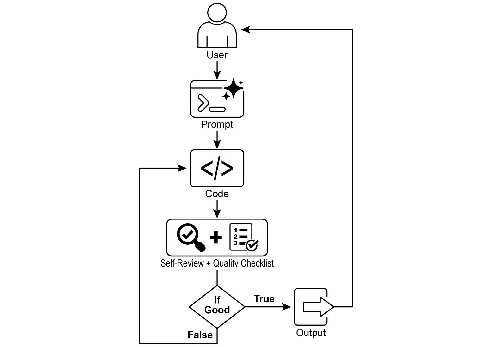
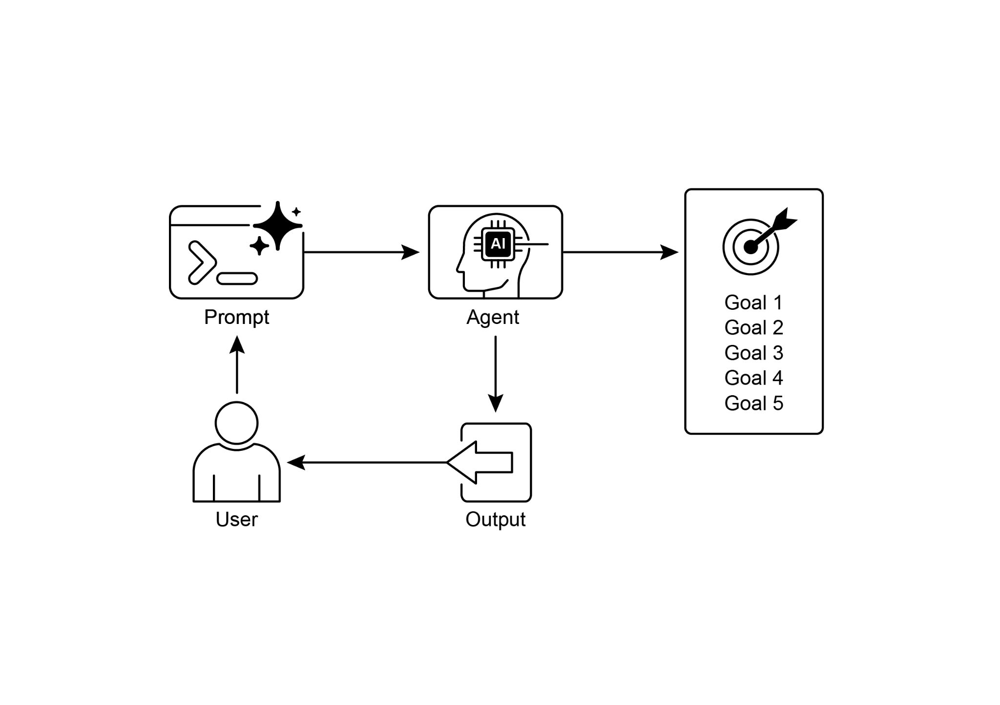

# Chapter 11: Goal Setting and Monitoring

> 第 11 章：目标设定与监控

For AI agents to be truly effective and purposeful, they need more than just the ability to process information or use tools; they need a clear sense of direction and a way to know if they're actually succeeding. This is where the Goal Setting and Monitoring pattern comes into play. It's about giving agents specific objectives to work towards and equipping them with the means to track their progress and determine if those objectives have been met.

> 要让智能体真正做到有效且有的放矢，仅仅具备信息处理或工具调用能力还不够；它还需要清晰的方向感，以及判断自己是否真的在朝目标前进的手段。「目标设定与监控」模式正是为此而来：它为智能体明确具体目标，并配套提供跟踪进展、判断目标是否达成的机制。

## Goal Setting and Monitoring Pattern Overview

> ## 目标设定与监控模式概览

Think about planning a trip. You don't just spontaneously appear at your destination. You decide where you want to go (the goal state), figure out where you are starting from (the initial state), consider available options (transportation, routes, budget), and then map out a sequence of steps: book tickets, pack bags, travel to the airport/station, board the transport, arrive, find accommodation, etc. This step-by-step process, often considering dependencies and constraints, is fundamentally what we mean by planning in agentic systems.

> 不妨把它类比为一次旅行规划：人不会凭空出现在目的地。你需要先确定要去哪里（目标状态）、自己当前身在何处（初始状态），再权衡交通方式、路线和预算等选项，最后安排出一系列步骤，例如订票、收拾行李、前往机场或车站、搭乘交通工具、抵达后入住等。这种逐步推进、同时考虑依赖关系与现实约束的过程，正是智能体系统中「规划」的核心含义。

In the context of AI agents, planning typically involves an agent taking a high-level objective and autonomously, or semi-autonomously, generating a series of intermediate steps or sub-goals. These steps can then be executed sequentially or in a more complex flow, potentially involving other patterns like tool use, routing, or multi-agent collaboration. The planning mechanism might involve sophisticated search algorithms, logical reasoning, or increasingly, leveraging the capabilities of large language models (LLMs) to generate plausible and effective plans based on their training data and understanding of tasks.

> 在智能体语境中，「规划」通常是指：智能体在接收到一个高层目标之后，自主或半自主地生成一系列中间步骤或子目标。这些步骤既可以按顺序执行，也可以组织成更复杂的流程，并与工具调用、路由、多智能体协作等模式结合使用。实现规划机制的方法可以依赖搜索算法、逻辑推理，也越来越多地借助大语言模型（LLM），利用其训练中获得的知识与任务理解能力来生成合理且有效的行动方案。

A good planning capability allows agents to tackle problems that aren't simple, single-step queries. It enables them to handle multi-faceted requests, adapt to changing circumstances by replanning, and orchestrate complex workflows. It's a foundational pattern that underpins many advanced agentic behaviors, turning a simple reactive system into one that can proactively work towards a defined objective.

> 良好的规划能力，使智能体能够处理那些并非简单单步查询的问题。它可以应对包含多个侧面的复杂需求，在环境变化时通过重新规划来调整路径，并编排复杂的工作流。这是一种支撑许多高级智能体行为的基础模式，它把原本只会被动响应的系统，转变为能够主动朝着明确目标推进的系统。

## Practical Applications & Use Cases

> ## 实践应用与用例

The Goal Setting and Monitoring pattern is essential for building agents that can operate autonomously and reliably in complex, real-world scenarios. Here are some practical applications:

> 「目标设定与监控」是构建能够在复杂现实环境中自主、可靠运行的智能体时不可或缺的一环。下面列出几个典型应用场景：

* **Customer Support Automation:** An agent's goal might be to "resolve customer's billing inquiry." It monitors the conversation, checks database entries, and uses tools to adjust billing. Success is monitored by confirming the billing change and receiving positive customer feedback. If the issue isn't resolved, it escalates.  
* **Personalized Learning Systems:** A learning agent might have the goal to "improve students’ understanding of algebra." It monitors the student's progress on exercises, adapts teaching materials, and tracks performance metrics like accuracy and completion time, adjusting its approach if the student struggles.  
* **Project Management Assistants:** An agent could be tasked with "ensuring project milestone X is completed by Y date." It monitors task statuses, team communications, and resource availability, flagging delays and suggesting corrective actions if the goal is at risk.  
* **Automated Trading Bots:** A trading agent's goal might be to "maximize portfolio gains while staying within risk tolerance." It continuously monitors market data, its current portfolio value, and risk indicators, executing trades when conditions align with its goals and adjusting strategy if risk thresholds are breached.  
* **Robotics and Autonomous Vehicles:** An autonomous vehicle's primary goal is "safely transport passengers from A to B." It constantly monitors its environment (other vehicles, pedestrians, traffic signals), its own state (speed, fuel), and its progress along the planned route, adapting its driving behavior to achieve the goal safely and efficiently.  
* **Content Moderation:** An agent's goal could be to "identify and remove harmful content from platform X." It monitors incoming content, applies classification models, and tracks metrics like false positives/negatives, adjusting its filtering criteria or escalating ambiguous cases to human reviewers.

> * **客户支持自动化：** 智能体的目标可以是「解决客户的账单问题」。它会持续监控对话过程、查询数据库记录，并调用工具调整账单。是否成功，则通过账单是否已完成变更以及客户反馈是否正向来判断；若问题仍未解决，则升级给人工处理。
> * **个性化学习系统：** 学习型智能体的目标可能是「提升学生对代数的理解」。它会监控学生在练习中的表现，动态调整教学材料，并跟踪准确率、完成时间等指标；当学生遇到困难时，再相应调整教学策略。
> * **项目管理助手：** 一个智能体可能被赋予「确保项目里程碑 X 在 Y 日期前完成」的目标。它会监控任务状态、团队沟通情况以及资源可用性；当目标存在风险时，及时提示延误并给出纠偏建议。
> * **自动交易机器人：** 交易智能体的目标可能是「在风险承受范围内尽量提升投资组合收益」。它会持续监控市场数据、当前持仓价值及风险指标，并在条件符合目标时执行交易；一旦风险阈值被突破，则会调整策略。
> * **机器人与自动驾驶：** 自动驾驶系统的核心目标通常是「安全地将乘客从 A 地送到 B 地」。它需要持续监控周围环境（其他车辆、行人、交通信号）、自身状态（速度、燃料）以及路线进展，并据此动态调整驾驶行为，以确保安全和效率。
> * **内容审核：** 智能体的目标可能是「识别并移除平台 X 上的有害内容」。它会持续监控进入平台的内容，调用分类模型，并跟踪误报率、漏报率等指标，再据此调整过滤规则，或将含糊不清的案例升级给人工审核。

This pattern is fundamental for agents that need to operate reliably, achieve specific outcomes, and adapt to dynamic conditions, providing the necessary framework for intelligent self-management.

> 这一模式对于那些需要可靠运行、达成特定结果并适应动态环境变化的智能体而言至关重要，它为智能体的自我管理提供了必要框架。

## Hands-On Code Example

> ## 动手代码示例

To illustrate the Goal Setting and Monitoring pattern, we have an example using LangChain and OpenAI APIs. This Python script outlines an autonomous AI agent engineered to generate and refine Python code. Its core function is to produce solutions for specified problems, ensuring adherence to user-defined quality benchmarks.

> 为了更直观地说明「目标设定与监控」模式，本节给出一个基于 LangChain 与 OpenAI API 的示例。这个 Python 脚本展示了一个能够自主生成并持续改进 Python 代码的智能体，其核心任务是围绕指定问题产出实现，并不断对照用户设定的质量标准进行迭代优化。

It employs a "goal-setting and monitoring" pattern where it doesn't just generate code once, but enters into an iterative cycle of creation, self-evaluation, and improvement. The agent's success is measured by its own AI-driven judgment on whether the generated code successfully meets the initial objectives. The ultimate output is a polished, commented, and ready-to-use Python file that represents the culmination of this refinement process.

> 它体现了「目标设定 + 监控」的思路：流程不是只生成一次代码就结束，而是进入「编写 - 自评 - 改写」的闭环。智能体会根据反馈不断判断当前结果是否已经满足目标。最终输出的是一个经过多轮打磨、带有注释且可直接使用的 `.py` 文件，这正是这一持续改进过程的结果。

 **Dependencies**:

> **依赖：**

```python
pip install langchain_openai openai python-dotenv .env file with key in OPENAI_API_KEY
```

You can best understand this script by imagining it as an autonomous AI programmer assigned to a project (see Fig. 1). The process begins when you hand the AI a detailed project brief, which is the specific coding problem it needs to solve.

> 最容易理解的方式，是把这个脚本想象成一位被分配到项目中的自主 AI 程序员（见图 1）。你首先会向它交付一份详细的项目说明，也就是它需要解决的具体编程问题。

```python
# MIT License
# Copyright (c) 2025 Mahtab Syed
# https://www.linkedin.com/in/mahtabsyed/

"""
Hands-On Code Example - Iteration 2
-  To illustrate the Goal Setting and Monitoring pattern, we have an example using LangChain and OpenAI APIs:

Objective: Build an AI Agent which can write code for a specified use case based on specified goals:
-  Accepts a coding problem (use case) in code or can be as input.
-  Accepts a list of goals (e.g., "simple", "tested", "handles edge cases")  in code or can be input.
-  Uses an LLM (like GPT-4o) to generate and refine Python code until the goals are met. (I am using max 5 iterations, this could be based on a set goal as well)
-  To check if we have met our goals I am asking the LLM to judge this and answer just True or False which makes it easier to stop the iterations.
-  Saves the final code in a .py file with a clean filename and a header comment.
"""

import os
import random
import re
from pathlib import Path

from langchain_openai import ChatOpenAI
from dotenv import load_dotenv, find_dotenv


# 🔐 Load environment variables
_ = load_dotenv(find_dotenv())
OPENAI_API_KEY = os.getenv("OPENAI_API_KEY")
if not OPENAI_API_KEY:
    raise EnvironmentError("❌ Please set the OPENAI_API_KEY environment variable.")

# ✅ Initialize OpenAI model
print("📡 Initializing OpenAI LLM (gpt-4o)...")
llm = ChatOpenAI(
    model="gpt-4o",  # If you dont have access to got-4o use other OpenAI LLMs
    temperature=0.3,
    openai_api_key=OPENAI_API_KEY,
)


# --- Utility Functions ---
def generate_prompt(
    use_case: str, goals: list[str], previous_code: str = "", feedback: str = ""
) -> str:
    print("📝 Constructing prompt for code generation...")
    base_prompt = f"""
You are an AI coding agent. Your job is to write Python code based on the following use case:

Use Case: {use_case}

Your goals are:
{chr(10).join(f"- {g.strip()}" for g in goals)}
"""
    if previous_code:
        print("🔄 Adding previous code to the prompt for refinement.")
        base_prompt += f"\nPreviously generated code:\n{previous_code}"
    if feedback:
        print("📋 Including feedback for revision.")
        base_prompt += f"\nFeedback on previous version:\n{feedback}\n"

    base_prompt += "\nPlease return only the revised Python code. Do not include comments or explanations outside the code."
    return base_prompt


def get_code_feedback(code: str, goals: list[str]) -> str:
    print("🔍 Evaluating code against the goals...")
    feedback_prompt = f"""
You are a Python code reviewer. A code snippet is shown below. Based on the following goals:

{chr(10).join(f"- {g.strip()}" for g in goals)}

Please critique this code and identify if the goals are met. Mention if improvements are needed for clarity, simplicity, correctness, edge case handling, or test coverage.

Code:
{code}
"""
    return llm.invoke(feedback_prompt)


def goals_met(feedback_text: str, goals: list[str]) -> bool:
    """
    Uses the LLM to evaluate whether the goals have been met based on the feedback text.
    Returns True or False (parsed from LLM output).
    """
    review_prompt = f"""
You are an AI reviewer.

Here are the goals:
{chr(10).join(f"- {g.strip()}" for g in goals)}

Here is the feedback on the code:
\"\"\"
{feedback_text}
\"\"\"

Based on the feedback above, have the goals been met?

Respond with only one word: True or False.
"""
    response = llm.invoke(review_prompt).content.strip().lower()
    return response == "true"


def clean_code_block(code: str) -> str:
    lines = code.strip().splitlines()
    if lines and lines[0].strip().startswith("```"):
        lines = lines[1:]
    if lines and lines[-1].strip() == "```":
        lines = lines[:-1]
    return "\n".join(lines).strip()


def add_comment_header(code: str, use_case: str) -> str:
    comment = f"# This Python program implements the following use case:\n# {use_case.strip()}\n"
    return comment + "\n" + code


def to_snake_case(text: str) -> str:
    text = re.sub(r"[^a-zA-Z0-9 ]", "", text)
    return re.sub(r"\s+", "_", text.strip().lower())


def save_code_to_file(code: str, use_case: str) -> str:
    print("💾 Saving final code to file...")

    summary_prompt = (
        f"Summarize the following use case into a single lowercase word or phrase, "
        f"no more than 10 characters, suitable for a Python filename:\n\n{use_case}"
    )
    raw_summary = llm.invoke(summary_prompt).content.strip()
    short_name = re.sub(r"[^a-zA-Z0-9_]", "", raw_summary.replace(" ", "_").lower())[:10]

    random_suffix = str(random.randint(1000, 9999))
    filename = f"{short_name}_{random_suffix}.py"
    filepath = Path.cwd() / filename

    with open(filepath, "w") as f:
        f.write(code)

    print(f"✅ Code saved to: {filepath}")
    return str(filepath)


# --- Main Agent Function ---
def run_code_agent(use_case: str, goals_input: str, max_iterations: int = 5) -> str:
    goals = [g.strip() for g in goals_input.split(",")]

    print(f"\n🎯 Use Case: {use_case}")
    print("🎯 Goals:")
    for g in goals:
        print(f"  - {g}")

    previous_code = ""
    feedback = ""

    for i in range(max_iterations):
        print(f"\n=== 🔁 Iteration {i + 1} of {max_iterations} ===")
        prompt = generate_prompt(
            use_case,
            goals,
            previous_code,
            feedback if isinstance(feedback, str) else feedback.content,
        )

        print("🚧 Generating code...")
        code_response = llm.invoke(prompt)
        raw_code = code_response.content.strip()
        code = clean_code_block(raw_code)
        print("\n🧾 Generated Code:\n" + "-" * 50 + f"\n{code}\n" + "-" * 50)

        print("\n📤 Submitting code for feedback review...")
        feedback = get_code_feedback(code, goals)
        feedback_text = feedback.content.strip()
        print("\n📥 Feedback Received:\n" + "-" * 50 + f"\n{feedback_text}\n" + "-" * 50)

        if goals_met(feedback_text, goals):
            print("✅ LLM confirms goals are met. Stopping iteration.")
            break

        print("🛠️ Goals not fully met. Preparing for next iteration...")
        previous_code = code

    final_code = add_comment_header(code, use_case)
    return save_code_to_file(final_code, use_case)


# --- CLI Test Run ---
if __name__ == "__main__":
    print("\n🧠 Welcome to the AI Code Generation Agent")

    # Example 1
    use_case_input = "Write code to find BinaryGap of a given positive integer"
    goals_input = "Code simple to understand, Functionally correct, Handles comprehensive edge cases, Takes positive integer input only, prints the results with few examples"
    run_code_agent(use_case_input, goals_input)

    # Example 2
    # use_case_input = "Write code to count the number of files in current directory and all its nested sub directories, and print the total count"
    # goals_input = (
    #     "Code simple to understand, Functionally correct, Handles comprehensive edge cases, Ignore recommendations for performance, Ignore recommendations for test suite use like unittest or pytest"
    # )
    # run_code_agent(use_case_input, goals_input)

    # Example 3
    # use_case_input = "Write code which takes a command line input of a word doc or docx file and opens it and counts the number of words, and characters in it and prints all"
    # goals_input = "Code simple to understand, Functionally correct, Handles edge cases"
    # run_code_agent(use_case_input, goals_input)
```

Along with this brief, you provide a strict quality checklist, which represents the objectives the final code must meet—criteria like "the solution must be simple," "it must be functionally correct," or "it needs to handle unexpected edge cases."

> 除了项目说明之外，你还会给它一份严格的质量清单，这些清单项就是最终代码必须满足的目标，例如「实现要足够简单」「功能必须正确」「能够处理异常边界情况」等。



Fig.1: Goal Setting and Monitor example

> 图 1：目标设定与监控示例

With this assignment in hand, the AI programmer gets to work and produces its first draft of the code. However, instead of immediately submitting this initial version, it pauses to perform a crucial step: a rigorous self-review. It meticulously compares its own creation against every item on the quality checklist you provided, acting as its own quality assurance inspector. After this inspection, it renders a simple, unbiased verdict on its own progress: "True" if the work meets all standards, or "False" if it falls short.

> 接到任务后，这位 AI 程序员会先生成一版代码初稿，但不会立刻提交，而是先进行一个关键步骤：严格自审。它会逐项对照你给出的质量清单来检查自己的产出，同时兼任「作者」和「质量审查者」两种角色。检查完成后，它会给出一个简单而明确的结论：如果全部要求都满足，就返回「True」；否则返回「False」。

If the verdict is "False," the AI doesn't give up. It enters a thoughtful revision phase, using the insights from its self-critique to pinpoint the weaknesses and intelligently rewrite the code. This cycle of drafting, self-reviewing, and refining continues, with each iteration aiming to get closer to the goals. This process repeats until the AI finally achieves a "True" status by satisfying every requirement, or until it reaches a predefined limit of attempts, much like a developer working against a deadline. Once the code passes this final inspection, the script packages the polished solution, adding helpful comments and saving it to a clean, new Python file, ready for use.

> 如果结论是「False」，流程并不会停止，而是会进入修订阶段：根据自评发现的问题改写代码。这样的「起草 - 自审 - 打磨」循环会不断持续，每一轮都努力让结果更接近预设目标；直到所有条件都满足并得到「True」，或者达到预先设定的迭代次数上限。这有点像开发者在截止日期前进行有限次数的返工。通过最后一轮检查后，脚本会将最终成果整理好、补上说明性注释，并保存为一个命名清晰的 `.py` 文件，以便直接使用。

**Caveats and Considerations:** It is important to note that this is an exemplary illustration and not production-ready code. For real-world applications, several factors must be taken into account. An LLM may not fully grasp the intended meaning of a goal and might incorrectly assess its performance as successful. Even if the goal is well understood, the model may hallucinate. When the same LLM is responsible for both writing the code and judging its quality, it may have a harder time discovering it is going in the wrong direction.

> **注意与考量：** 这个例子主要用于说明思路，并不是可以直接投入生产环境的代码。真正落地时，有几个问题必须考虑：LLM 可能并没有准确理解目标，却依然错误地判断自己「已经完成」；即便目标理解正确，模型仍可能产生幻觉；而当同一个模型同时负责写代码和评审代码时，它通常也更难意识到自己已经偏离了正确方向。

Ultimately, LLMs do not produce flawless code by magic; you still need to run and test the produced code. Furthermore, the "monitoring" in the simple example is basic and creates a potential risk of the process running forever.

> 归根结底，LLM 并不会像变魔术一样自动产出毫无瑕疵的代码；生成结果仍然需要经过真实运行和测试验证。此外，这个示例中的「监控」机制还比较基础，也因此存在一个潜在风险：如果终止条件设计得不够严谨，流程理论上可能会长时间持续下去。

```text
Act as an expert code reviewer with a deep commitment to producing clean, correct, and simple code. Your core mission is to eliminate code "hallucinations" by ensuring every suggestion is grounded in reality and best practices. When I provide you with a code snippet, I want you to: -- Identify and Correct Errors: Point out any logical flaws, bugs, or potential runtime errors. -- Simplify and Refactor: Suggest changes that make the code more readable, efficient, and maintainable without sacrificing correctness. -- Provide Clear Explanations: For every suggested change, explain why it is an improvement, referencing principles of clean code, performance, or security. -- Offer Corrected Code: Show the "before" and "after" of your suggested changes so the improvement is clear. Your feedback should be direct, constructive, and always aimed at improving the quality of the code.
```

A more robust approach involves separating these concerns by giving specific roles to a crew of agents. For instance, I have built a personal crew of AI agents using Gemini where each has a specific role:

> 更稳妥的做法，是将这些职责拆分开来，交由多个智能体各司其职。例如，笔者曾基于 Gemini 组建过一个个人「智能体小队」，其中每个成员都承担不同角色：

* The Peer Programmer: Helps write and brainstorm code.  
* The Code Reviewer: Catches errors and suggests improvements.  
* The Documenter: Generates clear and concise documentation.  
* The Test Writer: Creates comprehensive unit tests.  
* The Prompt Refiner: Optimizes interactions with the AI.

> * **同伴程序员：** 协助编写代码，并进行方案构思与头脑风暴。
> * **代码审查员：** 发现错误并提出改进。
> * **文档撰写者：** 生成清晰简洁的文档。
> * **测试编写者：** 负责编写覆盖更全面的单元测试。
> * **提示优化者：** 优化与 AI 的交互。

In this multi-agent system, the Code Reviewer, acting as a separate entity from the programmer agent, has a prompt similar to the judge in the example, which significantly improves objective evaluation. This structure naturally leads to better practices, as the Test Writer agent can fulfill the need to write unit tests for the code produced by the Peer Programmer.

> 在这种多智能体系统中，代码审查者与代码编写者彼此独立。前者的角色很接近前面示例中的「裁判」，因此更有利于保持评审的客观性；而测试编写者则可以为同伴程序员生成的代码补上单元测试，从系统结构上推动更可靠的工程实践。

I leave to the interested reader the task of adding these more sophisticated controls and making the code closer to production-ready.

> 至于如何进一步加入更复杂的控制机制，并把这套代码改造成更接近生产可用的形态，就留给感兴趣的读者继续扩展了。

## At a Glance

> ## 一览

**What**: AI agents often lack a clear direction, preventing them from acting with purpose beyond simple, reactive tasks. Without defined objectives, they cannot independently tackle complex, multi-step problems or orchestrate sophisticated workflows. Furthermore, there is no inherent mechanism for them to determine if their actions are leading to a successful outcome. This limits their autonomy and prevents them from being truly effective in dynamic, real-world scenarios where mere task execution is insufficient.

> **问题：** 智能体往往缺乏清晰的方向感，因此难以超越简单的反应式任务，真正做到有目的地行动。如果没有明确目标，它们就无法独立处理复杂的多步骤问题，也难以编排更复杂的工作流。同时，它们通常也缺少一种内在机制来判断自己的行为是否正在通向成功。这些限制削弱了智能体的自主性，使其在动态、真实的场景中仅靠机械执行任务，难以真正发挥作用。

**Why**: The Goal Setting and Monitoring pattern provides a standardized solution by embedding a sense of purpose and self-assessment into agentic systems. It involves explicitly defining clear, measurable objectives for the agent to achieve. Concurrently, it establishes a monitoring mechanism that continuously tracks the agent's progress and the state of its environment against these goals. This creates a crucial feedback loop, enabling the agent to assess its performance, correct its course, and adapt its plan if it deviates from the path to success. By implementing this pattern, developers can transform simple reactive agents into proactive, goal-oriented systems capable of autonomous and reliable operation.

> **思路：** 「目标设定与监控」模式通过为智能体系统注入目标感和自我评估能力，提供了一种标准化解法。它要求先为智能体设定清晰、可衡量的目标，再建立相应的监控机制，持续跟踪智能体的进展以及环境状态，并与目标进行对照。这样就形成了一个关键的反馈回路，使智能体能够评估自己的表现、及时纠偏，并在偏离成功路径时调整行动计划。通过引入这一模式，开发者可以把简单的反应式智能体转变为主动、目标导向且能够自主可靠运行的系统。

**Rule of thumb**: Use this pattern when an AI agent must autonomously execute a multi-step task, adapt to dynamic conditions, and reliably achieve a specific, high-level objective without constant human intervention.

> **经验法则：** 当智能体需要在较少人工干预的情况下，自主执行多步任务、适应动态变化，并可靠地达成某个明确的高层目标时，就应考虑采用这一模式。

**Visual summary:**

> **图示摘要：**



Fig.2: Goal design patterns

> 图 2：目标设计模式

## Key takeaways

> ## 要点

Key takeaways include:

> 要点包括：

* Goal Setting and Monitoring equips agents with purpose and mechanisms to track progress.  
* Goals should be specific, measurable, achievable, relevant, and time-bound (SMART).  
* Clearly defining metrics and success criteria is essential for effective monitoring.  
* Monitoring involves observing agent actions, environmental states, and tool outputs.  
* Feedback loops from monitoring allow agents to adapt, revise plans, or escalate issues.  
* In Google's ADK, goals are often conveyed through agent instructions, with monitoring accomplished through state management and tool interactions.

> * 目标设定与监控为智能体赋予了明确的目的感，以及跟踪进展的能力。
> * 目标最好符合 SMART 原则，即具体、可衡量、可实现、相关且有时间约束。
> * 要实现有效监控，就必须清楚定义评估指标和成功标准。
> * 监控不仅包括观察智能体的行为，也包括跟踪环境状态和工具输出。
> * 由监控形成的反馈回路，使智能体能够调整策略、修订计划，或在必要时升级问题。
> * 在 Google ADK 中，目标通常通过智能体指令来表达，而监控则往往借助状态管理与工具交互来完成。

## Conclusion

> ## 结语

This chapter focused on the crucial paradigm of Goal Setting and Monitoring. I highlighted how this concept transforms AI agents from merely reactive systems into proactive, goal-driven entities. The text emphasized the importance of defining clear, measurable objectives and establishing rigorous monitoring procedures to track progress. Practical applications demonstrated how this paradigm supports reliable autonomous operation across various domains, including customer service and robotics. A conceptual coding example illustrates the implementation of these principles within a structured framework, using agent directives and state management to guide and evaluate an agent's achievement of its specified goals. Ultimately, equipping agents with the ability to formulate and oversee goals is a fundamental step toward building truly intelligent and accountable AI systems.

> 本章聚焦于「目标设定与监控」这一关键范式，说明了它如何将智能体从单纯的被动响应系统，转变为主动、目标导向的行动体。文中强调，清晰且可衡量的目标，以及严格的监控机制，对于把握进度和确保结果至关重要。实践应用部分展示了这一范式如何支撑客服、机器人等场景中的稳健自主运行；示例代码则从工程实现角度说明了如何借助智能体指令与状态管理，来引导并评估智能体是否完成既定目标。归根结底，让智能体具备设定目标并持续审视自身进展的能力，是迈向更可信、更可问责 AI 系统的重要一步。

## References

1. SMART Goals Framework. [https://en.wikipedia.org/wiki/SMART\_criteria](https://en.wikipedia.org/wiki/SMART_criteria)
