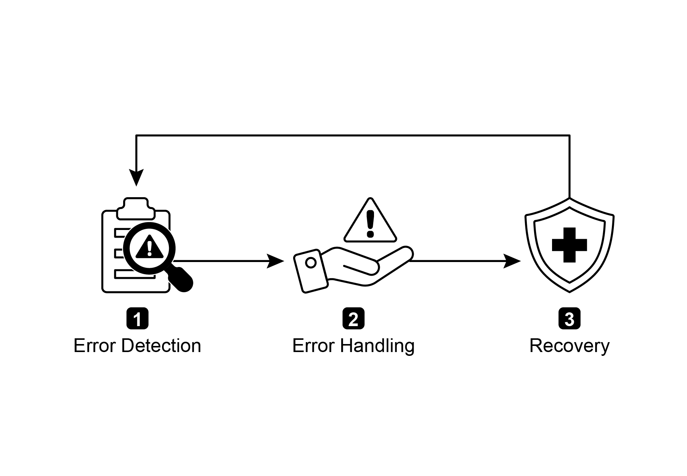
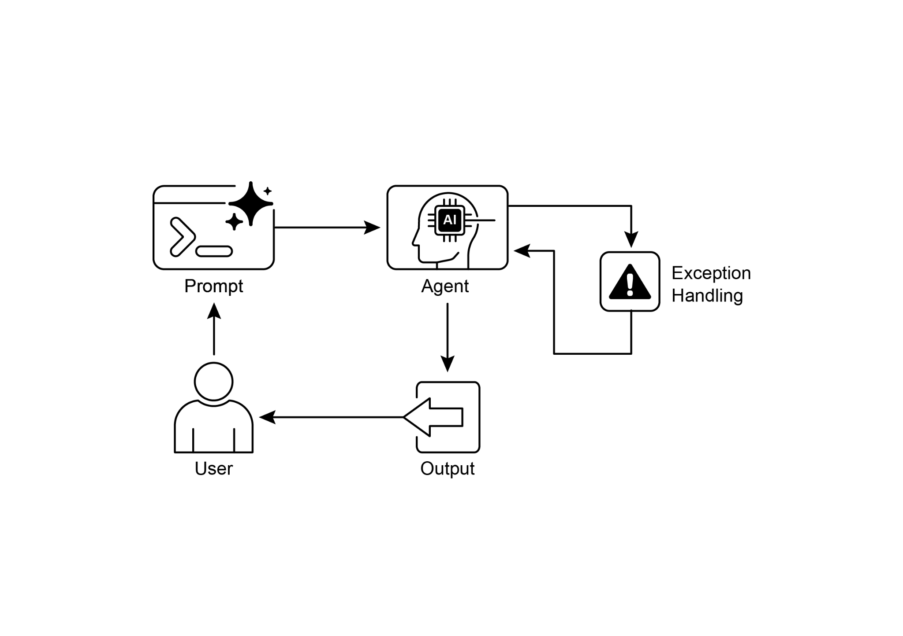

# Chapter 12: Exception Handling and Recovery

> 第 12 章：异常处理与恢复

For AI agents to operate reliably in diverse real-world environments, they must be able to manage unforeseen situations, errors, and malfunctions. Just as humans adapt to unexpected obstacles, intelligent agents need robust systems to detect problems, initiate recovery procedures, or at least ensure controlled failure. This essential requirement forms the basis of the Exception Handling and Recovery pattern.

> 要让智能体在多样而真实的环境中可靠运行，就必须能够应对意外情况、错误和故障。正如人类会适应突发障碍一样，智能体也需要稳健的机制来发现问题、启动恢复流程，或至少在无法恢复时实现受控失败。这一基本要求，正是「异常处理与恢复」模式的根基。

This pattern focuses on developing exceptionally durable and resilient agents that can maintain uninterrupted functionality and operational integrity despite various difficulties and anomalies. It emphasizes the importance of both proactive preparation and reactive strategies to ensure continuous operation, even when facing challenges. This adaptability is critical for agents to function successfully in complex and unpredictable settings, ultimately boosting their overall effectiveness and trustworthiness.

> 该模式关注的是如何打造高度稳健、富有韧性的智能体，使其在面对各种困难和异常时，仍能维持功能连续性与运行完整性。它强调事前预案与事后响应并重，以确保系统即使遭遇挑战，也能持续运行。这种适应能力，是智能体在复杂、不可预测环境中成功发挥作用的关键，也有助于提升其整体效能与可信度。

The capacity to handle unexpected events ensures these AI systems are not only intelligent but also stable and reliable, which fosters greater confidence in their deployment and performance. Integrating comprehensive monitoring and diagnostic tools further strengthens an agent's ability to quickly identify and address issues, preventing potential disruptions and ensuring smoother operation in evolving conditions. These advanced systems are crucial for maintaining the integrity and efficiency of AI operations, reinforcing their ability to manage complexity and unpredictability.

> 只有具备处理意外事件的能力，这些 AI 系统才称得上既智能又稳定、可靠，也更容易赢得人们对其部署与实际表现的信任。若再配合完善的监控与诊断工具，智能体就能更快定位并处理问题，预防潜在中断，并在环境变化时保持平稳运行。这类能力对于维持 AI 系统运行的完整性与效率尤为关键，也进一步增强了其应对复杂性与不确定性的能力。

This pattern may sometimes be used with reflection. For example, if an initial attempt fails and raises an exception, a reflective process can analyze the failure and reattempt the task with a refined approach, such as an improved prompt, to resolve the error.

> 该模式有时也会与「反思」结合使用。例如，当初次尝试失败并抛出异常时，反思过程可以分析失败原因，再用改进后的策略（如优化提示词）重新尝试任务，从而化解问题。

## Exception Handling and Recovery Pattern Overview

> ## 异常处理与恢复模式概览

The Exception Handling and Recovery pattern addresses the need for AI agents to manage operational failures. This pattern involves anticipating potential issues, such as tool errors or service unavailability, and developing strategies to mitigate them. These strategies may include error logging, retries, fallbacks, graceful degradation, and notifications. Additionally, the pattern emphasizes recovery mechanisms like state rollback, diagnosis, self-correction, and escalation, to restore agents to stable operation. Implementing this pattern enhances the reliability and robustness of AI agents, allowing them to function in unpredictable environments. Examples of practical applications include chatbots managing database errors, trading bots handling financial errors, and smart home agents addressing device malfunctions. The pattern ensures that agents can continue to operate effectively despite encountering complexities and failures.

> 「异常处理与恢复」模式关注的是智能体管理运行故障的能力。它要求系统预先考虑潜在问题，例如工具报错、服务不可用等，并设计相应的缓解策略，包括错误日志、重试、回退、优雅降级和通知等。此外，还需要建立恢复机制，如状态回滚、故障诊断、自我纠正与升级处置，帮助智能体尽快恢复到稳定运行状态。落实这一模式后，智能体的可靠性与鲁棒性会显著提升，从而能够在不可预测的环境中持续运行。典型应用包括聊天机器人处理数据库故障、交易机器人应对金融异常，以及智能家居代理处理设备失灵等，确保系统即使遭遇复杂问题和运行故障，也能继续提供有效服务。

Key Components of Exception Handling and Recovery for AI agents

> 智能体「异常处理与恢复」的关键组成




Fig.1: Key components of exception handling and recovery for AI agents

> 图 1：智能体「异常处理与恢复」的关键组成部分

**Error Detection:** This involves meticulously identifying operational issues as they arise. This could manifest as invalid or malformed tool outputs, specific API errors such as 404 (Not Found) or 500 (Internal Server Error) codes, unusually long response times from services or APIs, or incoherent and nonsensical responses that deviate from expected formats. Additionally, monitoring by other agents or specialized monitoring systems might be implemented for more proactive anomaly detection, enabling the system to catch potential issues before they escalate.

> **错误检测：** 即在问题出现时及时而准确地识别运行异常。常见信号包括：无效或格式错误的工具输出、特定 API 错误（如 404「未找到」、500「内部服务器错误」）、服务或 API 响应时间异常过长，以及明显偏离预期格式、前后不一致或语义混乱的回复。此外，也可以借助其他智能体或专门的监控系统进行更主动的异常检测，在问题扩大之前提前拦截。

**Error Handling**: Once an error is detected, a carefully thought-out response plan is essential. This includes recording error details meticulously in logs for later debugging and analysis (logging). Retrying the action or request, sometimes with slightly adjusted parameters, may be a viable strategy, especially for transient errors (retries). Utilizing alternative strategies or methods (fallbacks) can ensure that some functionality is maintained. Where complete recovery is not immediately possible, the agent can maintain partial functionality to provide at least some value (graceful degradation). Finally, alerting human operators or other agents might be crucial for situations that require human intervention or collaboration (notification).

> **错误处理：** 一旦检测到错误，就需要有周密的响应方案。这包括：将错误详情完整写入日志，便于后续调试和分析（日志记录）；对操作或请求进行重试，并在必要时适度调整参数，这对瞬时性故障往往尤其有效（重试）；改用替代策略或备用路径，以尽可能保留部分能力（回退）；如果暂时无法完全恢复，则通过降级运行继续提供有限价值（优雅降级）；而在需要人工介入或跨系统协同时，则应及时向人类操作员或其他智能体发送告警（通知）。

**Recovery:** This stage is about restoring the agent or system to a stable and operational state after an error. It could involve reversing recent changes or transactions to undo the effects of the error (state rollback). A thorough investigation into the cause of the error is vital for preventing recurrence. Adjusting the agent's plan, logic, or parameters through a self-correction mechanism or replanning process may be needed to avoid the same error in the future. In complex or severe cases, delegating the issue to a human operator or a higher-level system (escalation) might be the best course of action.

> **恢复：** 这一阶段的目标，是在出错之后把智能体或系统恢复到稳定、可运行的状态。常见手段包括：撤销近期变更或事务，以消除错误带来的影响（状态回滚）；深入分析故障根因，以防止类似问题再次发生；通过自我纠正或重新规划，调整计划、逻辑或参数，从而避免重蹈覆辙；而在问题复杂或影响严重时，将其移交给人类操作员或更高层级系统处理（升级），往往才是更稳妥的选择。

Implementation of this robust exception handling and recovery pattern can transform AI agents from fragile and unreliable systems into robust, dependable components capable of operating effectively and resiliently in challenging and highly unpredictable environments. This ensures that the agents maintain functionality, minimize downtime, and provide a seamless and reliable experience even when faced with unexpected issues.

> 稳健地实施异常处理与恢复，可以把原本脆弱、不可靠的智能体，塑造成能够在高挑战、高不确定性环境中持续运转的可靠组件。这不仅有助于维持系统能力在线、降低停机时间，也能让智能体在面对意外问题时，仍然提供更平稳、更可预期的使用体验。

## Practical Applications & Use Cases

> ## 实践应用与用例

Exception Handling and Recovery is critical for any agent deployed in a real-world scenario where perfect conditions cannot be guaranteed.

> 对于任何部署在真实环境中的智能体而言，只要运行条件不可能始终完美，异常处理与恢复就不可或缺。

- **Customer Service Chatbots:** If a chatbot tries to access a customer database and the database is temporarily down, it shouldn't crash. Instead, it should detect the API error, inform the user about the temporary issue, perhaps suggest trying again later, or escalate the query to a human agent.  
- **Automated Financial Trading:** A trading bot attempting to execute a trade might encounter an "insufficient funds" error or a "market closed" error. It needs to handle these exceptions by logging the error, not repeatedly trying the same invalid trade, and potentially notifying the user or adjusting its strategy.  
- **Smart Home Automation:** An agent controlling smart lights might fail to turn on a light due to a network issue or a device malfunction. It should detect this failure, perhaps retry, and if still unsuccessful, notify the user that the light could not be turned on and suggest manual intervention.  
- **Data Processing Agents:** An agent tasked with processing a batch of documents might encounter a corrupted file. It should skip the corrupted file, log the error, continue processing other files, and report the skipped files at the end rather than halting the entire process.  
- **Web Scraping Agents:** When a web scraping agent encounters a CAPTCHA, a changed website structure, or a server error (e.g., 404 Not Found, 503 Service Unavailable), it needs to handle these gracefully. This could involve pausing, using a proxy, or reporting the specific URL that failed.  
- **Robotics and Manufacturing:** A robotic arm performing an assembly task might fail to pick up a component due to misalignment. It needs to detect this failure (e.g., via sensor feedback), attempt to readjust, retry the pickup, and if persistent, alert a human operator or switch to a different component.

> - **客服聊天机器人：** 如果聊天机器人在访问客户数据库时发现数据库暂时不可用，它不应该直接崩溃。更合理的做法是识别 API 错误，向用户说明这是临时性问题，建议稍后重试，或将请求升级给人工客服。
> - **自动化金融交易：** 交易机器人可能会遇到「资金不足」「市场已闭市」等异常。它需要记录日志，避免对同一笔无效交易反复重试，并在必要时通知用户或调整自身策略。
> - **智能家居自动化：** 控制灯具的智能体可能因为网络问题或设备故障而无法开灯。它应能检测到失败，先尝试重试；如果仍然失败，则通知用户并建议人工干预。
> - **数据处理智能体：** 在批量处理文档时，如果遇到损坏文件，智能体应跳过该文件、记录错误、继续处理其他文件，并在最后汇总报告被跳过的内容，而不是让整个流程完全停摆。
> - **网页抓取智能体：** 当网页抓取智能体遇到验证码、页面结构变化，或 404、503 等服务器错误时，需要以稳妥方式处理。这可能包括暂停任务、切换代理，或报告具体失败的 URL。
> - **机器人与制造：** 机械臂在执行装配任务时，可能会因为对位偏差而无法抓取零件。它需要根据传感器反馈检测失败，尝试重新校准并重试；如果问题持续存在，则应告警人工操作员，或切换到其他部件/流程。

In short, this pattern is fundamental for building agents that are not only intelligent but also reliable, resilient, and user-friendly in the face of real-world complexities.

> 简言之，这一模式是构建「不仅聪明，而且在真实世界的复杂条件下依然可靠、有韧性、易于使用」的智能体的基础。

## Hands-On Code Example (ADK)

> ## 动手代码示例（ADK）

Exception handling and recovery are vital for system robustness and reliability. Consider, for instance, an agent's response to a failed tool call. Such failures can stem from incorrect tool input or issues with an external service that the tool depends on.

> 异常处理与恢复直接关系到系统的鲁棒性与可靠性。以工具调用失败为例，智能体就必须知道该如何应对。这类失败既可能源于参数或输入不正确，也可能来自工具所依赖的外部服务本身出现故障。

```python
from google.adk.agents import Agent, SequentialAgent


# Agent 1: Tries the primary tool. Its focus is narrow and clear.
primary_handler = Agent(
    name="primary_handler",
    model="gemini-2.0-flash-exp",
    instruction="""
    Your job is to get precise location information. Use the get_precise_location_info
    tool with the user's provided address.
    """,
    tools=[get_precise_location_info],
)

# Agent 2: Acts as the fallback handler, checking state to decide its action.
fallback_handler = Agent(
    name="fallback_handler",
    model="gemini-2.0-flash-exp",
    instruction="""
    Check if the primary location lookup failed by looking at state["primary_location_failed"].
    - If it is True, extract the city from the user's original query and use the get_general_area_info tool.
    - If it is False, do nothing.
    """,
    tools=[get_general_area_info],
)

# Agent 3: Presents the final result from the state.
response_agent = Agent(
    name="response_agent",
    model="gemini-2.0-flash-exp",
    instruction="""
    Review the location information stored in state["location_result"]. Present this information
    clearly and concisely to the user. If state["location_result"] does not exist or is empty,
    apologize that you could not retrieve the location.
    """,
    tools=[],  # This agent only reasons over the final state.
)

# The SequentialAgent ensures the handlers run in a guaranteed order.
robust_location_agent = SequentialAgent(
    name="robust_location_agent",
    sub_agents=[primary_handler, fallback_handler, response_agent],
)
```

This code defines a robust location retrieval system using a ADK's SequentialAgent with three sub-agents. The `primary_handler` is the first agent, attempting to get precise location information using the `get_precise_location_info` tool. The `fallback_handler` acts as a backup, checking if the primary lookup failed by inspecting a state variable. If the primary lookup failed, the fallback agent extracts the city from the user's query and uses the `get_general_area_info` tool. The `response_agent` is the final agent in the sequence. It reviews the location information stored in the state. This agent is designed to present the final result to the user. If no location information was found, it apologizes. The SequentialAgent ensures that these three agents execute in a predefined order. This structure allows for a layered approach to location information retrieval.

> 上述代码借助 ADK 的 `SequentialAgent` 和三个子智能体，构建了一条稳健的位置检索链路。`primary_handler` 首先调用 `get_precise_location_info`，尝试获取精确位置信息；`fallback_handler` 则通过状态变量判断主路径是否失败，若失败，就从用户原始查询中提取城市名称，再调用 `get_general_area_info`。最后的 `response_agent` 负责读取状态中存储的位置结果，并以清晰简洁的方式呈现给用户；如果没有取到结果，则向用户礼貌致歉。`SequentialAgent` 保证这三个子智能体按照既定顺序执行，从而形成一种分层检索与回退的处理机制。

## At a Glance

> ## 一览

**What:** AI agents operating in real-world environments inevitably encounter unforeseen situations, errors, and system malfunctions. These disruptions can range from tool failures and network issues to invalid data, threatening the agent's ability to complete its tasks. Without a structured way to manage these problems, agents can be fragile, unreliable, and prone to complete failure when faced with unexpected hurdles. This unreliability makes it difficult to deploy them in critical or complex applications where consistent performance is essential.

> **是什么：** 运行在真实环境中的智能体，难免会遭遇意外情况、错误和系统故障。无论是工具失灵、网络波动，还是输入数据异常，都可能削弱其完成任务的能力。如果缺乏结构化的问题处理方式，智能体就会显得十分脆弱，一旦遇到突发问题便可能整体失效，因此难以用于那些对稳定性要求很高的关键或复杂场景。

**Why**: The Exception Handling and Recovery pattern provides a standardized solution for building robust and resilient AI agents. It equips them with the agentic capability to anticipate, manage, and recover from operational failures. The pattern involves proactive error detection, such as monitoring tool outputs and API responses, and reactive handling strategies like logging for diagnostics, retrying transient failures, or using fallback mechanisms. For more severe issues, it defines recovery protocols, including reverting to a stable state, self-correction by adjusting its plan, or escalating the problem to a human operator. This systematic approach ensures agents can maintain operational integrity, learn from failures, and function dependably in unpredictable settings.

> **为什么：** 「异常处理与恢复」为构建鲁棒、富有韧性的智能体提供了一套标准化方法，使其能够预见、应对并从运行故障中恢复。它既包括主动检测机制，例如监控工具输出与 API 响应；也包括具体的应对策略，例如记录诊断日志、对瞬时故障进行重试、启用回退机制等。对于更严重的问题，它还规定了恢复路径，例如回退到稳定状态、调整计划进行自我纠正，或将问题升级给人工操作员。通过这种系统化的处理方式，智能体能够更好地保持运行完整性、从失败中学习，并在不确定环境中持续可靠地工作。

**Rule of Thumb:** Use this pattern for any AI agent deployed in a dynamic, real-world environment where system failures, tool errors, network issues, or unpredictable inputs are possible and operational reliability is a key requirement.

> **经验法则：** 只要智能体运行在动态、真实的环境中，而系统故障、工具异常、网络波动或不可预测输入都有可能发生，并且可靠性又是硬性要求，就应当采用这一模式。

**Visual Summary:**

> **图示摘要：**

Exception Handling Pattern

> 异常处理模式



Fig.2: Exception handling pattern

> 图 2：异常处理模式

## Key Takeaways

> ## 要点

Essential points to remember:

> 可重点记住：

- Exception Handling and Recovery is essential for building robust and reliable Agents.  
- This pattern involves detecting errors, handling them gracefully, and implementing strategies to recover.  
- Error detection can involve validating tool outputs, checking API error codes, and using timeouts.  
- Handling strategies include logging, retries, fallbacks, graceful degradation, and notifications.  
- Recovery focuses on restoring stable operation through diagnosis, self-correction, or escalation.  
- This pattern ensures agents can operate effectively even in unpredictable real-world environments.

> - 要构建鲁棒、可信的智能体，异常处理与恢复是不可缺少的能力。
> - 这一模式涵盖错误检测、妥善处置以及恢复路径设计。
> - 在检测层面，可以结合工具输出校验、API 错误码判断以及超时机制等手段。
> - 在处理层面，常见策略包括日志记录、重试、回退、优雅降级和通知。
> - 在恢复层面，则重点依赖诊断、自我纠正或升级处置，以重新回到稳定运行状态。
> - 落实这一模式后，智能体即使身处充满不确定性的真实环境，也能持续交付价值。

## Conclusion

> ## 结语

This chapter explores the Exception Handling and Recovery pattern, which is essential for developing robust and dependable AI agents. This pattern addresses how AI agents can identify and manage unexpected issues, implement appropriate responses, and recover to a stable operational state. The chapter discusses various aspects of this pattern, including the detection of errors, the handling of these errors through mechanisms such as logging, retries, and fallbacks, and the strategies used to restore the agent or system to proper function. Practical applications of the Exception Handling and Recovery pattern are illustrated across several domains to demonstrate its relevance in handling real-world complexities and potential failures. These applications show how equipping AI agents with exception handling capabilities contributes to their reliability and adaptability in dynamic environments.

> 本章介绍了「异常处理与恢复」模式，这是构建鲁棒、可依赖智能体时不可或缺的一环。内容涵盖了如何识别和管理意外问题、如何采取适当响应，以及如何将系统恢复到稳定运行状态；同时也讨论了从错误检测，到日志、重试、回退等处理机制，再到恢复正常功能的具体策略。文中还通过跨领域的实际应用场景，展示了这一模式在应对真实世界复杂性与潜在故障时的重要价值，以及异常处理能力如何增强智能体在动态环境中的可靠性与适应性。

## References


1. McConnell, S. (2004). *Code Complete (2nd ed.)*. Microsoft Press.
2. Shi, Y., Pei, H., Feng, L., Zhang, Y., & Yao, D. (2024). *Towards Fault Tolerance in Multi-Agent Reinforcement Learning*. arXiv preprint arXiv:2412.00534.
3. O'Neill, V. (2022). *Improving Fault Tolerance and Reliability of Heterogeneous Multi-Agent IoT Systems Using Intelligence Transfer*. Electronics, 11(17), 2724.
