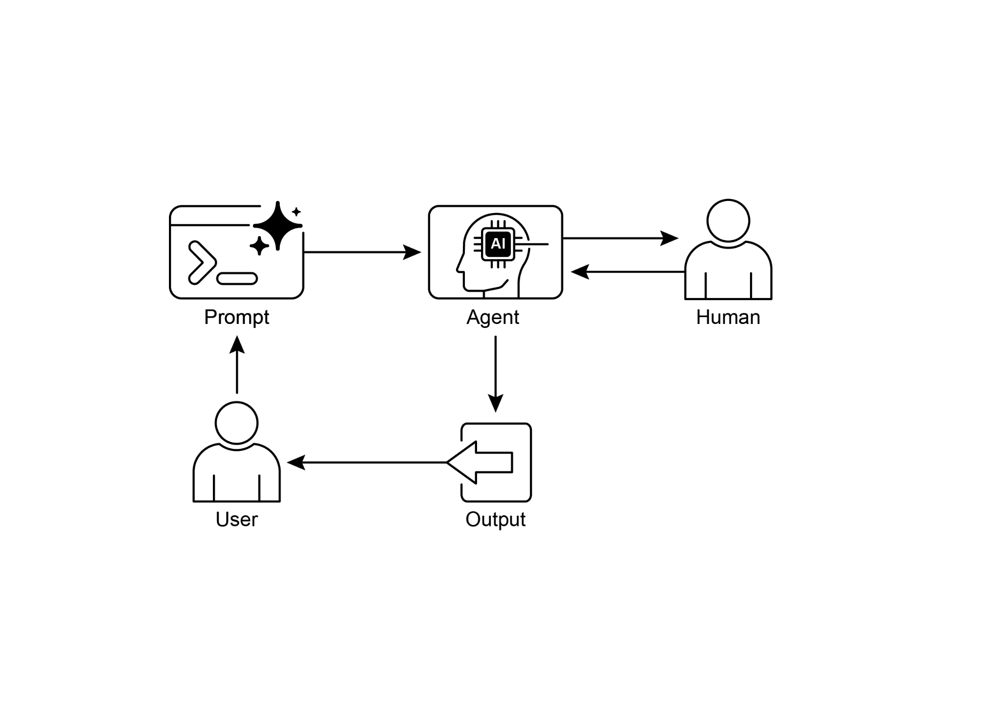

# Chapter 13: Human-in-the-Loop

> 第 13 章：人在回路中（HITL）

The Human-in-the-Loop (HITL) pattern represents a pivotal strategy in the development and deployment of Agents. It deliberately interweaves the unique strengths of human cognition—such as judgment, creativity, and nuanced understanding—with the computational power and efficiency of AI. This strategic integration is not merely an option but often a necessity, especially as AI systems become increasingly embedded in critical decision-making processes.

> 「人在回路中」（Human-in-the-Loop，HITL）是智能体开发与部署中的关键策略。它的核心做法，是把人类在判断、创造力和语境理解上的优势，与 AI 的计算能力和执行效率结合起来。随着 AI 越来越多地参与关键决策，这种结合往往不再只是「可选项」，而是刚需。

The core principle of HITL is to ensure that AI operates within ethical boundaries, adheres to safety protocols, and achieves its objectives with optimal effectiveness. These concerns are particularly acute in domains characterized by complexity, ambiguity, or significant risk, where the implications of AI errors or misinterpretations can be substantial. In such scenarios, full autonomy—where AI systems function independently without any human intervention—may prove to be imprudent. HITL acknowledges this reality and emphasizes that even with rapidly advancing AI technologies, human oversight, strategic input, and collaborative interactions remain indispensable.

> HITL 的核心，是让 AI 在伦理和安全边界内运行，并尽可能有效地达成目标。在复杂、模糊或高风险场景中，误判代价往往很高，因此一味追求「零人工、全自主」并不审慎。HITL 正是对此的回应：即便 AI 进步很快，人类的监督、判断和协同仍然不可替代。

The HITL approach fundamentally revolves around the idea of synergy between artificial and human intelligence. Rather than viewing AI as a replacement for human workers, HITL positions AI as a tool that augments and enhances human capabilities. This augmentation can take various forms, from automating routine tasks to providing data-driven insights that inform human decisions. The end goal is to create a collaborative ecosystem where both humans and AI Agents can leverage their distinct strengths to achieve outcomes that neither could accomplish alone.

> HITL 的底层逻辑是 `人机协同`，而不是用 AI 取代人类。AI 在这里更像是一种放大和延伸人类能力的工具。它可以承担重复性工作，也可以提供数据分析来辅助决策。最终目标，是让人与智能体各展所长，完成任何一方单独都难以完成的任务。

In practice, HITL can be implemented in diverse ways. One common approach involves humans acting as validators or reviewers, examining AI outputs to ensure accuracy and identify potential errors. Another implementation involves humans actively guiding AI behavior, providing feedback or making corrections in real-time. In more complex setups, humans may collaborate with AI as partners, jointly solving problems or making decisions through interactive dialog or shared interfaces. Regardless of the specific implementation, the HITL pattern underscores the importance of maintaining human control and oversight, ensuring that AI systems remain aligned with human ethics, values, goals, and societal expectations.

> 在实践中，HITL 有多种实现方式。人可以作为 `校验者` 或 `审核者`，把控输出质量并发现潜在错误；也可以在实时交互中持续纠偏，直接引导模型行为。更复杂的场景中，人和智能体还可以通过对话或共享界面 `共同解题`、`联合决策`。但不管形式如何变化，核心都一样：保留人的控制权和监督权，使系统始终与伦理、价值观、业务目标和社会预期保持一致。

## Human-in-the-Loop Pattern Overview

> ## 人在回路中模式概览

The Human-in-the-Loop (HITL) pattern integrates artificial intelligence with human input to enhance Agent capabilities. This approach acknowledges that optimal AI performance frequently requires a combination of automated processing and human insight, especially in scenarios with high complexity or ethical considerations. Rather than replacing human input, HITL aims to augment human abilities by ensuring that critical judgments and decisions are informed by human understanding.

> HITL 将人类输入纳入 AI 流程，用来提升智能体的整体能力。它承认，在高度复杂或涉及伦理判断的场景里，最佳结果往往来自「自动化处理 + 人类判断」的结合。它的目标不是减少人的参与，而是确保关键判断始终建立在人类理解之上。

HITL encompasses several key aspects: Human Oversight, which involves monitoring AI agent performance and output (e.g., via log reviews or real-time dashboards) to ensure adherence to guidelines and prevent undesirable outcomes. Intervention and Correction occurs when an AI agent encounters errors or ambiguous scenarios and may request human intervention; human operators can rectify errors, supply missing data, or guide the agent, which also informs future agent improvements. Human Feedback for Learning is collected and used to refine AI models, prominently in methodologies like reinforcement learning with human feedback, where human preferences directly influence the agent's learning trajectory. Decision Augmentation is where an AI agent provides analyses and recommendations to a human, who then makes the final decision, enhancing human decision-making through AI-generated insights rather than full autonomy. Human-Agent Collaboration is a cooperative interaction where humans and AI agents contribute their respective strengths; routine data processing may be handled by the agent, while creative problem-solving or complex negotiations are managed by the human. Finally, Escalation Policies are established protocols that dictate when and how an agent should escalate tasks to human operators, preventing errors in situations beyond the agent's capability.

> HITL 通常包含几个关键方面。**人类监督**，即通过日志、看板等方式持续观察智能体的行为与输出，防止其偏离目标。**干预与纠正**，即当模型出错、判断含糊或主动求助时，由人工介入纠偏、补充信息并指明方向。**人类反馈用于学习**，即把人的偏好和标注回流到训练中，在 RLHF 等方法里尤为常见。**决策增强**，即由模型提供分析和建议，但最终决策权仍保留在人手中。**人机协作**，即让智能体处理批量、结构化事务，把创造性或高难度任务留给人。**升级策略**，即预先定义何时、如何把任务移交给人，避免系统超出能力边界硬撑。

Implementing HITL patterns enables the use of Agents in sensitive sectors where full autonomy is not feasible or permitted. It also provides a mechanism for ongoing improvement through feedback loops. For example, in finance, the final approval of a large corporate loan requires a human loan officer to assess qualitative factors like leadership character. Similarly, in the legal field, core principles of justice and accountability demand that a human judge retain final authority over critical decisions like sentencing, which involve complex moral reasoning.

> 引入 HITL 后，智能体才更有可能进入那些「完全自主既不现实，也不合规」的敏感行业，并借助反馈闭环不断改进。比如在金融业中，大额贷款的最终审批通常仍需由信贷员评估管理层素质等定性因素；在司法场景中，量刑等涉及深层价值判断的决定，也应继续由法官保留最终裁决权。

**Caveats:** Despite its benefits, the HITL pattern has significant caveats, chief among them being a lack of scalability. While human oversight provides high accuracy, operators cannot manage millions of tasks, creating a fundamental trade-off that often requires a hybrid approach combining automation for scale and HITL for accuracy. Furthermore, the effectiveness of this pattern is heavily dependent on the expertise of the human operators; for example, while an AI can generate software code, only a skilled developer can accurately identify subtle errors and provide the correct guidance to fix them. This need for expertise also applies when using HITL to generate training data, as human annotators may require special training to learn how to correct an AI in a way that produces high-quality data. Lastly, implementing HITL raises significant privacy concerns, as sensitive information must often be rigorously anonymized before it can be exposed to a human operator, adding another layer of process complexity.

> **注意：** HITL 并非万能。它最大的短板是可扩展性: 人工把关虽然更稳，但难以覆盖海量任务，因此现实中常见的折中是「自动化负责规模，HITL 负责精度」。同时，它的效果也高度依赖人工的专业水平。比如模型可以生成代码，但只有经验丰富的工程师才能发现隐蔽缺陷并给出可靠修正。若把 HITL 用在训练数据生产上，标注人员往往还需要专门培训，学会如何高质量地纠正模型。再加上隐私治理成本较高，敏感信息通常必须先脱敏或匿名化后才能交由人工处理，这也会增加流程复杂度。

## Practical Applications & Use Cases

> ## 实践应用与用例

The Human-in-the-Loop pattern is vital across a wide range of industries and applications, particularly where accuracy, safety, ethics, or nuanced understanding are paramount.

> HITL 适用于众多行业和场景，尤其适合那些准确性、安全、伦理合规或细致判断比速度更重要的地方。

* **Content Moderation:** AI agents can rapidly filter vast amounts of online content for violations (e.g., hate speech, spam). However, ambiguous cases or borderline content are escalated to human moderators for review and final decision, ensuring nuanced judgment and adherence to complex policies.  
* **Autonomous Driving:** While self-driving cars handle most driving tasks autonomously, they are designed to hand over control to a human driver in complex, unpredictable, or dangerous situations that the AI cannot confidently navigate (e.g., extreme weather, unusual road conditions).  
* **Financial Fraud Detection:** AI systems can flag suspicious transactions based on patterns. However, high-risk or ambiguous alerts are often sent to human analysts who investigate further, contact customers, and make the final determination on whether a transaction is fraudulent.  
* **Legal Document Review:** AI can quickly scan and categorize thousands of legal documents to identify relevant clauses or evidence. Human legal professionals then review the AI's findings for accuracy, context, and legal implications, especially for critical cases.  
* **Customer Support (Complex Queries):** A chatbot might handle routine customer inquiries. If the user's problem is too complex, emotionally charged, or requires empathy that the AI cannot provide, the conversation is seamlessly handed over to a human support agent.  
* **Data Labeling and Annotation:** AI models often require large datasets of labeled data for training. Humans are put in the loop to accurately label images, text, or audio, providing the ground truth that the AI learns from. This is a continuous process as models evolve.  
* **Generative AI Refinement:** When an LLM generates creative content (e.g., marketing copy, design ideas), human editors or designers review and refine the output, ensuring it meets brand guidelines, resonates with the target audience, and maintains quality.  
* **Autonomous Networks:** AI systems are capable of analyzing alerts and forecasting network issues and traffic anomalies by leveraging key performance indicators (KPIs) and identified patterns. Nevertheless, crucial decisions—such as addressing high-risk alerts—are frequently escalated to human analysts. These analysts conduct further investigation and make the ultimate determination regarding the approval of network changes.

> * **内容审核：** 模型可以先大规模筛掉明显违规内容，如仇恨言论和垃圾信息；但灰度案例仍应交由人工终审，以兼顾规则细节和语境判断。
> * **自动驾驶：** 日常驾驶可由系统完成，但遇到极端天气、异常路况或高风险场景，且系统置信度不足时，应允许人类及时接管。
> * **反欺诈：** 模型负责标记可疑交易，高风险或难以判断的个案则交由分析师进一步调查、联系客户，并做最终裁定。
> * **法律文档：** 模型可以快速扫描并归类大量法律文档，以定位关键条款和证据；随后由律师复核其准确性、语境和法律后果，尤其适用于重大案件。
> * **客服（复杂工单）：** 机器人先处理常见问题；当问题过于复杂、情绪强烈或确实需要共情时，应顺畅转人工。
> * **数据标注：** 模型训练离不开高质量标注；人类进入回路，提供可靠的 `ground truth`，并随着模型迭代不断更新数据。
> * **生成式内容：** 文案、创意稿等可以先由 LLM 起草，再由编辑或设计人员根据品牌要求和受众特征打磨定稿。
> * **自治网络：** 模型可基于 KPI 和历史模式进行告警分析与容量预测，但像高风险告警处置、网络变更审批这类关键动作，通常仍需分析师拍板。

This pattern exemplifies a practical method for AI implementation. It harnesses AI for enhanced scalability and efficiency, while maintaining human oversight to ensure quality, safety, and ethical compliance.

> 这是一种务实的 AI 落地方式：由模型提升吞吐和效率，由人类守住质量、安全与合规底线。

"Human-on-the-loop" is a variation of this pattern where human experts define the overarching policy, and the AI then handles immediate actions to ensure compliance. Let's consider two examples:

> 「人在环上」（human-on-the-loop）是 HITL 的一种变体：由人先设定政策和边界，再由系统在高频、低延迟场景下自动执行。下面给出两个例子：

* **Automated financial trading system**: In this scenario, a human financial expert sets the overarching investment strategy and rules. For instance, the human might define the policy as: "Maintain a portfolio of 70% tech stocks and 30% bonds, do not invest more than 5% in any single company, and automatically sell any stock that falls 10% below its purchase price." The AI then monitors the stock market in real-time, executing trades instantly when these predefined conditions are met. The AI is handling the immediate, high-speed actions based on the slower, more strategic policy set by the human operator.  
* **Modern call center**:  In this setup, a human manager establishes high-level policies for customer interactions. For instance, the manager might set rules such as "any call mentioning 'service outage' should be immediately routed to a technical support specialist," or "if a customer's tone of voice indicates high frustration, the system should offer to connect them directly to a human agent." The AI system then handles the initial customer interactions, listening to and interpreting their needs in real-time. It autonomously executes the manager's policies by instantly routing the calls or offering escalations without needing human intervention for each individual case. This allows the AI to manage the high volume of immediate actions according to the slower, strategic guidance provided by the human operator.

> * **自动化交易：** 投资经理先设定总体规则，例如「组合 70% 为科技股、30% 为债券；单一公司持仓不超过 5%；跌破成本 10% 自动止损。」随后由系统在盘中实时监控市场，并在条件触发时立即执行交易。高频执行交给机器，策略性判断保留给人。
> * **呼叫中心：** 主管先制定「政策层」规则，例如来电提及「服务中断」则直接转接二线支持，客户语气明显焦躁时主动提供人工入口等。一线接待、意图识别和路由由系统实时完成，不必每通电话都由人工处理，但整体方向仍受人类策略约束。

## Hands-On Code Example

> ## 动手代码示例

To demonstrate the Human-in-the-Loop pattern, an ADK agent can identify scenarios requiring human review and initiate an escalation process . This allows for human intervention in situations where the agent's autonomous decision-making capabilities are limited or when complex judgments are required. This is not an isolated feature; other popular frameworks have adopted similar capabilities. LangChain, for instance, also provides tools to implement these types of interactions.

> 在演示 HITL 时，可以让 ADK 智能体识别「需要人工复核」的场景，并触发升级机制：当自主决策能力不足，或任务需要复杂判断时，就把人纳入流程。这类能力并不罕见，LangChain 等框架也提供了类似工具。

```python
from typing import Optional

from google.adk.agents import Agent
from google.adk.tools.tool_context import ToolContext
from google.adk.callbacks import CallbackContext
from google.adk.models.llm import LlmRequest
from google.genai import types


# Placeholder for tools (replace with actual implementations if needed)
def troubleshoot_issue(issue: str) -> dict:
    return {"status": "success", "report": f"Troubleshooting steps for {issue}."}


def create_ticket(issue_type: str, details: str) -> dict:
    return {"status": "success", "ticket_id": "TICKET123"}


def escalate_to_human(issue_type: str) -> dict:
    # This would typically transfer to a human queue in a real system
    return {"status": "success", "message": f"Escalated {issue_type} to a human specialist."}


technical_support_agent = Agent(
    name="technical_support_specialist",
    model="gemini-2.0-flash-exp",
    instruction="""
    You are a technical support specialist for our electronics company.
    FIRST, check if the user has a support history in state["customer_info"]["support_history"].
    If they do, reference this history in your responses.

    For technical issues:
    1. Use the troubleshoot_issue tool to analyze the problem.
    2. Guide the user through basic troubleshooting steps.
    3. If the issue persists, use create_ticket to log the issue.

    For complex issues beyond basic troubleshooting:
    1. Use escalate_to_human to transfer to a human specialist.

    Maintain a professional but empathetic tone. Acknowledge the frustration technical issues can cause,
    while providing clear steps toward resolution.
    """,
    tools=[troubleshoot_issue, create_ticket, escalate_to_human],
)


def personalization_callback(
    callback_context: CallbackContext, llm_request: LlmRequest
) -> Optional[LlmRequest]:
    """Adds personalization information to the LLM request."""
    # Get customer info from state
    customer_info = callback_context.state.get("customer_info")
    if customer_info:
        customer_name = customer_info.get("name", "valued customer")
        customer_tier = customer_info.get("tier", "standard")
        recent_purchases = customer_info.get("recent_purchases", [])

        personalization_note = (
            f"\nIMPORTANT PERSONALIZATION:\n"
            f"Customer Name: {customer_name}\n"
            f"Customer Tier: {customer_tier}\n"
        )
        if recent_purchases:
            personalization_note += f"Recent Purchases: {', '.join(recent_purchases)}\n"

        if llm_request.contents:
            # Add as a system message before the first content
            system_content = types.Content(
                role="system",
                parts=[types.Part(text=personalization_note)],
            )
            llm_request.contents.insert(0, system_content)

    return None  # Return None to continue with the modified request
```

This code offers a blueprint for creating a technical support agent using Google's ADK, designed around a HITL framework. The agent acts as an intelligent first line of support, configured with specific instructions and equipped with tools like `troubleshoot_issue`, `create_ticket`, and `escalate_to_human` to manage a complete support workflow. The escalation tool is a core part of the HITL design, ensuring complex or sensitive cases are passed to human specialists.

> 这段示例展示了如何用 Google ADK 搭建一线技术支持智能体的基本骨架，HITL 思路贯穿其中。清晰的系统指令，加上 `troubleshoot_issue`、`create_ticket` 和 `escalate_to_human` 三个工具，构成了一个完整闭环。其中，「升级到人工」是 HITL 的关键支点，专门用于承接复杂或敏感个案。

A key feature of this architecture is its capacity for deep personalization, achieved through a dedicated callback function. Before contacting the LLM, this function dynamically retrieves customer-specific data—such as their name, tier, and purchase history—from the agent's state. This context is then injected into the prompt as a system message, enabling the agent to provide highly tailored and informed responses that reference the user's history. By combining a structured workflow with essential human oversight and dynamic personalization, this code serves as a practical example of how the ADK facilitates the development of sophisticated and robust AI support solutions.

> 这一架构的一大亮点，是可以通过回调机制实现深度个性化：在调用 LLM 前，先从 `state` 中提取姓名、会员等级、近期订单等信息，再把这些内容注入系统消息。这样生成的回复既更贴近用户，也能准确引用其历史记录。把固定流程、必要的人类复核和动态上下文结合起来，也能看出 ADK 在构建高可靠客服智能体方面的工程适配性。

## At Glance

> ## 一览

**What:** AI systems, including advanced LLMs, often struggle with tasks that require nuanced judgment, ethical reasoning, or a deep understanding of complex, ambiguous contexts. Deploying fully autonomous AI in high-stakes environments carries significant risks, as errors can lead to severe safety, financial, or ethical consequences. These systems lack the inherent creativity and common-sense reasoning that humans possess. Consequently, relying solely on automation in critical decision-making processes is often imprudent and can undermine the system's overall effectiveness and trustworthiness.

> **是什么：** 即便能力再强的 LLM，在需要细致判断、伦理推理或深度语境理解的任务上也会暴露短板。如果在高风险场景中追求完全自主，一旦出错，安全、财务和声誉代价都可能很高。更重要的是，纯模型系统仍缺乏人类拥有的常识、创造力和价值判断。因此，在关键决策链路中完全依赖自动化，往往既不审慎，也不安全。

**Why:** The Human-in-the-Loop (HITL) pattern provides a standardized solution by strategically integrating human oversight into AI workflows. This agentic approach creates a symbiotic partnership where AI handles computational heavy-lifting and data processing, while humans provide critical validation, feedback, and intervention. By doing so, HITL ensures that AI actions align with human values and safety protocols. This collaborative framework not only mitigates the risks of full automation but also enhances the system's capabilities through continuous learning from human input. Ultimately, this leads to more robust, accurate, and ethical outcomes that neither human nor AI could achieve alone.

> **为什么：** HITL 通过把人的监督嵌入工作流，为 AI 系统建立起稳定的人类把关机制：模型负责高吞吐和计算密集型处理，人类负责审查、纠偏和经验输入。这样既能帮助系统对齐价值观和安全边界，也能降低完全自动化带来的尾部风险，并借助人工反馈不断提升系统的稳定性、准确性和合规性。

**Rule of Thumb:** Use this pattern when deploying AI in domains where errors have significant safety, ethical, or financial consequences, such as in healthcare, finance, or autonomous systems. It is essential for tasks involving ambiguity and nuance that LLMs cannot reliably handle, like content moderation or complex customer support escalations. Employ HITL when the goal is to continuously improve an AI model with high-quality, human-labeled data or to refine generative AI outputs to meet specific quality standards.

> **经验法则：** 只要错误代价会直接体现在安全、伦理或财务层面，例如医疗、金融、自动驾驶或机器人场景，就应认真考虑引入 HITL。对于灰度较大、边界细腻、模型容易凭经验臆断的任务，如内容审核或复杂客服升级，HITL 往往几乎是默认配置。若希望依靠高质量人工数据持续迭代模型，或把生成内容提升到可发布水准，也同样离不开人在回路中的参与。

**Visual Summary:**

> **图示摘要：**



Fig.1: Human in the loop design pattern

> 图 1：人在回路中（HITL）设计模式

## Key Takeaways

> ## 要点

Key takeaways include:

> 可重点把握以下几点：

* Human-in-the-Loop (HITL) integrates human intelligence and judgment into AI workflows.  
* It's crucial for safety, ethics, and effectiveness in complex or high-stakes scenarios.  
* Key aspects include human oversight, intervention, feedback for learning, and decision augmentation.  
* Escalation policies are essential for agents to know when to hand off to a human.  
* HITL allows for responsible AI deployment and continuous improvement.  
* The primary drawbacks of Human-in-the-Loop are its inherent lack of scalability, creating a trade-off between accuracy and volume, and its dependence on highly skilled domain experts for effective intervention.
* Its implementation presents operational challenges, including the need to train human operators for data generation and to address privacy concerns by anonymizing sensitive information.

> * HITL 的核心，是把人的判断纳入 AI 工作流。
> * 在复杂或高风险场景中，它直接关系到安全、伦理与业务效果。
> * 常见做法包括监督、人工干预、反馈驱动学习和决策增强。
> * 升级规则必须写清楚：机器何时必须把任务交给人。
> * HITL 有助于负责任地部署 AI，并推动系统持续改进。
> * 它的主要代价是可扩展性有限：精度与吞吐往往难以兼得，还会持续占用专家资源。
> * 在运营上，还需要培训标注或审核人员，并处理敏感数据脱敏与合规问题。

## Conclusion

> ## 结语

This chapter explored the vital Human-in-the-Loop (HITL) pattern, emphasizing its role in creating robust, safe, and ethical AI systems. We discussed how integrating human oversight, intervention, and feedback into agent workflows can significantly enhance their performance and trustworthiness, especially in complex and sensitive domains. The practical applications demonstrated HITL's widespread utility, from content moderation and medical diagnosis to autonomous driving and customer support. The conceptual code example provided a glimpse into how ADK can facilitate these human-agent interactions through escalation mechanisms. As AI capabilities continue to advance, HITL remains a cornerstone for responsible AI development, ensuring that human values and expertise remain central to intelligent system design.

> 本章聚焦 HITL，说明它如何帮助构建稳健、安全且符合伦理要求的 AI 系统。把监督、干预和反馈纳入智能体流程，能够显著提升系统表现和可信度，这在复杂、敏感场景中尤其重要。文中的案例覆盖内容审核、医疗辅助、自动驾驶和客户服务等领域；示例代码则展示了 ADK 如何通过「升级」机制实现人机协同。随着 AI 能力持续增强，HITL 仍会是负责任 AI 研发的重要基座，因为人类的价值判断和专业经验必须长期处于系统设计的核心位置。

## References


1. A Survey of Human-in-the-loop for Machine Learning, Xingjiao Wu, Luwei Xiao, Yixuan Sun, Junhang Zhang, Tianlong Ma, Liang He, [https://arxiv.org/abs/2108.00941](https://arxiv.org/abs/2108.00941)
