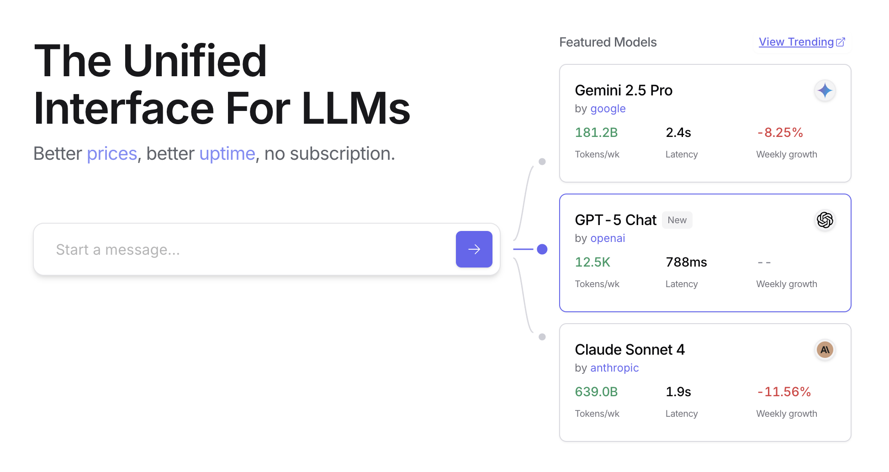
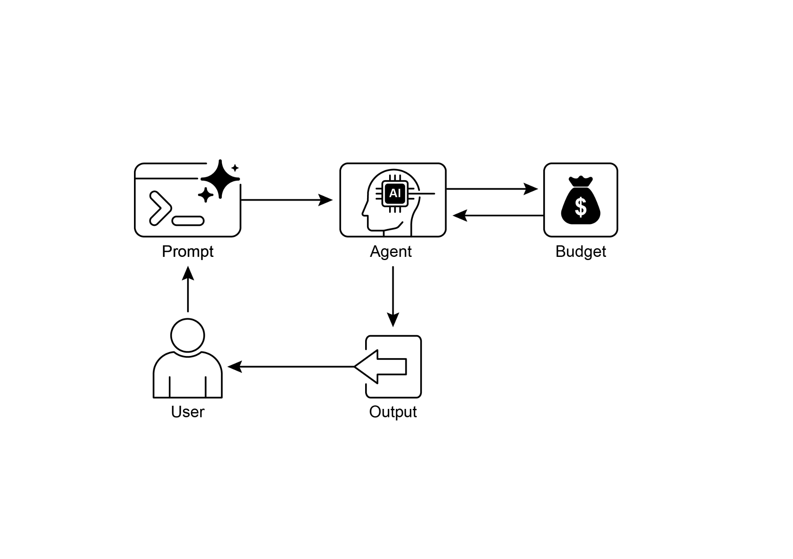

# Chapter 16: Resource-Aware Optimization

> 第 16 章：资源感知优化

Resource-Aware Optimization enables intelligent agents to dynamically monitor and manage computational, temporal, and financial resources during operation. This differs from simple planning, which primarily focuses on action sequencing. Resource-Aware Optimization requires agents to make decisions regarding action execution to achieve goals within specified resource budgets or to optimize efficiency. This involves choosing between more accurate but expensive models and faster, lower-cost ones, or deciding whether to allocate additional compute for a more refined response versus returning a quicker, less detailed answer.

> 资源感知优化，是指让智能体在运行过程中持续感知并调度计算、时间和资金消耗。它不同于只关心「先做什么、后做什么」的简单规划，而是要求智能体在执行层面不断权衡：要么在既定预算内完成目标，要么主动追求更高性价比。比如，它需要在「更准但更贵」与「更快更省」的模型之间做选择，或在「多花算力换更细答案」与「先给出够用结果」之间做取舍。

For example, consider an agent tasked with analyzing a large dataset for a financial analyst. If the analyst needs a preliminary report immediately, the agent might use a faster, more affordable model to quickly summarize key trends. However, if the analyst requires a highly accurate forecast for a critical investment decision and has a larger budget and more time, the agent would allocate more resources to utilize a powerful, slower, but more precise predictive model. A key strategy in this category is the fallback mechanism, which acts as a safeguard when a preferred model is unavailable due to being overloaded or throttled. To ensure graceful degradation, the system automatically switches to a default or more affordable model, maintaining service continuity instead of failing completely.

> 举例来说，智能体要为分析师处理大规模金融数据时，如果对方只想快速看一版初步结论，就可以选用更快、更经济的模型来概览主要趋势；如果任务涉及关键投资决策，且预算和时间更充裕，则可以投入更多资源，调用更强但更慢、误差控制更好的预测模型。在这类系统里，回退机制尤其关键：当首选模型因过载或限流而不可用时，系统会自动切到默认或更经济的备选模型，以优雅降级维持服务连续，而不是整体失效。

## Practical Applications & Use Cases

> ## 实践应用与用例

Practical use cases include:

> 典型落地场景包括：

* **Cost-Optimized LLM Usage:** An agent deciding whether to use a large, expensive LLM for complex tasks or a smaller, more affordable one for simpler queries, based on a budget constraint.  
* **Latency-Sensitive Operations:** In real-time systems, an agent chooses a faster but potentially less comprehensive reasoning path to ensure a timely response.  
* **Energy Efficiency:** For agents deployed on edge devices or with limited power, optimizing their processing to conserve battery life.  
* **Fallback for service reliability:**  An agent automatically switches to a backup model when the primary choice is unavailable, ensuring service continuity and graceful degradation.  
* **Data Usage Management:** An agent opting for summarized data retrieval instead of full dataset downloads to save bandwidth or storage.  
* **Adaptive Task Allocation:** In multi-agent systems, agents self-assign tasks based on their current computational load or available time.

> * **成本敏感的 LLM 选型：** 在预算硬约束下，复杂任务走大模型、轻量问答走小模型。
> * **延迟优先：** 实时场景可牺牲一定推理深度，换更短的端到端时延。
> * **能效与续航：** 边缘或电池供电环境下调度算力，尽量拉长可用时间。
> * **可靠性回退：** 主模型故障或限流时自动切备用模型，保障业务连续与体验平滑降级。
> * **数据与带宽：** 用摘要或抽样拉数，替代整库搬运，节省带宽与本地存储。
> * **负载感知的任务分派：** 多智能体按各自当前算力余量与时间片自组织认领子任务。

## Hands-On Code Example

> ## 动手代码示例

An intelligent system for answering user questions can assess the difficulty of each question. For simple queries, it utilizes a cost-effective language model such as Gemini Flash. For complex inquiries, a more powerful, but expensive, language model (like Gemini Pro) is considered. The decision to use the more powerful model also depends on resource availability, specifically budget and time constraints. This system dynamically selects appropriate models.

> 问答系统可以先判断请求难度：直白问题交给 Gemini Flash 这类经济型模型，复杂推理再考虑 Gemini Pro 等能力更强、成本也更高的后端。是否切到更高配置的模型，还要看当前预算和时间窗口，并由策略层动态决定。

For example, consider a travel planner built with a hierarchical agent. The high-level planning, which involves understanding a user's complex request, breaking it down into a multi-step itinerary, and making logical decisions, would be managed by a sophisticated and more powerful LLM like Gemini Pro. This is the "planner" agent that requires a deep understanding of context and the ability to reason.

> 以分层旅行助手为例：读懂冗长需求、拆解行程、做关键取舍的高层规划，可以交给 Gemini Pro 这类强模型，也就是承担深度语境理解与链式推理的「规划」智能体。

However, once the plan is established, the individual tasks within that plan, such as looking up flight prices, checking hotel availability, or finding restaurant reviews, are essentially simple, repetitive web queries. These "tool function calls" can be executed by a faster and more affordable model like Gemini Flash. It is easier to visualize why the affordable model can be used for these straightforward web searches, while the intricate planning phase requires the greater intelligence of the more advanced model to ensure a coherent and logical travel plan.

> 行程框架确定后，查票价、查空房、检索点评等子步骤，大多属于模式化检索，对应的工具调用就可以交给 Gemini Flash 等轻量模型。简言之，常规查询用低成本模型，统筹规划交给高能力模型，才能在成本和方案质量之间取得平衡。

Google's ADK supports this approach through its multi-agent architecture, which allows for modular and scalable applications. Different agents can handle specialized tasks. Model flexibility enables the direct use of various Gemini models, including both Gemini Pro and Gemini Flash, or integration of other models through LiteLLM. The ADK's orchestration capabilities support dynamic, LLM-driven routing for adaptive behavior. Built-in evaluation features allow systematic assessment of agent performance, which can be used for system refinement (see the Chapter on Evaluation and Monitoring).

> Google ADK 的多智能体架构天然适合这种拆分方式：按职责划分子智能体后，系统更容易模块化扩展。模型侧既可以直连 Gemini Pro/Flash，也可以通过 LiteLLM 接入第三方模型。编排层支持 LLM 驱动的动态路由，能够随负载和任务形态自适应；配套评估能力则可以持续度量智能体表现，并反哺路由策略（详见评估与监控章节）。

Next, two agents with identical setup but utilizing different models and costs will be defined.

> 下面先定义两个配置相同、但模型档位和成本曲线不同的智能体。

```python
# Conceptual Python-like structure, not runnable code
from google.adk.agents import Agent
# from google.adk.models.lite_llm import LiteLlm  # If using models not directly supported by ADK's default Agent

# Agent using the more expensive Gemini Pro 2.5
gemini_pro_agent = Agent(
    name="GeminiProAgent",
    model="gemini-2.5-pro",  # Placeholder for actual model name if different
    description="A highly capable agent for complex queries.",
    instruction="You are an expert assistant for complex problem-solving.",
)

# Agent using the less expensive Gemini Flash 2.5
gemini_flash_agent = Agent(
    name="GeminiFlashAgent",
    model="gemini-2.5-flash",  # Placeholder for actual model name if different
    description="A fast and efficient agent for simple queries.",
    instruction="You are a quick assistant for straightforward questions.",
)
```

A Router Agent can direct queries based on simple metrics like query length, where shorter queries go to less expensive models and longer queries to more capable models. However, a more sophisticated Router Agent can utilize either  LLM or ML models to analyze query nuances and complexity. This LLM router can determine which downstream language model is most suitable. For example, a query requesting a factual recall is routed to a flash model, while a complex query requiring deep analysis is routed to a pro model.

> 路由层可以先用粗粒度启发式（如词数）分流：短问句走经济模型，长文本走旗舰模型。更进一步，则可以让独立的 LLM 或小模型来判断语义复杂度，例如事实检索类走 Flash，多跳推理类走 Pro。

Optimization techniques can further enhance the LLM router's effectiveness. Prompt tuning involves crafting prompts to guide the router LLM for better routing decisions. Fine-tuning the LLM router on a dataset of queries and their optimal model choices improves its accuracy and efficiency. This dynamic routing capability balances response quality with cost-effectiveness.

> 还可以叠加提示工程、监督微调等手段：为路由 LLM 写清决策准则，或用「查询 - 最优后端」标注数据微调路由器，以提高命中率。动态路由的本质，就是在回答质量和账单之间找到可操作的最优折中。

```python
# Conceptual Python-like structure, not runnable code
import asyncio
from typing import AsyncGenerator

from google.adk.agents import Agent, BaseAgent
from google.adk.events import Event
from google.adk.agents.invocation_context import InvocationContext


class QueryRouterAgent(BaseAgent):
    name: str = "QueryRouter"
    description: str = "Routes user queries to the appropriate LLM agent based on complexity."

    async def _run_async_impl(self, context: InvocationContext) -> AsyncGenerator[Event, None]:
        user_query = context.current_message.text  # Assuming text input
        query_length = len(user_query.split())  # Simple metric: number of words

        if query_length < 20:  # Example threshold for simplicity vs. complexity
            print(f"Routing to Gemini Flash Agent for short query (length: {query_length})")
            # In a real ADK setup, you would 'transfer_to_agent' or directly invoke
            # For demonstration, we'll simulate a call and yield its response
            response = await gemini_flash_agent.run_async(context.current_message)
            yield Event(author=self.name, content=f"Flash Agent processed: {response}")
        else:
            print(f"Routing to Gemini Pro Agent for long query (length: {query_length})")
            response = await gemini_pro_agent.run_async(context.current_message)
            yield Event(author=self.name, content=f"Pro Agent processed: {response}")
```

The Critique Agent evaluates responses from language models, providing feedback that serves several functions. For self-correction, it identifies errors or inconsistencies, prompting the answering agent to refine its output for improved quality. It also systematically assesses responses for performance monitoring, tracking metrics like accuracy and relevance, which are used for optimization.

> 批评（Critique）智能体负责质检模型输出：一方面做在线纠错，指出事实或逻辑漏洞，推动回答侧继续迭代；另一方面沉淀指标，持续跟踪准确率、相关性等，为路由和模型策略提供优化信号。

Additionally, its feedback can signal reinforcement learning or fine-tuning; consistent identification of inadequate Flash model responses, for instance, can refine the router agent's logic. While not directly managing the budget, the Critique Agent contributes to indirect budget management by identifying suboptimal routing choices, such as directing simple queries to a Pro model or complex queries to a Flash model, which leads to poor results. This informs adjustments that improve resource allocation and cost savings.

> 这些信号也可以输入强化学习或监督微调流程：如果 Flash 屡次在某类题型上失手，就可以上调该类请求的路由阈值。Critique 虽然不直接「管账」，却能暴露错配问题，例如简单题误送 Pro、难题误送 Flash，从而间接减少资源浪费。

The Critique Agent can be configured to review either only the generated text from the answering agent or both the original query and the generated text, enabling a comprehensive evaluation of the response's alignment with the initial question.

> 它也可以按需配置：只审模型最终答复，或把原始提问连同答案一起审，以核对是否答所问、是否遗漏条件。

```python
CRITIC_SYSTEM_PROMPT = """
You are the **Critic Agent**, serving as the quality assurance arm of our collaborative research assistant system. Your primary function is to **meticulously review and challenge** information from the Researcher Agent, guaranteeing **accuracy, completeness, and unbiased presentation**. Your duties encompass: * **Assessing research findings** for factual correctness, thoroughness, and potential leanings. * **Identifying any missing data** or inconsistencies in reasoning. * **Raising critical questions** that could refine or expand the current understanding. * **Offering constructive suggestions** for enhancement or exploring different angles. * **Validating that the final output is comprehensive** and balanced. All criticism must be constructive. Your goal is to fortify the research, not invalidate it. Structure your feedback clearly, drawing attention to specific points for revision. Your overarching aim is to ensure the final research product meets the highest possible quality standards. 
"""
```

The Critic Agent operates based on a predefined system prompt that outlines its role, responsibilities, and feedback approach. A well-designed prompt for this agent must clearly establish its function as an evaluator. It should specify the areas for critical focus and emphasize providing constructive feedback rather than mere dismissal. The prompt should also encourage the identification of both strengths and weaknesses, and it must guide the agent on how to structure and present its feedback.

> Critique 的运行方式由系统提示来锚定，核心是写清「你是谁、评什么、怎么评」。好的提示会明确检查清单，要求给出基于证据的批评而不是空泛否定，并规定输出结构，以便下游自动处理。

## Hands-On Code with OpenAI

> ## OpenAI 动手代码

This system uses a resource-aware optimization strategy to handle user queries efficiently. It first classifies each query into one of three categories to determine the most appropriate and cost-effective processing pathway. This approach avoids wasting computational resources on simple requests while ensuring complex queries get the necessary attention. The three categories are:

> 该示例通过资源感知路由来处理用户查询：先把请求划分为三类，再映射到兼顾成本和效果的处理链路，避免在轻量问题上滥用大模型，同时在高强度推理或强时效需求上投入额外资源。三类定义如下：

* simple: For straightforward questions that can be answered directly without complex reasoning or external data.  
* reasoning: For queries that require logical deduction or multi-step thought processes, which are routed to more powerful models.  
* `internetsearch`: For questions needing current information, which automatically triggers a Google Search to provide an up-to-date answer.

> * `simple`：事实清晰、无需链式推理或外部数据的直接问题。
> * `reasoning`：依赖逻辑、演算或多步推断的请求，交给更强模型。
> * `internetsearch`：强依赖最新事实或训练集未覆盖的信息，自动走 Google 搜索后再综合作答。

The code is under the MIT license and available on Github: ([https://github.com/mahtabsyed/21-Agentic-Patterns/blob/main/16ResourceAwareOptLLMReflectionv2.ipynb](https://github.com/mahtabsyed/21-Agentic-Patterns/blob/main/16_Resource_Aware_Opt_LLM_Reflection_v2.ipynb))

> 源码采用 MIT 许可，仓库见 GitHub：[https://github.com/mahtabsyed/21-Agentic-Patterns/blob/main/16_Resource_Aware_Opt_LLM_Reflection_v2.ipynb](https://github.com/mahtabsyed/21-Agentic-Patterns/blob/main/16_Resource_Aware_Opt_LLM_Reflection_v2.ipynb)

```python
# MIT License
# Copyright (c) 2025 Mahtab Syed
# https://www.linkedin.com/in/mahtabsyed/

import os
import json
import requests
from dotenv import load_dotenv
from openai import OpenAI


# Load environment variables
load_dotenv()

OPENAI_API_KEY = os.getenv("OPENAI_API_KEY")
GOOGLE_CUSTOM_SEARCH_API_KEY = os.getenv("GOOGLE_CUSTOM_SEARCH_API_KEY")
GOOGLE_CSE_ID = os.getenv("GOOGLE_CSE_ID")

if not OPENAI_API_KEY or not GOOGLE_CUSTOM_SEARCH_API_KEY or not GOOGLE_CSE_ID:
    raise ValueError(
        "Please set OPENAI_API_KEY, GOOGLE_CUSTOM_SEARCH_API_KEY, and GOOGLE_CSE_ID in your .env file."
    )

client = OpenAI(api_key=OPENAI_API_KEY)


# --- Step 1: Classify the Prompt ---
def classify_prompt(prompt: str) -> dict:
    system_message = {
        "role": "system",
        "content": (
            "You are a classifier that analyzes user prompts and returns one of three categories ONLY:\n\n"
            "- simple\n"
            "- reasoning\n"
            "- internet_search\n\n"
            "Rules:\n"
            "- Use 'simple' for direct factual questions that need no reasoning or current events.\n"
            "- Use 'reasoning' for logic, math, or multi-step inference questions.\n"
            "- Use 'internet_search' if the prompt refers to current events, recent data, or things not in your training data.\n\n"
            "Respond ONLY with JSON like:\n"
            '{ "classification": "simple" }'
        ),
    }
    user_message = {"role": "user", "content": prompt}

    response = client.chat.completions.create(
        model="gpt-4o",
        messages=[system_message, user_message],
        temperature=1,
    )
    reply = response.choices[0].message.content
    return json.loads(reply)


# --- Step 2: Google Search ---
def google_search(query: str, num_results: int = 1) -> list:
    url = "https://www.googleapis.com/customsearch/v1"
    params = {
        "key": GOOGLE_CUSTOM_SEARCH_API_KEY,
        "cx": GOOGLE_CSE_ID,
        "q": query,
        "num": num_results,
    }
    try:
        response = requests.get(url, params=params)
        response.raise_for_status()
        results = response.json()
        if "items" in results and results["items"]:
            return [
                {
                    "title": item.get("title"),
                    "snippet": item.get("snippet"),
                    "link": item.get("link"),
                }
                for item in results["items"]
            ]
        else:
            return []
    except requests.exceptions.RequestException as e:
        return {"error": str(e)}


# --- Step 3: Generate Response ---
def generate_response(prompt: str, classification: str, search_results=None) -> tuple[str, str]:
    if classification == "simple":
        model = "gpt-4o-mini"
        full_prompt = prompt

    elif classification == "reasoning":
        model = "o4-mini"
        full_prompt = prompt

    elif classification == "internet_search":
        model = "gpt-4o"
        # Convert each search result dict to a readable string
        if search_results:
            search_context = "\n".join(
                [
                    f"Title: {item.get('title')}\nSnippet: {item.get('snippet')}\nLink: {item.get('link')}"
                    for item in search_results
                ]
            )
        else:
            search_context = "No search results found."
        full_prompt = (
            "Use the following web results to answer the user query: "
            f"{search_context}\nQuery: {prompt}"
        )
    else:
        # Fallback
        model = "gpt-4o"
        full_prompt = prompt

    response = client.chat.completions.create(
        model=model,
        messages=[{"role": "user", "content": full_prompt}],
        temperature=1,
    )
    return response.choices[0].message.content, model


# --- Step 4: Combined Router ---
def handle_prompt(prompt: str) -> dict:
    classification_result = classify_prompt(prompt)
    classification = classification_result["classification"]

    search_results = None
    if classification == "internet_search":
        search_results = google_search(prompt)

    answer, model = generate_response(prompt, classification, search_results)
    return {"classification": classification, "response": answer, "model": model}


if __name__ == "__main__":
    test_prompt = "What is the capital of Australia?"
    # test_prompt = "Explain the impact of quantum computing on cryptography."
    # test_prompt = "When does the Australian Open 2026 start, give me full date?"

    result = handle_prompt(test_prompt)

    print("🔍 Classification:", result["classification"])
    print("🧠 Model Used:", result["model"])
    print("🧠 Response:\n", result["response"])
```

This Python code implements a prompt routing system to answer user questions. It begins by loading necessary API keys from a .env file for OpenAI and Google Custom Search. The core functionality lies in classifying the user's prompt into three categories: simple, reasoning, or internet search. A dedicated function utilizes an OpenAI model for this classification step. If the prompt requires current information, a Google search is performed using the Google Custom Search API. Another function then generates the final response, selecting an appropriate OpenAI model based on the classification. For internet search queries, the search results are provided as context to the model. The main `handleprompt` function orchestrates this workflow, calling the classification and search (if needed) functions before generating the response. It returns the classification, the model used, and the generated answer. This system efficiently directs different types of queries to optimized methods for a better response.

> 这段 Python 用提示路由来驱动问答：先从 `.env` 读取 OpenAI 与 Google 自定义搜索密钥；再由 `classify_prompt` 借助 OpenAI 给输入打上 `simple`、`reasoning`、`internet_search` 标签；命中搜索类时，先拉取检索结果，再连同用户问题一起传给相应档位的模型。入口函数 `handle_prompt`（正文有一处误写为 `handleprompt`）把分类、可选搜索和生成串起来，最终返回标签、实际调用模型和答案，实现按题型分配算力。

## Hands-On Code Example (OpenRouter)

> ## OpenRouter 动手示例

OpenRouter offers a unified interface to hundreds of AI models via a single API endpoint. It provides automated failover and cost-optimization, with easy integration through your preferred SDK or framework.

> OpenRouter 通过单一 HTTPS 端点聚合数百个模型路由，内置故障转移与成本导向的选型能力，也可以嵌入常见 SDK 与编排框架。

```python
import json
import requests

response = requests.post(
    url="https://openrouter.ai/api/v1/chat/completions",
    headers={
        "Authorization": "Bearer <OPENROUTER_API_KEY>",
        "HTTP-Referer": "<YOUR_SITE_URL>",  # Optional. Site URL for rankings on openrouter.ai.
        "X-Title": "<YOUR_SITE_NAME>",      # Optional. Site title for rankings on openrouter.ai.
    },
    data=json.dumps({
        "model": "openai/gpt-4o",  # Optional
        "messages": [
            {
                "role": "user",
                "content": "What is the meaning of life?"
            }
        ]
    }),
)
```

This code snippet uses the requests library to interact with the OpenRouter API. It sends a POST request to the chat completion endpoint with a user message. The request includes authorization headers with an API key and optional site information. The goal is to get a response from a specified language model, in this case, "openai/gpt-4o".

> 示例使用 `requests` 直接调用接口：向 `/chat/completions` 发送 POST，请求中带上用户消息、Bearer Token 和可选的站点元数据，即可指定 `openai/gpt-4o` 等模型完成补全。

Openrouter offers two distinct methodologies for routing and determining the computational model used to process a given request.

> 在「由谁执行推理」这一层，OpenRouter 提供了两条主要路径。

* **Automated Model Selection:** This function routes a request to an optimized model chosen from a curated set of available models. The selection is predicated on the specific content of the user's prompt. The identifier of the model that ultimately processes the request is returned in the response's metadata.

> * **自动模型选择：** 根据提示语义在候选池中挑选「当前最优」后端；真正执行请求的模型 ID 会在响应元信息中回显。

```json
{  
    "model": "openrouter/auto",  
    ... // Other params 
}
```

* **Sequential Model Fallback:** This mechanism provides operational redundancy by allowing users to specify a hierarchical list of models. The system will first attempt to process the request with the primary model designated in the sequence. Should this primary model fail to respond due to any number of error conditions—such as service unavailability, rate-limiting, or content filtering—the system will automatically re-route the request to the next specified model in the sequence. This process continues until a model in the list successfully executes the request or the list is exhausted. The final cost of the operation and the model identifier returned in the response will correspond to the model that successfully completed the computation.

> * **顺序回退列表：** 显式给出一个按优先级排列的模型列表。请求会先在首选模型上执行；如果遇到宕机、429、内容策略拦截等错误，就自动降级到下一个候选，直到命中或耗尽。最终账单与 `model` 字段都以真正成功执行的那个模型为准。

```json
{  
    "models": ["anthropic/claude-3.5-sonnet", "gryphe/mythomax-l2-13b"],  
    ... // Other params }
```

OpenRouter offers a detailed leaderboard ( [https://openrouter.ai/rankings](https://openrouter.ai/rankings)) which ranks available AI models based on their cumulative token production. It also offers latest models from different providers (ChatGPT, Gemini, Claude) (see Fig. 1)

> 官方排行榜（[https://openrouter.ai/rankings](https://openrouter.ai/rankings)）会从调用量、性价比等维度展示模型生态，并持续收录 ChatGPT、Gemini、Claude 等各家的最新模型（见图 1）。

 

Fig. 1: OpenRouter Web site ([https://openrouter.ai/](https://openrouter.ai/))

> 图 1：OpenRouter 控制台首页（[https://openrouter.ai/](https://openrouter.ai/)）

## Beyond Dynamic Model Switching: A Spectrum of Agent Resource Optimizations

> ## 超越动态换模：智能体资源优化谱系

Resource-aware optimization is paramount in developing intelligent agent systems that operate efficiently and effectively within real-world constraints. Let's see a number of additional techniques:

> 要让智能体在真实世界的预算、时延和能耗约束下稳定运行，资源感知优化几乎贯穿全栈。除动态换模外，还可以组合以下手段：

**Dynamic Model Switching** is a critical technique involving the strategic selection of large language models  based on the intricacies of the task at hand and the available computational resources. When faced with simple queries, a lightweight, cost-effective LLM can be deployed, whereas complex, multifaceted problems necessitate the utilization of more sophisticated and resource-intensive models.

> **动态模型切换：** 根据任务难度和当前算力余量切换后端；简单问答使用轻量模型，复杂高难任务再调用能力更强的旗舰模型。

**Adaptive Tool Use & Selection** ensures agents can intelligently choose from a suite of tools, selecting the most appropriate and efficient one for each specific sub-task, with careful consideration given to factors like API usage costs, latency, and execution time. This dynamic tool selection enhances overall system efficiency by optimizing the use of external APIs and services.

> **自适应工具选择与调用：** 在工具箱里为每个子问题挑出「性价比最高」的工具，综合考虑单价、时延和失败率，避免为小事开大车。

**Contextual Pruning & Summarization** plays a vital role in managing the amount of information processed by agents, strategically minimizing the prompt token count and reducing inference costs by intelligently summarizing and selectively retaining only the most relevant information from the interaction history, preventing unnecessary computational overhead.

> **上下文剪枝与摘要：** 对历史对话做滚动摘要或相关性过滤，控制 prompt 体积与 KV 缓存占用，把 token 花在刀刃上。

**Proactive Resource Prediction** involves anticipating resource demands by forecasting future workloads and system requirements, which allows for proactive allocation and management of resources, ensuring system responsiveness and preventing bottlenecks.

> **主动容量预测：** 结合排队长度、季节性流量等信号预估峰值，提前扩容或预热模型，降低尾延迟。

**Cost-Sensitive Exploration** in multi-agent systems extends optimization considerations to encompass communication costs alongside traditional computational costs, influencing the strategies employed by agents to collaborate and share information, aiming to minimize the overall resource expenditure.

> **多智能体下的成本敏感协同：** 把跨节点消息、向量检索等传统「隐形开销」纳入目标函数，调整通信拓扑和信息共享粒度。

**Energy-Efficient Deployment** is specifically tailored for environments with stringent resource constraints, aiming to minimize the energy footprint of intelligent agent systems, extending operational time and reducing overall running costs.

> **能效导向部署：** 针对边缘或电池场景，调度批大小、量化精度和唤醒频率，以换取更长的持续作业时间。

**Parallelization & Distributed Computing Awareness** leverages distributed resources to enhance the processing power and throughput of agents, distributing computational workloads across multiple machines or processors to achieve greater efficiency and faster task completion.

> **并行与分布式感知：** 识别可并行子图，把互不依赖的子任务扇出到多机或多卡，缩短关键路径。

**Learned Resource Allocation Policies** introduce a learning mechanism, enabling agents to adapt and optimize their resource allocation strategies over time based on feedback and performance metrics, improving efficiency through continuous refinement.

> **可学习的资源策略：** 用在线反馈或 bandit 类算法持续更新「何时用哪档模型、开多大并发」等策略参数，让系统越跑越省。

**Graceful Degradation and Fallback Mechanisms** ensure that intelligent agent systems can continue to function, albeit perhaps at a reduced capacity, even when resource constraints are severe, gracefully degrading performance and falling back to alternative strategies to maintain operation and provide essential functionality.

> **优雅降级与多级回退：** 当预算触顶或依赖故障时，自动缩小上下文、切换小模型或返回部分结果，保证核心链路不中断。

## At a Glance

> ## 速览

**What:** Resource-Aware Optimization addresses the challenge of managing the consumption of computational, temporal, and financial resources in intelligent systems. LLM-based applications can be expensive and slow, and selecting the best model or tool for every task is often inefficient. This creates a fundamental trade-off between the quality of a system's output and the resources required to produce it. Without a dynamic management strategy, systems cannot adapt to varying task complexities or operate within budgetary and performance constraints.

> **是什么：** 资源感知优化要回答的问题是：「在算力、时延和账单三重约束下，智能体该如何工作？」LLM 应用天然既贵又慢，如果凡事都上顶配模型，质量的边际收益会很快递减；如果缺乏动态治理，系统就既难贴合任务难度，也难守住 SLA 和预算红线。

**Why:** The standardized solution is to build an agentic system that intelligently monitors and allocates resources based on the task at hand. This pattern typically employs a "Router Agent" to first classify the complexity of an incoming request. The request is then forwarded to the most suitable LLM or tool—a fast, inexpensive model for simple queries, and a more powerful one for complex reasoning. A "Critique Agent" can further refine the process by evaluating the quality of the response, providing feedback to improve the routing logic over time. This dynamic, multi-agent approach ensures the system operates efficiently, balancing response quality with cost-effectiveness.

> **为什么：** 从工程角度看，这一模式可以收敛为「感知 - 决策 - 反馈」的闭环：路由智能体先判断请求难度，再把流量导向匹配的模型或工具链；Critique 智能体持续抽检答案质量，并把错配案例回灌给路由策略。多角色分工之后，系统就能在质量、时延和费用之间持续运营、持续迭代。

**Rule of Thumb:** Use this pattern when operating under strict financial budgets for API calls or computational power, building latency-sensitive applications where quick response times are critical, deploying agents on resource-constrained hardware such as edge devices with limited battery life, programmatically balancing the trade-off between response quality and operational cost, and managing complex, multi-step workflows where different tasks have varying resource requirements.

> **经验法则：** 只要你同时在意「答得好不好」和「花多少钱、等多久」，例如 API 配额吃紧、实时交互、边缘续航，或一条流水线里各步骤算力需求差异很大，就应显式引入资源感知优化，而不是默认全局只用同一档模型。

**Visual Summary:**

> **图示摘要：**



Fig. 2: Resource-Aware Optimization Design Pattern

> 图 2：资源感知优化设计模式

## Key Takeaways

> ## 要点

* Resource-Aware Optimization is Essential: Intelligent agents can manage computational, temporal, and financial resources dynamically. Decisions regarding model usage and execution paths are made based on real-time constraints and objectives.  
* Multi-Agent Architecture for Scalability: Google's ADK provides a multi-agent framework, enabling modular design. Different agents (answering, routing, critique) handle specific tasks.  
* Dynamic, LLM-Driven Routing: A Router Agent directs queries to language models (Gemini Flash for simple, Gemini Pro for complex) based on query complexity and budget. This optimizes cost and performance.  
* Critique Agent Functionality: A dedicated Critique Agent provides feedback for self-correction, performance monitoring, and refining routing logic, enhancing system effectiveness.  
* Optimization Through Feedback and Flexibility: Evaluation capabilities for critique and model integration flexibility contribute to adaptive and self-improving system behavior.  
* Additional Resource-Aware Optimizations: Other methods include Adaptive Tool Use & Selection, Contextual Pruning & Summarization, Proactive Resource Prediction, Cost-Sensitive Exploration in Multi-Agent Systems, Energy-Efficient Deployment, Parallelization & Distributed Computing Awareness, Learned Resource Allocation Policies, Graceful Degradation and Fallback Mechanisms, and Prioritization of Critical Tasks.

> * 资源感知优化是智能体落地后的「运营层」：运行期要同时盯紧算力、时间和账单，并据此切换模型与执行路径。
> * 多智能体拆分有利于伸缩：Google ADK 等框架让回答、路由、批评等角色解耦，便于独立演进。
> * LLM 级动态路由：按难度和预算在 Gemini Flash、Gemini Pro 等档位间调度，直接影响 P99 延迟与单请求成本。
> * Critique 闭环：专用质检智能体输出纠错信号与监控指标，持续收紧路由策略。
> * 评估与模型可插拔：统一的评测面加多后端适配，使系统能随业务反馈自我校准。
> * 资源优化并不止于模型切换：还包括自适应工具选择、上下文剪枝与摘要、容量预测、成本敏感的多智能体协同、能效部署、并行分发、可学习调度与多级回退等；关键任务也可以单独预留配额。

## Conclusions

> ## 结论

Resource-aware optimization is essential for the development of intelligent agents, enabling efficient operation within real-world constraints. By managing computational, temporal, and financial resources, agents can achieve optimal performance and cost-effectiveness. Techniques such as dynamic model switching, adaptive tool use, and contextual pruning are crucial for attaining these efficiencies. Advanced strategies, including learned resource allocation policies and graceful degradation, enhance an agent's adaptability and resilience under varying conditions. Integrating these optimization principles into agent design is fundamental for building scalable, robust, and sustainable AI systems.

> 资源感知优化把「会思考」进一步扩展为「会算账」：在真实约束下，智能体通过调度模型、工具和上下文，持续寻找质量、成本与时延之间更优的平衡点。动态换模、工具精选和上下文治理，是最主要的几个杠杆；可学习策略与优雅降级，则保证系统在故障和流量尖峰下仍能降级运行。把这一层纳入架构设计，是走向可扩展、可运维、可持续 AI 系统的必经之路。

## References

1. Google's Agent Development Kit (ADK): [https://google.github.io/adk-docs/](https://google.github.io/adk-docs/)
2. Gemini Flash 2.5 & Gemini 2.5 Pro:  [https://aistudio.google.com/](https://aistudio.google.com/)
3. OpenRouter: [https://openrouter.ai/docs/quickstart](https://openrouter.ai/docs/quickstart)
